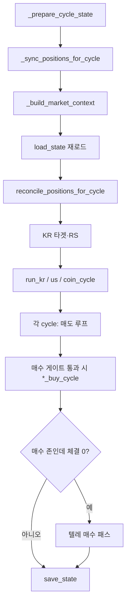

# c-bot — 국·미·코인 자동매매 봇

_문서 갱신: 2026-06-09 — COIN SWING 진입 유예(2h·-3% 하드컷) 반영._

---

## 목차

1. [이 프로젝트는 무엇인가요?](#1-이-프로젝트는-무엇인가요)
2. [처음 오셨나요? (준비물 체크)](#2-처음-오셨나요-준비물-체크)
3. [빠른 시작](#3-빠른-시작)
3-1. [GUI 사용 안내 (`run_gui.py`)](#gui-사용-안내)
4. [폴더 구조 한눈에 보기](#4-폴더-구조-한눈에-보기)
5. [한 사이클 안에서 일어나는 일](#5-한-사이클-안에서-일어나는-일)
6. [최상위 파일 설명](#6-최상위-파일-설명)
7. [데이터 파일과 Git](#7-데이터-파일과-git)
8. [전략: V8(추세)과 스윙](#8-전략-v8추세과-스윙) — [HTS 조건검색 26.05](#국장-hts-조건검색-v8-2605)
9. [Phase 1~5가 의미하는 것](#9-phase-15가-의미하는-것)
10. [관측성: 로그를 읽는 법](#10-관측성-로그를-읽는-법)
11. [`config.json` 핵심 키](#11-configjson-핵심-키)
12. [트러블슈팅](#12-트러블슈팅)
13. [운영 팁 · 체크리스트](#13-운영-팁--체크리스트)
14. [`config.json` 예시 템플릿](#14-configjson-예시-템플릿)

---

## 1) 이 프로젝트는 무엇인가요?

**한국투자증권(KIS)** 로 국장·미장 주식을, 코인은 **`config.json`** 으로 **업비트(원화 마켓)** 또는 **바이낸스 현물(USDT 마켓, CCXT)** 중 하나를 고르고, 정해진 규칙에 따라 **자동으로 매매**하는 프로그램입니다.

| 구분 | 설명 |
|------|------|
| **일상 운영** | `run_bot.bat` 또는 `py -3.11 run_gui.py` — **GUI 권장** |
| **개발·서버** | `py -3.11 run_bot.py` — 헤드리스(콘솔만), 선택 사항 |
| **엔진** | `run_bot.py` 안의 `run_trading_bot()` 이 한국·미국·코인 순으로 동기화 → 리스크 → 매도 → 매수를 처리합니다 |

코드는 크게 **전략(`strategy/`)**, **실행·장부(`execution/`)**, **브로커 API(`api/`)**, **GUI·조회 보조(`services/`, `utils/`)** 로 나뉩니다. **중복 주문 방지(멱등)**·**장부 저장 재시도**·**잔고 TTL** 은 `execution/idempotency.py`, `execution/ledger_apply.py`, `execution/balance_read.py`, `execution/state_schema.py` 와 **`docs/idempotency/`** 설계 문서를 함께 보세요. 파일 단위 목차는 **`PROJECT_STRUCTURE.txt`**.

---

## 2) 처음 오셨나요? (준비물 체크)

1. **Python 3.11** 권장 (`py -3.11` 명령이 동작하는지 확인).
2. **`requirements.txt`** 로 의존성 설치: `py -3.11 -m pip install -r requirements.txt`
3. **`.gitignore`에 있는 파일**은 저장소에 없을 수 있습니다. 특히 **`config.json`** 은 직접 만들고, API 키·계좌·텔레그램 값을 넣어야 합니다.
4. **`bot_state.json`**, **`trade_history.json`** 은 없으면 실행 중 생성되거나 비어 있는 상태에서 시작해도 됩니다.
5. **국장 후보 종목**은 스크리너가 **`kr_targets.json`** 을 만듭니다. HTS에는 **`조건검색/v8조건검색 26.05(외국인수급제외 간결화).txt`** (또는 동명 `.xml`/`.tdf`)를 등록해 두고, `screener.py` 가 API로 조회합니다. `kr_targets.json` 은 **매 스캔마다 바뀌므로 Git에 포함하지 않습니다**. 처음에는 비어 있으면 국장 매수 루프만 스킵되므로, 운영 전에 스크리너를 한 번 돌리세요.

---

## 3) 빠른 시작

### 실행

```bash
py -3.11 -m pip install -r requirements.txt
```

**GUI (권장)**

```bash
run_bot.bat
```

또는

```bash
py -3.11 run_gui.py
```

미니 PC 등 **CMD 창 없이** 실행: `py -3.11 launch_gui.py --no-console` 또는 `start_gui_once.vbs`(더블클릭, 1회). 자동 재시작 루프는 `start_gui.vbs`.

**헤드리스 (선택)**

```bash
py -3.11 run_bot.py
```

**Phase 5 고점 수동 보정(입·출금 후)**

```bash
py -3.11 adjust_capital.py
```

### 설정이 반영되지 않을 때

`config.json` 은 **프로세스가 시작될 때 한 번** 읽습니다. 값을 바꾼 뒤에는 **GUI/봇을 완전히 종료했다가 다시 실행**해야 합니다.

### 매매·알림 시계

- **매매 엔진:** **GUI**는 기동 직후 즉시 실행 없이, KST **`:00` / `:15` / `:30` / `:45`** 분기 스케줄에서만 `run_trading_bot()` 을 돌립니다. **`run_bot.py` 헤드리스**는 시작 시 **`run_trading_bot()` 1회**를 먼저 돌린 뒤, 같은 KST 분 슬롯에 이어서 스케줄합니다.
- **텔레그램 생존신고(heartbeat):** **GUI**는 **기동 직후 발송 없음**. 다음 **KST `:00` / `:30`** 슬롯을 예약한 뒤, **해당 슬롯의 15분 매매 사이클(`:00/:15/:30/:45`)이 끝난 다음** `heartbeat_report()` 를 보냅니다(매매 15분 주기와 별도). **`run_bot.py` 단독(헤드리스)** 은 프로세스 시작 시 **`heartbeat_report()` 1회**를 보낸 뒤, **`schedule.every(4).hours`** 로 이어집니다(벽시계 `:00/:30` 정렬은 GUI 전용). 보유 한 줄은 **`종목 | 전략:V8|스윙 | 매수가 | 현재가(수익%) | 최고가(%) | 매도선(%) | 보유기간`** 형식이며, 국·미는 **`N일 N시간 (영업 N.Nh)`** 로 타임스탑과 동일한 영업시간을 함께 표시합니다. **매도선·스윙 5MA** 재계산에 쓰는 일봉은 **15분 매매 루프와 동일한 `get_cached_ohlcv`**(국·미 교차검증·날짜 정렬·꼬리 검증, 아래 [일봉 OHLCV](#일봉-ohlcv-확보-get_cached_ohlcv))입니다. 장부 `strategy_type`·`tier`·없으면 `trade_history` 최근 BUY 로 전략을 표시합니다. 주말 미장 **표시가**는 `normalize_us_current_p_api_for_display` 로 장부 폴백 시에도 **yfinance 종가**를 쓰도록 GUI와 동일 전처리를 맞춥니다. **코인** 보유 한 줄의 가격은 바이낸스 **USDT** 단위. 요약 줄의 **예수·총평**(바이낸스)은 ``coin_broker.binance_display_cash_and_total_usdt()`` 로 **가용 USDT + 코인 명목**을 직접 합산한다(KRW 왕복 없음). 업비트 요약은 **원**. 서킷·Phase5용 스냅샷은 여전히 원화 환산. 코인 TWAP 체결 알림도 같은 단위 규칙을 따른다.

---

## GUI 사용 안내

일상 운영은 **`run_gui.py`** (또는 `run_bot.bat`) 로 켜는 **PyQt5 대시보드**가 기본입니다. **다크 터미널 스타일** UI(Fusion + 전역 QSS)이며, 기본 크기는 **1480×900**(최소 **1280×760**)입니다. 내부에서 **`import run_bot`** 을 하므로 **`config.json` 은 GUI를 켜는 순간 한 번만** 읽힙니다. 설정을 바꿨다면 **GUI를 껐다가 다시 실행**해야 합니다.

### 상단 영역

| 요소 | 설명 |
|------|------|
| **성적표 라벨** | `bot_state.stats` 의 **승/패·누적 수익률 합**(전량 청산 기준)·마지막 보유 ROI. 수동 부분 매도 분(`manual_partial_total_profit_pct`)은 **JSON에는 누적**되지만 성적표 한 줄에는 아직 표시하지 않습니다. 약 **3초마다** 갱신합니다. |
| **🇰🇷 🇺🇸 🪙 세 칸** | 시장별 **예수금·총평가·보유 수익률**. 숫자는 백그라운드 스레드(`BalanceUpdaterThread`)가 브로커·스냅샷 규칙에 맞춰 채웁니다. **코인 칸:** 업비트는 **원(KRW)**. 바이낸스는 상단 **가용·총평**을 ``coin_broker.binance_display_cash_and_total_usdt()`` 로 **거래소 USDT·시세 직접 합산**(KRW 왕복 없음). 스냅샷·Phase5·서킷용 내부 수치는 여전히 **원화 환산**입니다. |
| **🔄 예수금 새로고침** | **장부+시세** (`kis_balance_sync_mode: on_trade` 기본) — 국·미 KIS 잔고 API는 생략하고, 상단 라벨은 **`last_kis_display_snapshot` 예수 + 장부 보유 × 표시 시세**. 로그: `[표시] 장부+시세`. 코인만 거래소 실조회. |
| **🏦 KIS 강제 새로고침** | **KIS 실조회 1회** + **장부 동기화·자동복구** (`sync_first=True`). 비장중에는 **총평** 급변(±12%↑)만 라벨 유지(예수만 줄고 총평 안정이면 반영). 로그: `🔁 [KIS 강제 새로고침]`, `📜 [매매내역 보강]`. 상세: **[`docs/KIS_GUI_DISPLAY.md`](docs/KIS_GUI_DISPLAY.md)** |
| **최대 종목 수 스핀박스** | 국장 / 미장 / 코인 각각 **동시에 들고 갈 수 있는 종목 수 상한**입니다. |
| **💾 설정 실시간 적용** | `run_bot` 모듈의 `MAX_POSITIONS_*` 값을 즉시 바꾸고, 같은 내용을 **`bot_state.json` 의 `settings`** (`max_pos_kr` / `max_pos_us` / `max_pos_coin`)에 저장합니다. **다음 매수 사이클부터** 반영됩니다. |

### 탭·로그 레이아웃

- **위쪽:** `QTabWidget` — **실시간 현황**(보유표·수동 매도), **매매 내역**, **장부**, **전략 계산 안내**, **고점 보정** 등 탭만 전환됩니다.  
- **아래쪽:** **실시간 작동 로그(봇 브리핑)** 는 탭 **밖**에 두어, 탭을 바꿔도 **항상 같은 자리**에 보입니다. 대시보드 글꼴은 전역 **15pt/15px** (`run_gui.py` `_dashboard_stylesheet`). 세로 **`QSplitter`** 로 위·아래 높이를 드래그해 조절합니다(초기 비율은 `run_gui.py` 의 `setSizes` 참고).  
- 기동 시 **매매 루프는 돌리지 않되**, 약 **0.15초 후** `refresh_balance(sync_first=False)` 를 한 번 호출해 표·라벨을 가능한 빨리 채웁니다(스냅샷 폴백 포함).

1. **실시간 현황** 탭  
   - 보유 종목 **테이블(7열)**: 시장, 종목명, **수량(가운데 정렬)**, 매수가, **현재가**, **전략(V8 / 스윙 / 헷지)**, **수동 매도**(수량 입력 + 버튼). 최고가·매도선·보유시간은 이 탭에 두지 않습니다(아래 **장부**·텔레·15분 매매 로그).  
   - 확인 창 후 `run_bot.manual_sell` 로 주문합니다. 국·미장은 정수 주, 코인은 소수 수량 입력 가능합니다.  
   - 잔고 갱신 시 `build_account_snapshot_for_report`·`gui_table_adapter` 경로로 행이 만들어집니다. **비장·주말**에는 KIS API 대신 장부 `positions` + `curr_p`(마지막 시세, 없으면 평단)로 현재가·수익률을 맞춥니다. **바이낸스**일 때 코인 행의 매수가·현재가는 **USDT** 단위로 표시합니다(업비트는 **원**).

2. **매매 내역**  
   - `trade_history.json` 을 읽어 **시간·시장·종목·매수/매도·수량·가격·수익률·사유** 를 표로 보여 줍니다.  
   - **코인 `BUY`의 `qty`** 는 **체결 코인 수량(base)** 입니다(원화·USDT 지출액이 아님). 과거에 잘못 기록된 행은 수동 보정이 필요합니다.

3. **장부 (현재 포지션)**  
   - `bot_state.json` 의 `positions` 를 **텔레그램·15분 매매 로그와 같은 한 줄 포맷**으로 표시합니다(전략, 매수가, 현재가, 최고가, 매도선 ±%, 보유시간 `N.Nh` — 타임스탑과 동일 시계). 기동·예수금 새로고침만으로는 이 블록을 찍지 않습니다.
   - 표 아래 또는 별도 영역에서 **매수가·손절가·최고가·수량·매수시간** 등 상세 열도 볼 수 있습니다. 코인이 **바이낸스(USDT 마켓)** 이면 해당 가격 열은 **USDT** 로 보여 줍니다(업비트 코인은 **원**).  
   - **수량**은 실시간 보유 표와 같이 **실계좌 잔고**를 우선 표시합니다(`qty` 미기록·구형 장부도 동기화·조회로 맞춤).  
   - **수익률** 열은 **매수가 대비 장부 최고가(`max_p`)** 기준입니다(실시간 보유 표·상단 보유 ROI는 **현재가** 기준).  
   - 마지막 열 **「전략」** 은 헷지 유니버스 종목이면 **`헷지 · 코드(한글명)`**, 아니면 매수 시 `tier`·`strategy_type` 기준 **V8·스윙 전략명**을 보여 줍니다. `1/N 고정`·`vol-target` 같은 비중 라벨만 있는 구형 행은 화면에서 전략명으로 복원합니다.
   - **매도선·최고가·보유시간**은 `build_holding_display_bundle` 한 경로로 표시합니다(일봉은 **`get_cached_ohlcv`**, 15분 매매 로그·텔레그램 생존신고와 동일). 스윙은 `get_swing_exit_display_price` 로 **매 사이클 재계산**(러너 구간 **5MA** 포함).

4. **매매·전략 안내**  
   - 타임스탑, V8/스윙 매도선, **러너 5MA 트레일링**, **하락장 헷지**(Phase4·MAX·AI 예외, `strategy/hedge_universe.py` 티커 목록) — `strategy/rules.py`·`docs/HEDGE_UNIVERSE.md` 와 동기화.

5. **고점 보정 (입출금)**  
   - `adjust_capital.py` 와 **동일한 로직**을 백그라운드 스레드(`CapitalAdjustThread`)로 실행합니다.  
   - **입금 / 출금** 선택, 원화 금액 입력 후 **「실행 (스냅샷 갱신 → 고점 반영)」** → `peak_total_equity` 등 갱신·`capital_adjustments` 기록.

### 자동으로 도는 것들

| 동작 | 설명 |
|------|------|
| **매매 엔진** | 기동 직후 즉시 실행 없이, **KST `:00` / `:15` / `:30` / `:45`** 마다 `run_trading_bot()` 실행. 이미 한 사이클이 돌고 있으면 중복 호출은 건너뜁니다. |
| **매매 직전** | `do_trade()` 안에서 잔고 갱신(`refresh_balance`)으로 **최신 `max_p` 등**을 맞춘 뒤 `WorkerThread`에서 실제 `run_trading_bot()` 을 돌립니다. |
| **텔레그램 heartbeat** | **기동 직후 전송 없음.** 다음 **KST `:00` / `:30`** 슬롯을 예약한 뒤, **해당 슬롯의 15분 매매 사이클(`:00/:15/:30/:45`)이 끝난 다음** `heartbeat_report()` 를 보냅니다(UI 스레드 블로킹 방지용 백그라운드 스레드). 보유 한 줄에 **`전략:V8`**·**`전략:스윙`**·(헷지 유니버스 보유 시 엔진 로그와 동일 분류) 이 포함됩니다. **GUI 하단 로그**에도 같은 생존신고·보유 블록이 heartbeat 시점에만 붙습니다(잔고 새로고침마다 반복하지 않음). |
| **스캐너 스케줄** | GUI가 `run_bot` 을 불러올 때 `start_scanner_scheduler()` 가 한 번 붙습니다(국·미 스캔 시각은 README 앞부분·`PROJECT_STRUCTURE.txt` 참고). |
| **네트워크 감시** | 일정 간격으로 외부망 연결을 검사하고, **연속 실패** 시 프로세스를 종료합니다. `run_bot.bat` 로 감싸 두었다면 **자동 재기동**에 맡기는 설계입니다. (끄려면 환경 변수 `BOT_DISABLE_NET_WATCH` 참고 — 코드 주석 확인.) |

### GUI에서 장부와 맞추는 가격

- 잔고 테이블을 그릴 때 확인한 **현재가**는 가능하면 장부 `positions[*].curr_p` 로 넘기고, **최고가 `max_p`** 도 시장이 열려 있을 때만 더 높으면 올립니다(`update_max_price_if_higher`). 저장 직전 **`ledger_apply.merge_disk_if_newer`** 로 봇이 방금 저장한 장부가 더 최신이면 병합한 뒤 가격만 다시 반영합니다. `bot_state.json` 의 **`state_gen`** 이 저장마다 증가합니다(`execution/guard.save_state`).

---

## 4) 폴더 구조 한눈에 보기

```
c-bot/
├── run_bot.py          # 메인 매매 엔진
├── run_gui.py          # PyQt5 운영 GUI
├── screener.py         # 국장 HTS 조건검색 → kr_targets.json
├── us_screener.py      # 미장 유니버스 캐시 갱신
├── adjust_capital.py   # 입출금 시 Phase5 고점 보정
├── config.json         # (로컬 생성) API·설정 — Git 제외
├── bot_state.json      # (자동) 장부·쿨다운·Phase5 등 — Git 제외
├── trade_history.json  # (자동) 매매 이력 append — Git 제외
├── kr_targets.json     # (스캐너 생성) 국장 스캔 결과 — Git 제외
├── us_universe_cache.json  # 미장 감시 목록 캐시 — Git 제외
├── api/                # KIS·업비트·거시 데이터 래퍼
├── strategy/           # rules, alpha_sizing(RS·변동성·Portfolio Heat), market_hours(영업시간), ai_filter, macro_guard 등
├── execution/          # 동기화, TWAP, order_executor, state_schema, 멱등·ledger_apply·balance_read·market_cycles
├── docs/idempotency/   # 멱등·장부정합·스모크 체크리스트 (코드와 동기화)
├── services/           # 잔고 facade, 스냅샷, GUI 테이블, trade_history_ledger(장부 복구)
├── scripts/            # restore_positions_from_trade_history.py 등 운영 스크립트
├── utils/              # 로그, 텔레그램, math_utils(Hurst) 등
├── tests/              # 실험·회귀 테스트 (test_lab, test_kis_parsers, test_alt_data_research, test_news_fetch, diagnose_*)
└── 조건검색/           # HTS 조건검색식 — 최신: v8조건검색 26.05(외국인수급제외 간결화).txt
```

---

## 5) 한 사이클 안에서 일어나는 일

아래는 **`run_trading_bot()` 한 번**의 **코드 순서**입니다. “동기화 → 리스크 → 매도 → 매수” 개요는 맞지만, **중간에 context·재로드·KR 타겟 조립**이 끼어 있습니다.

**멱등 vs 포지션 장부:** `order_idempotency` 는 **주문·체결 기록**, `positions` 는 **전략 상태** — 자동 1:1 연동은 하지 않습니다. 체결은 됐는데 `positions` 저장만 실패한 경우는 사이클 시작 정합 + 매도 직후 `ledger_apply` 검증 저장으로 보정합니다. **매매내역(`trade_history.json`)** 에 BUY가 있으면 `services/trade_history_ledger.py`·`sync_all_positions`·스크립트 `scripts/restore_positions_from_trade_history.py` 로 SWING 메타(`buy_time`, `entry_fib_level`, `sl_p` 등)를 복구합니다. 상세: [`docs/idempotency/LEDGER_RECONCILE.md`](docs/idempotency/LEDGER_RECONCILE.md).

### 5-1) `run_trading_bot()` 실행 순서 (정확)

| # | 단계 | 위치 | 비고 |
|---|------|------|------|
| 1 | `_prepare_cycle_state` | `run_bot.py` | load·키 정규화·멱등 prune·(조건부) `bal_read.invalidate` |
| 2 | `_sync_positions_for_cycle` | `run_bot.py` | KR/US **정규장**일 때만 KIS 보유 조회. **전 API 성공 시만** `sync_all_positions` |
| 3 | `_build_market_context` | `run_bot.py` | 날씨·Phase4 스냅샷·Phase5 보조 — **여기서 state 저장될 수 있음** |
| 4 | **`load_state` 재로드** | `run_bot.py` | context 직후 **disk 장부를 다시 읽음** (3번과 4번 사이 혼동 주의) |
| 5 | `reconcile_positions_for_cycle` | `execution/idempotency.py` | 이번 15분 `cycle_tag` 의 filled 매도 ↔ `positions` |
| 6 | KR 타겟 조립 | `run_bot.py` | `kr_targets` + 시총200 + 거래대금50 → hedge merge → **10일 RS 정렬 (KR만 여기서)** |
| 7 | 시장 엔진 | `execution/market_cycles/` | **`run_kr_cycle` → `run_us_cycle` → `run_coin_cycle`** (고정 순서) |
| 8 | 매수 패스 텔레 | `run_bot.py` | `buy_zone_*` 이고 신규 체결 0건일 때만 |
| 9 | `save_state` | `execution/guard.py` | 직전 `bot_state.bak` (positions 있을 때) |



### 5-2) 시장 cycle vs buy_cycle (래퍼 vs 본문)

| 계층 | 파일·함수 | 역할 |
|------|-----------|------|
| **cycle** | `execution/market_cycles/{kr,us,coin}_cycle.py` → `run_*_cycle` | 장 개장 시 **매도 루프 항상** → 예수·총평 갱신 → **매수 게이트**(MDD·Phase5·매수창) → buy_cycle 호출 |
| **buy_cycle** | `execution/market_cycles/*_buy_cycle.py` → `run_*_buy_cycle` | V8→스윙 스캔·Portfolio Heat·AI·**TWAP 매수** 본문 |
| **래퍼** | `run_bot._run_*_buy_cycle`, `_execute_*_market_buy_twap` | **위임만** — grep·하위 호환용 이름. **구현 본문은 위 두 모듈** |

**매수 게이트 (cycle 레벨, 매도 후):** 시장별 MDD → `macro_mult <= 0`(현재 `budget_multiplier`는 항상 1.0이라 **실질 차단은 Phase4 `market_buy_allowed`**) → Phase5 쿨다운 → **매수 시간창**.

**매수 시간창** (`buy_window_minutes_before_close`, 기본 **30**분):

| 시장 | 마감 기준 | N=30일 때 허용 구간 |
|------|-----------|---------------------|
| **KR** | KRX **15:30 KST** | **15:00~15:29 KST** |
| **US** | NYSE **16:00 ET** | **15:30~15:59 ET** |
| **COIN** | 일봉 **09:00 KST** (바이낸스 UTC 일봉 경계) | **08:30~08:59 KST** |

창 안에서는 KST `:00/:15/:30/:45` 매매 틱마다 V8→스윙을 **반복** 판단합니다.

**RS(10일 상대강도) 정렬 시점 — 시장마다 다름:**

| 시장 | RS 정렬 위치 |
|------|----------------|
| **KR** | `run_trading_bot` 6번 — `final_targets_kr` 로 buy_cycle에 전달 |
| **US** | `us_buy_cycle.py` **내부** — 150종 → hedge → Phase4 → RS |
| **COIN** | `coin_buy_cycle.py` **내부** — 거래대금 상위 스캔 후 |

### 5-3) 매도 — SWING vs V8 (가장 헷갈리는 부분)

**공통:** 매도는 **Phase4·매수창과 무관**하게, 장이 열려 있으면 **매 사이클** 돕니다.

| | **`SWING_FIB`** | **`TREND_V8`** |
|---|-----------------|----------------|
| **1순위** | `check_swing_exit` — HALF(1.5R 50%) / FULL(피보·구름·5MA·RSI) | — |
| **HALF/FULL 후** | `continue` — 아래 V8 경로 **진입 안 함** | — |
| **HOLD 이후** | **V8 Scale-Out 블록 절대 안 탐** | **Scale-Out** 1차 `entry_atr×3` → 2차 `entry_atr×6` (ATR 없을 때만 +30% fallback) |
| **그 다음** | 타임스탑 → (수익≥0) `check_swing_profit_lock_trailing_exit` | 타임스탑 → (손실) hard_stop → (수익) 샹들리에 |
| **V8 hard_stop** | **적용 안 함** (피보·구름 FULL은 `check_swing_exit` 전담) | 손실 구간만 |
| **스윙 1.5R HALF vs V8 Scale-Out** | **스윙 HALF만** — `scale_out_done`은 러너 전환용, V8 Scale-Out과 **별개** | V8만 `_try_v8_scale_out_*` |
| **COIN 진입 유예** | **2h 미만** + 기술바닥 FULL → 유예(로그 `🔰 … 기술바닥 이탈 검사 유예`). **-3% 이하** 하드컷은 유예 없이 즉시 FULL. 15분 신규매수 보호와 **별도** | — |

**전량 청산**(타임스탑·하드·샹들리에·스윙 FULL): 멱등 lane **`exit` / `swing_full`** — **시장가 1회 전량**. TWAP 분할 **아님**.  
COIN 스윙 유예: `config.json` — `coin_swing_entry_noise_grace_hours`(기본 2), `coin_swing_entry_hard_cut_pct`(기본 -3).  
**TWAP 분할 매도**는 **V8 Scale-Out**(및 대액 slice)과 **매수 TWAP**에만 씁니다.

### 5-4) TWAP·Scale-Out 모듈 역할 (이름만 보면 헷갈림)

| 모듈 | 하는 일 | 하지 **않는** 일 |
|------|---------|------------------|
| `execution/order_twap.py` | slice **계획·sleep** (`plan_*_slices`, `plan_sell_qty_twap`) | 브로커 주문·장부 저장 |
| `execution/order_executor.py` | **매수 TWAP** 브로커 호출 본문 (`execute_*_market_buy_twap`) | 매도·Scale-Out 판정 |
| `execution/scale_out.py` | V8 익절 **조건·수량·장부** (`scale_out_price_target_hit`, `post_partial_ledger`) | 직접 주문 — `run_bot._try_v8_scale_out_*` + `order_twap` + 멱등 lane |

`run_bot._execute_*_market_buy_twap` → **`order_executor` 위임** (thin wrapper).

### 5-5) 동기화 vs 매도 루프 “자동등록”

| 경로 | 시점 | 목적 |
|------|------|------|
| **`sync_all_positions`** | 사이클 2번, 수동매도 후(전 API 성공 시) | 장부↔실계좌 **정기 정합**, `trade_history` 우선 **자동복구**, 유령 삭제(15분 유예) |
| **매도 루프 `자동등록(보유종목)`** | `*_cycle` 매도 루프 안 | 브로커에 있는데 `positions` 없을 때 **즉시** 행 생성 — sync와 **별개**, sl_p/tier 계산 다름 |

KR/US **비장중:** KIS 보유 목록 API **생략** → `sync_all_positions`는 장부 키로 `held` 보강(유령 일괄삭제 방지). 코인 동기화는 **계속**.

**Phase4 거시:** `_build_market_context` → `market_buy_allowed[시장]`. `false`면 **일반 종목(V8·SWING) 신규 매수 중단**, **`hedge_universe` 헷지만** buy_cycle에서 검토. COIN은 **`HEDGE_TICKERS_COIN`(PAXG·XAUT 금 토큰)**. `macro_mult`는 **항상 1.0**.

**매수 (buy_cycle 내부 요약):** RS 정렬된 후보 → 종목마다 **V8**(`calculate_pro_signals`, Hurst **&lt; 0.45**) → 실패 시 **스윙**(`check_swing_entry`) → Portfolio Heat → AI(`_ai_false_breakout_buy_gate`, 헷지·비활성 시 생략) → `order_executor` TWAP. BEAR 날씨는 **V8만** 차단, SWING은 계속.

**텔레그램 `📭 [매수 패스]`:** `buy_zone_*=True`(매수창·MDD·Phase5·Phase4 통과 후 **cycle에서 buy_cycle 호출**)인데 **신규 TWAP 체결 0건**일 때. COIN은 KR/US와 같이 `coin_cycle`에서만 `buy_zone_coin`을 켭니다.

---

## 6) 최상위 파일 설명

### `run_bot.py`

- **국장(KR) / 미장(US) / 코인(COIN)** 통합 엔진.
- 읽고 쓰는 대표 파일: `config.json`, `bot_state.json`, `trade_history.json`.
- **일봉 OHLCV:** `get_cached_ohlcv` — 메모리·`data/ohlcv_cache` → 국장 KIS→pykrx → 미장 KIS→(Stooq)→yfinance. 상세·최소 봉 수는 **[일봉 OHLCV 확보](#일봉-ohlcv-확보-get_cached_ohlcv)**.
- **Phase 5** 계좌 서킷: 기본은 **시장별 포트폴리오 비중** (`circuit_aux_last_*`, `phase5_share_anchor`). **`docs/PHASE5_ACCOUNT_CIRCUIT.md`** 참고. 레거시 **합산 MDD**는 `peak_total_equity` / `account_circuit_use_total`.
- US 스냅샷(`services/account_snapshot.py`)은 미장 예수금/총평가가 간헐적으로 튈 때 직전 `last_kis_display_snapshot.us`로 폴백해 텔레그램/GUI 표시를 안정화합니다.
- **GUI 국·미 라벨:** 평상시 **장부+시세** (`on_trade`), **KIS 강제 새로고침**·체결·입출금 때만 실조회. 비장중 강제 조회 시 **총평** 급변만 라벨 유지. 장부+시세 경로는 스냅샷 **이중 합산·덮어쓰기 방지** (`ledger_valuation.coalesce_ledger_kis_labels`). **`docs/KIS_GUI_DISPLAY.md`** 참고.
- **매매내역 → 장부:** 매수 시 `trade_history` BUY에 `strategy_type`·`entry_fib_level`·`sl_p`·`buy_time` 등 저장. 장부 누락·자동복구 후 **`python scripts/restore_positions_from_trade_history.py [티커…]`** 또는 KIS 강제 새로고침·`sync` 로 `[매매내역 복구]`·`[매매내역 보강]`.
- KR/US **보유 목록 동기화:** 정규장이 아니면 KIS 보유 목록 API 생략(아래와 동일). 코인은 기존대로 실조회합니다.  
- **`_sync_positions_for_cycle` / `fetch_equity_held_lists_for_position_sync`:** 동기화 시 국·미가 **정규장이 아니면 KIS 보유 목록 API를 호출하지 않고** 빈 리스트로 넘깁니다. **`sync_all_positions`** 안에서 비장중·빈 보유 대비 **장부 키로 `held` 보강** 등으로 유령 일괄 삭제를 막습니다. 시장이 **False** 인 경우 **KIS 시드·평단 보정·유령 삭제·주식 자동복구** 루프는 실행하지 않습니다(코인 동기화는 계속). 주식 **자동복구**로 새 행을 넣을 때 **`buy_date`** 는 가능하면 **`trade_history.json`** 에서 해당 티커·시장의 **가장 최근 `BUY`의 `timestamp`** 를 씁니다(없을 때만 복구 시각).
- **매수 패스 텔레그램:** 위 [한 사이클](#5-한-사이클-안에서-일어나는-일) 참고.
- **Phase4·알파 사이징:** `_build_market_context` 가 `macro_snap`(PCR·고래·환율 Z-Score·`market_buy_allowed`)을 넘깁니다. **KR RS**는 `_sort_buy_targets_by_rs` 로 사이클 시작 시; **US RS**는 `us_buy_cycle` 내부. `_position_ratio_with_vol_target` 로 변동성 타겟 비중.
- **하락장 헷지:** 티커는 **`strategy/hedge_universe.py`** 단일 출처. 병합·Phase4 필터·MAX_POSITIONS·AI 예외는 **`execution/market_cycles/*_buy_cycle.py`** 본문 (`run_bot._run_*_buy_cycle` 은 위임 래퍼).
- **주문 멱등·장부:** `_prepare_cycle_state` 에서 `prune_order_idempotency`·`bal_read.invalidate()`. 사이클 본문 직전 `reconcile_positions_for_cycle`(이번 15분 슬롯 filled 매도 ↔ `positions`). 자동 매도·Scale-Out·스윙 HALF/FULL·EXIT 체결 후 `ledger_apply.persist_*` (3회 저장 + reload 검증). 멱등 슬라이스 실패 시 `persist_idempotency`.
- **매도 후 Layer2:** 전량 청산 시 `set_ticker_cooldown_after_sell`(매도 **사유별** 1h/24h). 수동 매도는 `_apply_manual_sell_state_update`·`_run_manual_sell_position_sync` 경로.
- **보유 중복 방지:** 스캔 대상이 실계좌·장부에 **이미 보유**이면 `이미 보유중 (패스)` — 신규 매수·쿨다운과 무관하게 유지됩니다.
- **관측성:** 예산·예수·TWAP·시장별 스킵은 `[KR …]`, `[US …]`, `[COIN …]` 등 태그 로그로 남깁니다. 모듈 상단 docstring에 grep용 태그 요약이 있습니다.
- **모듈화(B-2/B-3/C-1):** 매도·매수 사이클 본문은 `execution/market_cycles/` (`run_kr/us/coin_cycle`, `*_buy_cycle`). TWAP 매수는 `execution/order_executor.py` (`run_bot._execute_*` 위임). 장부 load/save 관측·`.bak` 은 `execution/state_schema.py` + `execution/guard.py`. 상세는 [`docs/MODULARIZATION.md`](docs/MODULARIZATION.md).

### `run_gui.py`

- PyQt5 GUI. `run_bot` 을 import 해서 **같은 엔진**을 돌립니다.
- 국·미·코인 ROI 등은 스냅샷과 맞추고, **바이낸스** 상단 코인 **가용·총평** 숫자는 ``binance_display_cash_and_total_usdt()``(API USDT 직접). 보유표·장부의 코인 **단가**는 USDT 표기. 내부 서킷·Phase5는 **원화 환산** 유지.
- **KIS 주말 점검** 구간에는 국·미 API를 덜 부르고, 저장된 **`last_kis_display_snapshot`** 과 장부 **`positions[*].qty`** 로 화면을 채웁니다. 강제 새로고침은 점검 창에서도 시도 가능(로그 `🔁 [KIS 강제 새로고침]`).
- **코인 수익률·수량:** 상단 코인 보유 ROI는 `_calc_coin_holdings_metrics` 가 **바이낸스 평단 API 부재** 시 장부 `buy_p`·`trade_history` BUY를 씁니다. 실시간·장부 **수량**은 `_build_live_qty_lookup` 으로 실계좌 잔고를 우선합니다.
- **수동 매도 UI:** 보유 행마다 **수량 `QLineEdit`(기본=해당 행 보유 전량) + 매도 버튼**. 빈 칸은 전량, 국·미는 정수 주, 코인은 소수 입력. `_on_manual_sell_click` 에서 보유 초과·형식 검증.
- **매매·전략 안내 탭:** `_build_strategy_guide_text()` — V8·SWING·**헷지**·Phase 1~5. 헷지 종목표는 `hedge_universe` 에서 읽어 GUI 재시작 시 자동 반영.
- **버튼·탭·타이머** 등 화면 구성은 위 **[GUI 사용 안내](#gui-사용-안내)** 절을 보세요.

### `screener.py` / `us_screener.py`

- **국장:** `config.json` 의 **`kis_hts_id`** 계좌에 HTS에 등록된 **조건검색식 전체** 결과를 합쳐 **`kr_targets.json`** 에 기록 (로컬 전용, Git 무시). 조건식 본문·등록 방법은 아래 **[국장 HTS 조건검색 (V8 26.05)](#국장-hts-조건검색-v8-2605)**.
- **미장:** 감시 유니버스 **`us_universe_cache.json`** — **`us_screener.py`** 고베타·섹터 분산 모델(아래). 평소 매매는 **24h TTL** 캐시만 읽고, **수동 실행은 필수 아님**.
- 스케줄: `run_bot.start_scanner_scheduler` — 국장 **14:50 KST** (`screener.run_night_screener`), 미장 **15:20 US/Eastern** (`us_screener.run_us_screener`, **강제 재빌드**). CLI: `python us_screener.py`.

#### 미장 고베타 유니버스 (`us_screener.py`)

| 단계 | 내용 |
|------|------|
| 원천 | Wikipedia **S&P 500** · **Nasdaq-100** 구성표 + **GICS 섹터**(위키 열만 사용, 대량 yfinance 섹터 보강 없음) |
| 배제 | Utilities, Consumer Staples/Defensive, Real Estate, Materials·Basic Materials |
| NDX | 필터 통과 종목 **시총 순 최대 90** (목표 ~80–90) |
| S&P | 잔여 슬롯을 **섹터별 라운드로빈**(시총 순)으로 채워 **총 150** |
| 시총 | **AAPL 1회 프로브** 성공 시에만 필터 통과 종목 병렬 조회(`fast_info`, 워커 20). **401·rate limit** 이면 **516종 일괄 조회 생략** → `wiki_order_proxy` 순위로도 150종 구성 |
| 최종 섹터 | yfinance 가능 시 편입 150종만 재조회 + 배제 섹터 **purge·S&P 슬롯 보충**; 불가 시 위키 GICS 유지 |
| 캐시 | `us_universe_cache.json` — `tickers`, `sectors`, `meta` (`caps_source`: `yfinance` \| `wiki_order_proxy`, `ndx_n`, `sector_histogram` 등). 빌드 실패 시 **8종 비상 목록으로 캐시를 덮어쓰지 않음**(기존 50종 이상 캐시 유지) |
| 디버그 | Traceback 기본 숨김 — `US_SCREENER_DEBUG=1` 일 때만 출력 |

**성능:** yfinance 시총 불가 시 **수 초** 수준(구버전: 500+종 시총 + 섹터 보강으로 401 시 **80초+**). 시총 API가 살아 있으면 **대략 20~30초**(필터 통과분만 조회).

**회귀 테스트:** `python -m unittest tests.test_us_screener_high_beta -v`

### `adjust_capital.py`

- 예수금 입출금만으로 총자산이 바뀌면 Phase5 고점이 왜곡될 수 있어, **`peak_total_equity`** 를 수동으로 맞출 때 사용합니다.
- 실행 시 **`refresh_circuit_aux_from_brokers`** 로 스냅샷을 맞춘 뒤 금액을 입력합니다.

### `config.json`

- 키·계좌·`test_mode`·TWAP·거시·AI 필터 등. **저장소에 올리지 마세요.**

### `bot_state.json` (장부)

| 키/영역 | 한 줄 설명 |
|---------|------------|
| `positions[티커]` | 매수가·손절·수량 `qty`·ATR·분할익절 여부 `scale_out_done`·**`strategy_type`**·**`entry_fib_level`** 등 |
| `stats` | `wins` / `losses` / `total_profit` 은 **전량 청산**(자동·수동) 시만 반영. 수동 **부분** 매도 실현분은 **`manual_partial_total_profit_pct`** 에만 가중 누적 |
| `cooldown` / `ticker_cooldowns` | 단기 쿨다운, 매도 후 **재진입 금지** 시각 |
| `peak_total_equity`, `last_reset_week` | Phase5 **월요일 앵커** 이후 이번 주 합산 고점·주차 라벨(고점은 **`peak_total_equity`만** 표준; 레거시 키는 로드 시 정리) |
| `circuit_aux_last_*` | 국·미·코인 합산용 최근 스냅샷 |
| `last_kis_display_snapshot` | 평일 마지막 성공한 KIS 라벨(주말 GUI/텔레용) |
| `last_coin_display_snapshot` | 마지막 성공한 **코인 라벨**(예수·총평·ROI; 업비트=원, 바이낸스=원화환산 정수) — 잔고 API 실패 시 GUI/텔레 상단 폴백. 이때 `labels["coin"].display_fallback` 이 켜지고, **바이낸스**는 라이브 USDT가 0이어도 직전 숫자를 덮어쓰지 않음. 보유 **행**은 장부·실조회 |
| `order_idempotency` | 주문·슬라이스별 `filled` / `submitted` / `failed` (15분 `cycle_tag` + lane). **positions 와 분리** |
| `buy_inflight` / `sell_inflight` | 동일 15분·티커(·lane) 중복 주문 시도 완화 |
| `state_gen` | 저장 버전 — GUI·봇 동시 저장 시 `merge_disk_if_newer` 가 더 큰 쪽 `positions` 등을 병합 |
| `bot_state.bak` | `save_state` 직전 자동 백업(positions 있을 때). 유실 시 수동 복사로 `bot_state.json` 복구 |

저장·로드 관측: `execution/state_schema.py` — load 시 positions 요약(동일 내용 반복 로그 억제), save 시 positions 급감 **경고만**(positions 삭제·덮어쓰기 없음).

### 장부 `positions` 키의 `KRW-` / `USDT-`는 “원화 잔고”가 아닙니다

- 업비트를 쓸 때 코인 포지션은 티커 키가 **`KRW-BTC`**, **`KRW-XRP`** 처럼 보입니다. 여기서 **`KRW`는 “지금 장부에 원화만 따로 적혀 있다”는 뜻이 아니라**, 업비트 API가 쓰는 **마켓 이름(원화로 거래하는 코인 시장)** 을 그대로 옮긴 **종목 식별자(접두사)** 입니다. 매수가·손절가 등 숫자는 그 안의 필드(`buy_p`, `sl_p` …)에 들어 있고, 단위는 해당 마켓이 **원화(KRW)** 일 때 **원**입니다.
- 바이낸스 현물(USDT)을 선택하면 같은 역할의 키가 **`USDT-BTC`**, **`USDT-ETH`** 처럼 **`USDT-` 접두사**로 저장될 수 있습니다. 이때 가격·평단 필드는 **USDT** 기준으로 쓰이고, **합산 평가액·Phase5용 코인 스냅샷** 등은 봇이 **`krw_per_usdt`(또는 자동 추정 환율)** 으로 **원화로 환산**해 기존과 맞춥니다. **GUI**에서는 금액·단가를 **USDT** 로 읽기 쉽게 보여 줄 뿐이며, 그 숫자를 다시 환산해 합산 로직을 바꾸지는 않습니다.
- **거래소만 바꾸고 장부를 그대로 두면** `KRW-` 키로 남아 있는 기록이 **새 거래소 잔고와 안 맞을 수** 있으니, 업비트↔바이낸스 전환 시에는 **실계좌·`positions`를 같이 정리**하는 것이 안전합니다.

---

## 7) 데이터 파일과 Git

| 파일 | 설명 | Git |
|------|------|-----|
| `config.json` | 비밀·환경 설정 | **제외** (`.gitignore`) |
| `bot_state.json` | 장부·상태 | **제외** |
| `bot_state.bak` | `save_state` 직전 자동 백업(positions 있을 때). 유실 시 수동 복사로 복구 | **제외** (로컬) |
| `trade_history.json` | 매매 로그 | **제외** |
| `us_universe_cache.json` | 미장 고베타 150종·GICS·`meta`(시총 출처 등), TTL 24h | **제외** |
| `kr_targets.json` | 국장 스크리너 출력(자주 변함) | **제외** |
| `data/ohlcv_cache/*.json` | 일봉 OHLCV 디스크 캐시(최대 약 3일, `utils/ohlcv_store.py`) | **제외** (`.gitignore`) |
| `조건검색/` | HTS 조건검색식 원본 — **최신 V8:** `v8조건검색 26.05(외국인수급제외 간결화).txt` (`.xml`/`.tdf` 동봉) | 선택적으로 커밋 |

새로 클론한 저장소에는 위 제외 파일이 없을 수 있으니, **로컬에서 생성**하거나 스크리너/봇을 한 번 실행해 채우면 됩니다.

### 일봉 OHLCV 확보 (`get_cached_ohlcv`)

매수·매도·RS·날씨(ADX)·**스윙 매도선(5MA)·텔레그램 생존신고·GUI 장부**에 쓰는 **일봉**은 `run_bot.py` 의 **`get_cached_ohlcv(ticker, broker=None)`** 로 모읍니다. 목표는 **200봉**이며, 확보·저장 전에 **`utils/ohlcv_store.py`** 에서 **날짜 정렬·꼬리 검증·교차검증**을 합니다.

**핵심 규칙 (2026-06)**

| 규칙 | 내용 |
|------|------|
| **날짜·정렬** | KIS·pykrx 일봉에 `d`(YYYYMMDD)를 붙이고 `normalize_ohlcv_series` 로 **오름차순** 정렬·중복 제거 후 저장 |
| **꼬리 검증** | `ohlcv_series_valid` — 마지막 봉이 너무 옛날(14영업일 초과)이거나 꼬리 종가가 비정상이면 **디스크 캐시 삭제·재조회** |
| **교차검증** | **미장:** KIS vs **yfinance**(Yahoo 기준). **국장:** KIS vs **pykrx**(없으면 yfinance). 괴리·비정상 시 **기준源 채택**, 일치 시 **KIS** |

잘못 정렬된 KIS 캐시(예: ANET 꼬리가 1월 종가로 끝남)는 5MA·매도선이 본절락만 보이게 만들 수 있어, 위 검증으로 **저장·재사용을 막습니다**.

**조회 순서**

| 단계 | 내용 |
|------|------|
| 1 | 메모리 `_ohlcv_cache` — **≥200봉** 이고 `ohlcv_series_valid` 통과 시 반환 |
| 2 | 디스크 `data/ohlcv_cache/{티커}.json` — 동일 검증 통과 시 사용, 실패 시 파일 삭제 |
| 3 | **국장:** KIS 국내 일봉(`get_ohlcv_kis_domestic_daily`, `d` 포함) + **pykrx** → `select_validated_kr_ohlcv` |
| 4 | **미장:** KIS 해외 일봉(`get_ohlcv_kis_us_daily`, `d` 포함) + **yfinance** → `select_validated_equity_ohlcv` |
| 5 | **`stooq_apikey`:** 200봉 미만이면 Stooq 보강 |
| 6 | **yfinance** — 국장 200봉 미만·미장 보강 (`utils/yfinance_guard.py`) |

로그 예: `[OHLCV] [ANET] KIS/yfinance 일치`, `[OHLCV] [005930] KIS 비정상, pykrx 채택`

**생존신고·GUI 장부:** `_heartbeat_fetch_ohlcv_for_holding` → 위와 **동일 `get_cached_ohlcv`**(별도 yfinance 단독 경로 없음).

코인 일봉은 거래소 `fetch_ohlcv` 경로를 쓰며, 위 캐시 체인과는 별도입니다.

**기능별 최소 봉 수** (`utils/ohlcv_store.py` — `OHLCV_MIN_BARS`, 테스트와 동기화)

| 용도 (`purpose`) | 최소 봉 | 쓰는 곳 |
|------------------|---------|---------|
| `sell_loop` | 14 | 매도 루프·ATR |
| `v8_exit` | 20 | V8 `get_final_exit_price` |
| `swing` | 60 | 스윙 진입·피보·구름·매도선·러너 5MA(일봉 5일 SMA) |
| `v8_entry` | 120 | V8 `calculate_pro_signals` (120MA) |
| `cache_target` | 200 | `get_cached_ohlcv` 목표·ma200 여유 |

봉 수가 부족하면 V8은 `120일선 데이터 부족`, 스윙은 `60봉 미만` 등으로 **해당 종목만 패스**하며, 다른 종목·매도 루프는 계속 돌아갑니다.

**회귀 테스트**

```bash
py -3.11 -m unittest discover -s tests -p "test_ohlcv*.py" -v
```

`tests/test_ohlcv_pipeline.py` — 최소 봉 계약, V8 120봉 게이트, 스윙 60봉 게이트, `get_cached_ohlcv` 폴백 체인(모킹), 삼성전자 pykrx 실조회(네트워크·장 종료 시 스킵 가능).  
`tests/test_ohlcv_series.py` — 날짜 정렬·꼬리 검증·KIS/pykrx·KIS/yfinance 교차검증·스윙 HALF `scale_out_done`.

---

## 8) 전략: V8(추세)과 스윙

### 국장 HTS 조건검색 (V8 26.05)

**최신 원본 (2026.05):** `조건검색/v8조건검색 26.05(외국인수급제외 간결화).txt` — HTS 등록용 동명 **`.xml` / `.tdf`** 와 내용을 맞춥니다. (`조건검색/README.md` 요약)

**이전안과 차이:** 구 `조건검색/v8조건검색 26.05.txt` 는 시가총액·**외국인/기관 5일 순매수**·순이익 증가율 등 **3갈래 OR** 이었습니다. **간결화(26.05)** 는 외국인·기관·시총·실적 조건을 빼고, **유동성(A·B) + 두 가지 진입 경로**만 남깁니다.

**조합 로직 (HTS):**

```text
A and B and ((C and D and E and F) or (G and H))
```

| 심볼 | 조건 항목 | 요약 |
|------|-----------|------|
| **A** | 주가범위 | 종가 3,000원 이상 |
| **B** | 평균거래대금 | 5봉 평균 거래대금 하한(천원 단위 HTS 설정) |
| **C** | 가격/20MA | 종가 &gt; 20일 단순이평 |
| **D** | 20MA 추세 | 20일선 상승 추세 유지 |
| **E** | 거래량 | 전일 동시간 대비 200%~900% |
| **F** | MACD | MACD(12,26,9) &gt; Signal |
| **G** | 볼린저 | 종가가 하한밴드(20,2) **상향 돌파** |
| **H** | RSI | RSI(14,9)가 Signal **상향 돌파** |

| 경로 | HTS 블록 | 봇 2차 필터 (같은 사이클) |
|------|----------|---------------------------|
| **추세·수급** | C ∧ D ∧ E ∧ F | **`calculate_pro_signals`** (V8) — Hurst·양봉·MACD·RSI·20MA 우상향·**120MA 위**·ATR 과열 등 |
| **턴어라운드 / Pullback** | G ∧ H (국장 HTS) | V8 실패 시 **`check_swing_entry`** (KR·US·COIN 코드 검증) |

**국장 후보 → 매수까지 흐름**

1. HTS에 위 조건식 등록 → `screener.py` (`run_night_screener`, **14:50 KST** 스케줄)가 `kis_hts_id` 계정의 **등록된 모든 조건식** 종목을 합쳐 **`kr_targets.json`** 저장.
2. `run_bot` 매수 창: `kr_targets` + 당일 **시총 상위 200** + **거래대금 상위 50** 교집합·티어 정렬(`_build_kr_targets`) → **10일 RS** 정렬 → 종목마다 **V8 → 스윙** → 예산·AI·섹터락 등.

**참고:** `조건검색/스윙조건검색.txt`, `바닥탈출턴어라운드.txt` 등은 **별도 HTS 식**(레거시·참고). `screener`는 계정에 등록된 식을 **이름 구분 없이 전부** 합치므로, V8만 쓰려면 HTS에 **간결화 식만** 두거나 다른 식을 비활성화하세요.

### 진입 (매수)

1. **`calculate_pro_signals`** (V8 계열 추세·수급 스나이퍼)를 **먼저** 평가합니다. 스캔 로그에는 **`[V8]`** 접두사가 붙습니다. (HTS **C~F** 경로와 대응)
2. V8이 실패하면 **`check_swing_entry`**(추세 속 눌림목)를 **추가로** 평가합니다. 미장·코인은 HTS 없이 이 코드 필터만 사용합니다. 실패 시 **`[스윙]`** 한 줄로 사유가 나옵니다.
3. V8으로 통과하면 **`[V8-BUY]`**, 스윙으로만 통과하면 **`[SWING-BUY]`** 와 `entry_fib_level` 이 로그에 찍힙니다.

**시장 날씨 `🌧️ BEAR`:** 지수 급락·MDD·Phase4 등과 별도로, 날씨가 BEAR여도 **스캔 루프는 계속** 돌고 V8 신호만 차단합니다(`_v8_trend_buy_allowed_in_weather`). V8 통과 종목은 `⏭️ BEAR — V8 차단` 로그 후 스윙 분기로 넘어가며, **`check_swing_entry` 통과 시 `SWING_FIB` 매수는 허용**됩니다. BULL/SIDEWAYS에서는 기존과 동일하게 V8·스윙 모두 가능합니다.

#### 스윙 매수 (`check_swing_entry`) — V8 실패 시 2차 폴백 (Pullback, KR·US·COIN)

| 항목 | 내용 |
|------|------|
| **추세** | 판정가 **&gt; 60MA** 이고 시장별 이격 상한 이내 — **US ≤+15%**, **KR ≤+20%**, **COIN ≤+30%** (`swing_ma60_max_extension_pct`) |
| **양봉** | 시가 &lt; 판정가 (`reference_close` 실시간 우선) |
| **갭** | 전일 종가→당일 시가 **+3% 미만** (`SWING_GAP_UP_MAX_PCT`) — 뇌동 추격 컷 |
| **거래량 (Dry-up)** | 당일 거래량 **&lt; 5일 평균** — 거래량 터지며 60MA로 내려오는 종목 거절 |
| **윗꼬리** | 당일 고가 대비 판정가 하락 **&lt; 5%** |
| **모멘텀(RSI)** | 판정 종가 기준 **RSI(14) ≥ 35** (`SWING_ENTRY_RSI_MIN`) — 35 미만 과매도·칼날 구간 차단 |
| **손절 피보** | 60봉 38.2/50/61.8% 중 **현재가 아래** 가장 가까운 지지 → `entry_fib_level` |
| **하드 바닥** | `max(피보, 구름)` — 평단 위이면 **평단×0.97(-3%)** 로 보정 (`SWING_STOP_ABOVE_ENTRY_FALLBACK_MULT`) |
| **판정가** | KR/US/COIN: **`reference_close`**(KIS·거래소) 우선, 없으면 일봉 종가 |
| **V8 대비** | Hurst·MACD·RSI·20MA 우상향·3ATR 과열 **없음** |
| **국장 V8·공통** | `run_bot` 국장 루프: 갭 **+5%** (`calculate_pro_signals` 전) — 스윙 **+3%** 와 별도 |
| **바깥 게이트** | MDD·Phase4·BEAR(V8만)·섹터락·AI(`swing_terminal_risk`) 등 |

**논리 요약:** HTS 후보(국장)든 RS 유니버스(미·코)든, 코드에서 **추세(60MA) 안의 눌림 반등**만 허용합니다. **거래량은 5일 평균보다 작을 때만**(Volume Dry-up) 진입하고, 과열 이격·거래량 급증 하락·갭 추격·**RSI 35 미만 칼날**은 차단합니다. **피보는 현재가 아래**만 인정합니다.

**스윙 상수 (`strategy/rules.py`)**

| 상수 | 기본값 | 용도 |
|------|--------|------|
| `SWING_UPPER_WICK_DROP_PCT` | 5.0 | 당일 고가 대비 판정가 하락 ≥ 이 값(%)이면 매수 거절 |
| `SWING_MA60_MAX_EXTENSION_PCT_US` | 15.0 | 미장 60MA 이격 상한(%) — 펀더멘털 훼손·칼날 차단 |
| `SWING_MA60_MAX_EXTENSION_PCT_KR` | 20.0 | 국장 60MA 이격 상한(%) — 테마 설거지 차단 |
| `SWING_MA60_MAX_EXTENSION_PCT_COIN` | 30.0 | 코인 60MA 이격 상한(%) |
| `SWING_GAP_UP_MAX_PCT` | 3.0 | 전일 종가→당일 시가 갭 상한(%) |
| `SWING_ENTRY_RSI_MIN` | 35.0 | 진입 RSI(14) 하한 — 미만이면 모멘텀 둔화·칼날 패스 |
| `_SWING_FIB_RETRACE_RATIOS` | 0.382, 0.5, 0.618 | 손절 피보 후보(현재가 **아래**만) |
| `SWING_PROFIT_LOCK_ACTIVATE_PCT` | 3.0 | **스윙 전용** — max_p 최고수익 **>3%** 일 때만 본절 락 |
| `BREAKEVEN_LOCK_MULT` | 1.005 | 활성화 시 락 바닥 = 평단×1.005 (V8·스윙 공통) |
| `SWING_SCALE_OUT_R_MULT` | 1.5 | HALF: 현재 수익 ≥ **1.5R** (1R = 진입 시 평단−초기 하드 바닥) |
| `SWING_TIME_DECAY_START_TRADING_HOURS` | 24 | 영업시간 24h 경과 후 시간가중 손절 시작 |
| `SWING_TIME_DECAY_GAP_CLOSE_PER_24H` | 0.40 | 이후 영업 24h마다 (평단−바닥) gap의 40% 상향 조임 |
| `SWING_RUNNER_TRAIL_MA_DAYS` | 5 | 러너 구간 트레일링 — 당일 5일 종가 SMA |
| `SWING_RSI_FULL_*` | +1%~+10% 미만 | RSI FULL 허용 구간 (+10%↑는 락·5MA 트레일링) |

**실시간가 주입 (`run_bot.py` / 매도 루프)**

| 시장 | 매도 루프 `reference_price` | 매수 스캔 등 |
|------|------------------------------|--------------|
| KR | **잔고 `output1` `prpr`** (동일 사이클 잔고조회) → GUI override | `kis_api.broker_kr.fetch_price` → `stck_prpr` |
| US | **잔고 `output1` 해외 현재가** → GUI override | `kis_api.broker_us.fetch_price` → `last` |
| COIN | `coin_broker.get_current_price` | 동일 |

국·미 **매도 루프**는 종목별 `fetch_price`를 생략하고 잔고 현재가를 씁니다(KIS 초당 한도 절약). GUI가 넣은 `curr_p`·`gui_price`가 있으면 `_resolve_curr_price_with_gui_override`로 **우선**합니다.

#### V8 필수: 120일선 위 (장기 추세, 거래량 예외 포함)

- **위치:** `calculate_pro_signals` — 20일선 우상향 검증 **직후**.
- **기본 조건:** 판정 종가 **&gt; 120MA** (`ma120`). **120봉 미만** OHLCV는 `120일선 데이터 부족`으로 패스.
- **예외 조건(바닥권 턴어라운드):** 판정 종가가 120MA 아래여도, **당일 거래량이 최근 20봉 최고 거래량 이상**(`v >= rolling(20).max()`)이면 120MA 이탈 차단을 해제하고 통과.
- **의도:** 120MA 아래 단기 모멘텀은 기본적으로 가짜 반등으로 차단하되, 압도적 수급 유입으로 추세 전환이 시작되는 1파동은 포착.

#### V8 방어: Hurst Exponent (횡보·역추세 차단)

- **위치:** `strategy/rules.py` 의 `calculate_pro_signals` — 20일선·MACD 등 **기존 V8 타점 검증보다 앞**에서, OHLCV가 **50봉 이상**일 때만 적용합니다.
- **계산:** `utils/math_utils.py` 의 `calculate_hurst_exponent` (R/S 분석, numpy). 최근 **50~100봉** 종가를 사용합니다.
- **차단:** Hurst **H &lt; 0.45** 이면 `❌ 패스: Hurst 차단 — 강한 횡보/역추세` 로 **매수 시그널을 내지 않습니다**. **0.45 이상**이면 Hurst만으로는 통과하며, 이후 양봉·윗꼬리·이격도·수급 등 **기존 V8 필터**가 그대로 이어집니다.
- **스윙(`check_swing_entry`)** 경로에는 Hurst 필터를 **넣지 않습니다** (V8 전용 방어막).

#### V8 매수 시 초기 손절 (`calculate_pro_signals`)

| 항목 | 내용 |
|------|------|
| **기술 손절** | `max(20일선 − ATR×1.0, 종가 − ATR×2.0)` — ATR 없으면 종가×0.90(-10%) |
| **장부** | 체결 후 `buy_p`=실제 평단, `sl_p`=위에서 계산한 값, `strategy_type=TREND_V8` |

스윙의 피보·구름과 달리 V8은 **ATR·이평·샹들리에**만 기준으로 하며, **평단 대비 고정 % 절대 캡은 사용하지 않습니다.**

#### 포지션 사이징 (Position Sizing)

- 국장·미장·코인은 **1/N 고정**을 **뼈대**로 두고, 그 위에 **상대강도(RS) 정렬**과 **변동성 타겟 비중**을 얹습니다 (`strategy/alpha_sizing.py`, `run_bot.py`).
  - 국장: `base_ratio = 1 / MAX_POSITIONS_KR`
  - 미장: `base_ratio = 1 / MAX_POSITIONS_US`
  - 코인: `base_ratio = 1 / MAX_POSITIONS_COIN`
- **개별 종목·티어·날씨로 비중을 키우는 로직(0.4·0.6 등 가산)은 없습니다.**  
  과거 ADX·불장에 따라 비중을 키우던 분기와 `max_allowed_ratio` 캡은 제거되었습니다.

**1) 후보 정렬 — 10일 상대강도(RS)**

- **시점:** V8·스윙 **진입 판단 직전**, 시장별 매수 스캔 대상 리스트를 **한 번** RS 내림차순으로 정렬합니다.
- **정의:** `(종목 최근 10일 수익률 %) − (벤치마크 10일 수익률 %)`. 데이터가 부족하면 RS=0으로 취급해 순서만 유지합니다.
- **벤치마크:** 국장 `^KS11`, 미장 `^GSPC`, 코인 `coin_config.btc_benchmark_ticker()` (업비트·바이낸스 공통).
- **데이터:** 국·미는 `get_ohlcv_yfinance`, 코인은 `coin_broker.fetch_ohlcv(..., "day", 120)`.
- **로그:** `-> [RS] KR|US|COIN 후보 N개 10일 상대강도 순 정렬 (벤치=...)`. 정렬 실패 시 **원본 순서 유지** + `⚠️ [RS]` 한 줄.

**2) 종목별 비중 — 변동성 타겟 (1/N 상한)**

- **공식:** `ratio = min(base_ratio, alpha_target_vol / ATR%)`  
  - `ATR%` = `get_safe_atr(티커, OHLCV) / 종가` (소수, 일봉 ATR 14).  
  - `alpha_target_vol` 기본 **0.02** (2% 일일 변동성 타겟, `config.json` 선택).
- **의미:** 변동성이 큰 종목은 **1/N보다 작은 비중**만 배정합니다. **1/N을 넘기지 않습니다** (`min` 처리).
- **표시:** 장부 `tier`·로그에 `1/N 고정` 또는 `vol-target(ATR%, cap 1/N=...)` 가 붙습니다.

**3) 최종 예산**

```python
target_budget = total_equity * ratio * macro_mult
```

- `macro_mult`는 Phase4에서 **항상 1.0**입니다(예산 축소 없음). 시장별 매수 차단은 `market_buy_allowed` 로만 적용됩니다.
- 예수금이 부족하면 기존처럼 **“영끌”** 로 조정합니다.

```python
if cash < target_budget:
    target_budget = cash
```

- 시장별 최소 주문 금액(국장 5만 원 / 미장 50달러 / 코인 5천 원 상당) 미만이면 주문을 내지 않고 **“예산 부족/예수금 부족”** 로그만 남깁니다.

**4) Portfolio Heat (시장별 리스크 총합 상한)**

- **정의:** 해당 시장(KR / US / COIN) 보유·신규 1건 포함 시  
  `Heat = Σ (종목 배분 비중 × ATR%)` — 비중은 `시장 총자산 대비 포지션 명목`, ATR%는 `get_safe_atr / 종가`.
- **한도:** `config.json` 의 `portfolio_heat_max_pct`(기본 **0.06** = 총자산의 6% 상당 리스크 누적).
- **동작:** 한도 **이상**이면 그 시장의 **V8·스윙 신규 매수를 즉시 차단**(`run_bot._portfolio_heat_snapshot`, 로그 `🚫 [KR|US|COIN Portfolio Heat]`).
- **구현:** `strategy/alpha_sizing.py` (`compute_market_portfolio_heat`, `portfolio_heat_blocks_entry`).

### 청산 (매도)

- 장부 **`SWING_FIB`**(``strategy_type`` 또는 ``tier``·``SWING`` 포함)이면 먼저 **`check_swing_exit`** (`FULL` / `HALF` / `HOLD`)를 봅니다. **`HALF`·`FULL`** 이 나오면 스윙 규칙으로 부분·전량 매도 후 **`continue`** — **`HOLD`** 는 **V8 분할 익절(Scale-Out, `entry_atr×3.0`) 블록에 절대 진입하지 않음** (`_resolve_sell_loop_strategy_type` + ``if strategy_type == "TREND_V8":``). 이후 **타임스탑 → (수익≥0일 때) 트레일링** 만 탑니다. 스윙 절반 익절은 **`check_swing_exit`의 1.5R HALF** 만 사용합니다. **피보·구름·러너 5MA 이탈은 `check_swing_exit` FULL** — 손실 구간 V8식 `hard_stop` 루프는 스킵. 수익 구간 트레일링은 **`check_swing_profit_lock_trailing_exit`**: 비러너는 본절 락, **러너는 5MA 이탈**(`[SWING-SELL] 5MA 트레일링 이탈`). **V8 샹들리에는 쓰지 않습니다.**
- **`TREND_V8`** 만 **V8 매도 루프**의 **분할 익절(Scale-Out)** → 타임스탑 → 하드스탑 → 샹들리에 순을 탑니다.
  - **1차:** ``entry_atr×3.0`` 도달 시 50% → ``scale_out_done`` (ATR 없을 때만 +30% fallback) — **이후 Free Ride 본절 락** 활성화
  - **2차:** 1차 완료 후 ``entry_atr×6.0`` 도달 시 **잔량의 50%** → ``second_scale_out_done`` (멱등 lane ``scale_out_2``)
  - **본절 락:** **스윙과 분리** — V8은 ``max_p`` %가 아니라 **``scale_out_done == true``** 일 때만 ``평단×1.005`` 를 ``get_final_exit_price`` 에 반영
- ``tier``만 스윙인데 ``strategy_type`` 미기록 시 Scale-Out 침범은 ``_resolve_sell_loop_strategy_type`` 으로 방지합니다.

#### 스윙 매도선 vs 1차 익절 (개념)

| 구분 | 방향 | 동작 | 장부·화면 |
|------|------|------|-----------|
| **매도선(스윙)** | 가격이 **아래로** 이 선 이하 | 하드+본절락; **러너**는 **+5MA** 포함 표시 → 이탈 시 전량 | `sl_p`, GUI 손절가 열, 생존신고 `매도선` |
| **1차 익절(1.5R)** | 수익이 **1.5R** 이상 | `HALF` → **약 50%만** 익절, 잔량은 **러너** 후보 | 로그 `1.5R 1차 익절` (매도선과 별개) |
| **러너 5MA** | 1차 익절 완료 또는 max_p≥1.5R | 현재가 **&lt; 5MA** → FULL `[SWING-SELL] 5MA 트레일링 이탈` | `check_swing_exit` · 트레일링 경로 연동 |
| **오버슈팅 캔들** | 러너 **且** max_p 최고수익 **≥10%** | 매도선 **max(하드,락,5MA,전일저가)** 이탈 → `[SWING-SELL] 오버슈팅 캔들 트레일링 이탈` | `get_swing_runner_trail_floor` |

**1R 정의:** 매수 체결 직후 `register_swing_entry_risk_fields` 가 장부에 기록 —  
`entry_initial_risk_1r` = 평단 − `entry_initial_hard_floor`(진입 시점 피보·구름 기술 바닥, **시간가중 전**).  
HALF 목표가 = `평단 + SWING_SCALE_OUT_R_MULT × 1R` (기본 **1.5R**).

**기존 보유 종목:** 매도 루프마다 `get_swing_exit_display_price`·`get_swing_hard_stop_floor`(영업시간 `trading_hours_held` 반영)로 재계산하고 `sl_p`·`max_p` 를 갱신합니다. `entry_fib_level` 이 비어 있으면 `reconcile_swing_position` 이 60봉·평단으로 피보를 백필합니다. **1.5R HALF** 체결·멱등 정합(`swing_half` lane) 시 장부 **`scale_out_done=True`** 로 러너(5MA) 전환. GUI·텔레 매도선은 **`get_cached_ohlcv` 일봉**으로 동일 재계산합니다.

#### 스윙 매도선 표시·실행 (`get_swing_exit_display_price`)

| 구간 | 매도선(표시) | 실제 청산 담당 |
|------|-------------|----------------|
| 손실·저수익 | `max(피보·구름+시간가중)` | 하드 FULL → **`check_swing_exit`** |
| max_p 최고수익 **>3%** (비러너) | 위 + 평단×1.005 본절 락 | 본절 락 이탈 → **`check_swing_profit_lock_trailing_exit`** |
| **러너** (1차 익절 완료 또는 max_p≥1.5R) | `max(하드, 본절락, **5MA**)` | 5MA 이탈 FULL → **`check_swing_exit`** · 동일 조건 **`check_swing_profit_lock_trailing_exit`** (`[SWING-SELL] 5MA 트레일링 이탈`) |
| 수익 **≥1.5R**·HALF 미실행 | 로그 `1차익절(1.5R): …` | HALF → **`check_swing_exit`** (50%만) |

**러너 판정:** `scale_out_done == true` **또는** `max_p − 평단 ≥ 1.5 × entry_initial_risk_1r`. 러너에서는 본절 락만으로 청산하지 않고 **5MA 하향 이탈**을 트레일링 기준으로 씁니다.

GUI·텔레그램 **`sl_p`** = 위 **합성 표시선**(매 사이클 갱신). 실행은 행의 **담당 함수**대로 분리됩니다.

#### 보유 종목 — 전략(V8 / 스윙) 표시

| 위치 | 표기 | 판별 (`run_bot.py` / `run_gui.py`) |
|------|------|-------------------------------------|
| **텔레그램 생존신고** | `전략:스윙` / `전략:V8` | `_heartbeat_strategy_label` — 장부 `strategy_type`·`tier` → 없으면 `_strategy_from_trade_history_buy`(최근 BUY `reason`에 `SWING`/`SWING_FIB`면 스윙) |
| **GUI 실시간 현황** | `스윙` / `V8` | `_dashboard_strategy_short` — 장부 `strategy_type`·`tier` |
| **텔레·장부 폴백(비장·주말)** | `(주말·마지막현재가)` / `(주말·장부평단)` / `(장외·…)` | `_equity_ledger_source_tag` — **KR·US 동일 규칙**. `curr_p` 있으면 마지막현재가 |
| **GUI 장부 탭** | tier 전략명 또는 `SWING_FIB` / V6 스나이퍼… | `_position_strategy_label` — `1/N` 등 사이징 라벨은 전략명으로 치환 |

텔레그램 보유 한 줄 예:

```
  025560(유니온) | 전략:스윙 | 매수가 12,300원 | 현재가 12,800원(+4.07%) | 최고가 13,100원(+6.50%) | 매도선 11,900원(-3.25%) | 보유 5일
  USDT-HOME(HOME) | 전략:스윙 | 매수가 0.0234 USDT | 현재가 0.0245 USDT(+4.70%) | ...
```

코드·설정 변경 후에는 **GUI/봇 재시작**이 있어야 새 형식이 반영됩니다.

보유 로그 예: `매도선(스윙): 25,200원` · V8 보유는 `매도선(V8): …`  
`SWING_FIB` 포지션은 V8 `get_final_exit_price`(샹들리에)를 **표시·수익 트레일링·`check_pro_exit`에 쓰지 않습니다.**

#### 스윙 매도 (`check_swing_exit`) — `strategy/rules.py`

판정 **현재가** = 매도 루프의 KIS/거래소 실시간가(`reference_price`), 없으면 당일 일봉 종가.  
평단 = 장부 `avg_price` → 없으면 **`buy_p`** (실계좌 평단 보정값).

| 우선순위 | 신호 | 조건 | 비고 |
|----------|------|------|------|
| 1 | **FULL** 하드스탑 | 현재가 < `get_swing_hard_stop_floor` (피보·구름 + **시간가중**) | 평단 위 후보만 ×0.97 보정 |
| 2 | **HALF** 1차 익절 | `(현재가 − 평단) ≥ 1.5 × entry_initial_risk_1r` | 50% 분할, `scale_out_done` 후 **러너** 후보 |
| 3 | **FULL** 러너 5MA | **러너**(`scale_out_done` 또는 max_p≥1.5R) **且** 현재가 < **5일 종가 SMA** | `5MA 트레일링 이탈` / `[SWING-SELL] 5MA 트레일링 이탈` |
| 4 | **FULL** RSI | 데드크로스 **且** 수익 **+1% ~ +10% 미만** | +10%↑는 RSI 무시·락·5MA만 |
| — | **HOLD** | 위 미해당 | 아래 트레일링·타임스탑 |

- HALF 시 로그·`trade_history` 예: `1.5R 1차 익절 (현재 1.62R≥1.5R, …)` — **50% 분할 매도**이므로 매도선과 별개입니다.
- **폐기:** 볼밴 상단·고정 +5% HALF (`SWING_BB_HALF_*`, `SWING_HALF_FIXED_*`, `get_swing_half_target_price`).
- FULL(피보·구름·RSI)과 HALF·RSI는 **매 사이클 OHLCV·실시간가로 재판정**합니다.
- `HOLD` 이후 수익 구간: **러너**는 `check_swing_profit_lock_trailing_exit` 에서 **5MA 이탈** 전량, **비러너**는 최고수익 **>3%** 본절 락(평단×1.005) 이탈 전량 (`run_bot._check_swing_trailing_exit` 래퍼). 하드·5MA FULL은 위 표와 `check_swing_exit` 전담.

#### 스윙 전략 — 설계 정합성·알려진 주의점

| 구분 | 평가 |
|------|------|
| **매수 ↔ HALF** | 진입 시 1R·초기 바닥 기록 후, 수익 **≥1.5R** 일 때만 HALF(50%). 리스크 대비 보상(R-Multiple) 구조. |
| **매수 ↔ 피보 손절** | 60봉 38.2/50/61.8% 중 **현재가 아래** 가장 가까운 지지 → `entry_fib_level`. FULL·표시는 `get_swing_hard_stop_floor`(영업시간 기준 시간가중 포함). |
| **매도선 vs 1차 익절** | 매도선 = 아래 방향 전량 방어선(시간가중 포함). 1차 익절 = 위 방향 **1.5R** HALF(절반만). |
| **매수 ↔ RSI FULL** | RSI 데드크로스 FULL은 수익 **+1% ~ +10% 미만** 구간만 (+10%↑는 수익 락 트레일링만). |
| **V8 vs 스윙** | V8 탈락 후 스윙 2차 진입. 스윙 전용 **윗꼬리 5%**·**피보 아래 지지**로 V8식 상투·즉시 손절 일부 완화. Hurst·3ATR 과열은 여전히 V8만. |
| **일봉 고가 한계** | 윗꼬리 판정의 “고가”는 일봉 `h`(실시간 고가 미반영 시 둔할 수 있음). 판정가는 실시간 우선. |

#### 타임스탑 (보유 시간 `buy_date` 우선, 없으면 `buy_time`)

**KR·US:** 보유 시간(타임스탑)은 **“휴장일(주말·공휴일) Pause”** 입니다. 매수~현재 사이 **거래일(장이 열리는 날)** 은 **장외(밤)까지 포함해 연속으로 시간 누적(24h 기준)** 하고, **휴장일(주말·공휴일)** 은 누적에서 제외합니다(`pandas_market_calendars` — KR=`XKRX`, US=`NYSE`).  
**COIN:** 24/7 연속 시각(달력 시간과 동일).

임계값은 `run_bot.py` 상수(선택: `portfolio_heat_max_pct` 만 `config.json`).

| 전략 | 대상 | 타임스탑 (휴장일 pause / 연속 h) | 생존(유예) | 요약 |
|------|------|------------------------|------------|------|
| **V8** | 국장·미장 | **72h** (≈3영업일) | 수익 **≥ +4%** | 추세 돌파 — 시간가중 손절 **없음** |
| **V8** | 코인 | **48h** | **≥ +4%** | 코인 단기 횡보 정리 |
| **스윙** | 국장·미장 | **48h** (≈2영업일) | **≥ +2%** | 눌림 반등 실패 시 빠른 정리 |
| **스윙** | 코인 | **24h** | **≥ +2%** | 단기 반등 실패 시 정리 |

**판정:** 최소 보유 **영업/연속 시간 이상** 이고, 수익률이 유예 기준 **미만**이면 전량 매도. 유예 **이상**이면 타임스탑 없음(로그: `타임스탑 유예`). 전량 청산 시 `ticker_cooldowns` **24h**.

상수: `V8_TIME_STOP_HOURS_EQUITY`, `V8_TIME_STOP_HOURS_COIN`, `V8_TIME_STOP_EXEMPT_PROFIT_PCT`, `SWING_TIME_STOP_HOURS_EQUITY`, `SWING_TIME_STOP_HOURS_COIN`, `SWING_TIME_STOP_EXEMPT_PROFIT_PCT`.

매도 **`reason`**·로그에는 **`[V8_TIME_STOP_KR]`**, **`[V8_TIME_STOP_US]`**, **`[V8_TIME_STOP_COIN]`**, **`[SWING_TIME_STOP_KR]`** 등 태그가 붙습니다.

#### 하드스탑·매도선 계산 (`strategy/rules.py`, `run_bot._calc_hard_stop`)

**공통:** GUI·텔레 생존신고·장부 손절가·보유 로그의 **「매도선」** 은 매 사이클 **일봉+현재가**로 다시 계산한 값입니다(`sl_p` 저장값을 그대로 쓰지 않음 — 스윙·V8 모두 갱신).

| 구분 | V8 (`TREND_V8`) | 스윙 (`SWING_FIB`) |
|------|-----------------|-------------------|
| **표시용 매도선** | `get_final_exit_price` | `get_swing_exit_display_price` |
| **기술 기준** | ATR·20MA·샹들리에 | 피보·일목 구름 |
| **손실 기준** | 샹들리에 + 20MA/ATR 기술선 | 피보 + 일목 구름 |
| **손실 구간 V8식 `hard_stop` 루프** | **적용** (현재가 ≤ `sl_p`·하드스탑) | **미적용** (피보·구름은 `check_swing_exit` FULL만) |

**V8 매도선 (`get_final_exit_price`)**

```
샹들리에     = max_p − (current_atr × 2.5)   (ATR 없으면 현재가×2% 대체)
기술 매도선  = max(20MA − ATR×1, 현재가 − ATR×2)   (일봉 OHLCV)
본절 락      = scale_out_done == true → 평단×1.005, 미완료 → 0  (max_p % 무관)
최종 매도선  = max(샹들리에, 기술 매도선, 본절 락, 장부 sl_p 폴백)
```

1. **샹들리에 바닥:** `max_p`는 장부 최고가·현재가 중 큰 값.
2. **기술 매도선:** 매수 시그널과 동일한 20MA·ATR 구조.
3. **본절 락 (Free Ride):** **1차 분할 익절 완료 후**에만 평단+0.5% 방어. 익절 전에는 샹들리에·기술선만.
4. **손실 구간 로그:** 본절 락이 매도선에 반영된 뒤 이탈 시 `본절락 이탈`, 그 외 `하드스탑 이탈` (`run_bot._v8_loss_zone_exit_meta`).
5. **수익 구간 청산:** `check_pro_exit` — 현재가 ≤ 최종 매도선이면 전량(본절 락이 샹들리에보다 높을 때 락 사유)

**적용 경로:** `run_bot` 매 사이클 `_resolve_exit_display_price` → `sl_p` 갱신, 손실 시 `_calc_hard_stop`(V8은 `sl_p`), 텔레 생존신고·보유 로그 **「매도선(V8)」**.

**스윙 하드 바닥 (`get_swing_hard_stop_floor`) — FULL·표시의 손실 쪽**

```
기술 바닥 = max( entry_fib_level, 일목 구름 하단 )
시간가중  = 영업 24h 경과 후, 영업 24h마다 (평단 − 기술 바닥) gap의 40% 상향 (최대 평단 근처, `SWING_TIME_DECAY_GAP_CLOSE_PER_24H`)
하드 바닥 = 시간가중(기술 바닥) → 평단 위이면 평단 × 0.97 (-3%)
```

- **`entry_fib_level`:** 진입 시 60봉 고저의 38.2/50/61.8% 중 **현재가 아래** 가장 가까운 피보. 비어 있으면 `infer_swing_entry_fib_from_ohlcv` 로 백필.
- **V8과의 차이:** V8은 타임스탑만으로 기회비용을 정리하고, **시간가중 손절은 스윙 전용**입니다.

**스윙 표시용 통합 매도선 (`get_swing_exit_display_price`)**

```
본절 락     = max_p 최고수익 > +3% → 평단×1.005 (활성화 후 고정, 하향 없음)
러너 5MA    = 1차 익절·1.5R 이후 — 당일 5MA를 따라 올리되 swing_ma5_trail_high 고점 래칫(내려가지 않음)
매도선(표시) = max( 하드, 본절 락, 러너 5MA 고점 ) → swing_exit_high_water 로 통합선도 래칫 · sl_p 동일
```

**스윙 실행 분리 (표시선 ≠ 한 번에 전량)**

| 조건 | 함수 | 비고 |
|------|------|------|
| 현재가 < 하드 바닥 | `check_swing_exit` → **FULL** | 피보·구름 + 시간가중 |
| 러너·현재가 < 5MA | `check_swing_exit` / `check_swing_profit_lock_trailing_exit` → **FULL** | 5MA 트레일링 |
| 비러너·본절 락 이탈 | `check_swing_profit_lock_trailing_exit` | max_p>3% 활성화 후 |
| 수익 ≥ **1.5R** | `check_swing_exit` → **HALF** | 매도선과 무관, 50%만 |

**매도 루프 우선순위 (스윙):** `check_swing_exit`(HALF/FULL) → **V8 Scale-Out 없음** → 타임스탑 → 수익 락·5MA 트레일링.  
**매도 루프 우선순위 (V8):** Scale-Out(`entry_atr×3`·`×6`) → 타임스탑 → **손실 시** `hard_stop` → **수익 시** 샹들리에(`decide_v8_exit`).

#### Layer 2: `ticker_cooldowns` (매도 후 재매수 금지, 시간 단위)

전량 청산 시에만 매도 **`reason`**·**`profit_rate`** 로 **사유별** 쿨다운을 부여합니다(전략·시장과 무관, KR/US/COIN 동일). **분할 익절 후 잔여 수량이 있으면** (`remaining_qty > 0`) 쿨다운을 **부여하지 않습니다**.

| 매도 사유 (요약) | `reason` 키워드 예 | 쿨다운 |
|------------------|---------------------|--------|
| **익절·트레일링·분할 익절** | 샹들리에, Scale-Out, `[SWING-SELL]`, 익절·Lock 등 | **1시간** |
| **손절** | 하드스탑, 손절, Hard Stop, Cut Loss, `profit_rate < 0` (타임스탑 제외) | **24시간** |
| **타임스탑** | `[V8_TIME_STOP_*]`, `[SWING_TIME_STOP_*]`, 타임스탑 | **24시간** |

구현·로그: `execution/guard.py` 의 `_classify_exit_cooldown_bucket` / `compute_ticker_cooldown_hours` / `set_ticker_cooldown_after_sell`, 매도 루프는 `run_bot.py` (전량 청산 직전 `reason`·`profit_rate`·`remaining_qty` 전달). 발동 시 `[쿨다운 적용] …`, 분할 익절 잔량 시 `[쿨다운 패스] …`.

**건드리지 않는 레이어:** 같은 파일의 Layer1 공용 매수 후 `cooldown`(분 단위), Phase5 계좌 서킷, 신규 매수 후 **15분** 매도 보호 등은 기존대로 유지합니다.

#### 수동 매도 (`run_bot.manual_sell`)

| 항목 | 동작 |
|------|------|
| **호출 경로** | GUI **매도수량 입력 + 매도** 또는 코드에서 `manual_sell(market, code, quantity, idem_lane=…)` |
| **주문 멱등** | `_idempotent_kis_sell` / `_idempotent_coin_sell` — lane 기본 `manual`, Phase5는 `phase5` (`docs/idempotency/SELL_LANES.md`) |
| **부분 vs 전량** | 장부 `positions[*].qty` 와 주문 수량 비교. 부분이면 `post_partial_ledger`(`set_scale_out_done=False`) |
| **장부 저장** | 체결 후 `persist_idempotency` → `bal_read.invalidate(시장)` → `_apply_manual_sell_state_update(..., state=st)` 가 **`ledger_apply.persist_position_set/remove`** (자동 매도와 동일한 3회·검증) |
| **통계** | **전량 청산** 시에만 `wins`·`losses`·`total_profit` 반영. **부분**만 `stats.manual_partial_total_profit_pct` 에 가중 누적 |
| **Layer2 쿨다운** | **전량**만 `ticker_cooldowns` 적용; 부분 매도 후 잔량 있으면 미부여 |
| **동기화** | 체결 반영 후 국·미·코인 실보유 조회가 **모두 성공**할 때만 `sync_all_positions` 로 재동기화(실패 시 다음 자동 사이클·정합에 위임) |

#### TWAP(`twap_*`)과 전량 청산 (의도된 설계)

- **`config.json`의 `twap_*`** 로 **나눠 치는 것**은 **매수 TWAP**(`order_executor`)와 **V8 Scale-Out 매도**(`scale_out` + `order_twap` slice)에만 붙습니다.
- **타임스탑·하드스탑·샹들리에로 나가는 전량 청산**은 시장가 **한 번에 전량 주문**(실패 시 재시도)입니다. 금액이 커도 이 경로에서는 **TWAP 분할을 쓰지 않습니다.**

---

## 9) Phase 1~5가 의미하는 것

코드·로그에서 **Phase N** 이라고 부르는 운영 레이어 묶음입니다. (`tests/test_lab.py` 에도 같은 이름의 실험 블록이 있습니다.)

| Phase | 역할 | 주요 위치 |
|-------|------|-----------|
| **1** | 같은 GICS **섹터** 과다 보유 방지 | `strategy/sector_lock.py` |
| **2** | **TWAP** 분할 매수·**분할 익절 매도**(전량 청산 타임스탑/하드스탑 경로는 단일 주문) | `execution/order_twap.py`, `execution/order_executor.py`, `execution/scale_out.py`, `run_bot._execute_*` 위임 |
| **3** | **AI 휩쏘** 필터 (전략별 **듀얼 프롬프트**) | `strategy/ai_filter.py`, `run_bot._ai_false_breakout_buy_gate`, `config.json` 의 `ai_false_breakout_*` |
| **4** | **거시 방어막** (시장별 글로벌 알파) | `strategy/macro_guard.py`, `api/macro_data.py` |
| **5** | **Phase5 계좌 서킷** — 기본 **시장별 포트폴리오 비중** 하한 미만 시 **해당 시장만** 청산·매수 쿨다운. 레거시 **합산 MDD**는 `account_circuit_use_total`. 상세는 [`docs/PHASE5_ACCOUNT_CIRCUIT.md`](docs/PHASE5_ACCOUNT_CIRCUIT.md) | `execution/circuit_break.py`, `execution/guard.py`, `run_bot`, `adjust_capital.py` |

**Phase 3 — 뉴스 악재 LLM 필터 (`strategy/ai_filter.py`):** 매수 직전 **최근 뉴스 헤드라인**만 LLM(Gemini → OpenAI 폴백)에 넘겨 **0~100 위험도**를 받습니다. OHLCV·호가 숫자는 **프롬프트에 넣지 않습니다**.

| 구간 | 의미 (요약) |
|------|-------------|
| **0~30** | 단순 노이즈·중립·호재 — 통과 구간 |
| **80~100** | 횡령·배임·상장폐지·대규모 유상증자·CEO 구속 등 **단기 치명 악재** 징후 |
| **중간** | 프롬프트가 “악재가 확실하면 80~100, 노이즈면 0~30” 으로 유도 |

**뉴스 수집**

| 시장 | 소스 | 비고 |
|------|------|------|
| **KR** | 네이버 금융 종목 뉴스 API (`collect_recent_news_text`) | 상위 5건 헤드라인 |
| **US** | `yfinance` `Ticker.news` | 최근 24시간, 영문 헤드라인 |
| **COIN** | 동일 (`KRW-`/`USDT-` → `BASE-USD` 심볼 매핑) | |

- 수집 실패·본문 없음 → **LLM 미호출**, `false_breakout_prob=0`, **매수 차단 없음** (`evaluation_engine=skip_no_news`).
- 스모크: `tests/test_news_fetch.py`.

**듀얼 프롬프트:** `run_bot` → `evaluate_false_breakout_filter(..., strategy_type=…)` 로 전략명을 넘기면 LLM 시스템 프롬프트가 분기됩니다.

| 전략 | `prompt_profile` | 프롬프트 성격 |
|------|------------------|---------------|
| **TREND_V8** | `v8_strict` | 단기 악재·가짜 돌파에 민감 (기존과 동일) |
| **SWING** / **SWING_FIB** 등 | `swing_terminal_risk` | 실적 부진·섹터 하락 등 일반 악재 무시, **상폐·부도·횡령/배임** 등 Terminal Risk만 80~100 |

**매수 게이트:** `false_breakout_prob >= ai_false_breakout_threshold`(국장·미장 기본 70) 또는 `>= ai_false_breakout_threshold_coin`(코인 기본 80) 이면 차단(전략 공통 임계).

**Gemini → OpenAI 폴백:** `ai_false_breakout_provider` 가 `gemini`(기본)일 때, Gemini가 키 없음·API 오류·JSON 실패 등으로 **LLM 점수를 내지 못하면**, `OPENAI_API_KEY`가 있고 `ai_false_breakout_openai_fallback` 이 `false`가 아니면(기본: 폴백 **켜짐**) **한 번** OpenAI를 호출한다. OpenAI 모델명은 `ai_false_breakout_openai_model`(기본 `gpt-4o-mini`).

**Phase 4 — 거시 방어막 (시장별 글로벌 알파)**

VIX·Crypto Fear&Greed **예산 배수**(`block`/`reduce`)와 원/달러 **절대값**(예: 1500원) 차단은 **제거**되었습니다. `get_macro_guard_snapshot` 의 `budget_multiplier`(`macro_mult`)는 **항상 1.0**이며, 신규 매수는 아래 **시장별 1지표**만으로 막습니다.

`api/macro_data.py` 수집 + `evaluate_market_macro_buy_permission` (지표 **미수집 시 해당 조건은 통과**, fail-open)

| 시장 | 지표 | 수집 | 차단 조건 (기본) |
|------|------|------|------------------|
| **US** | SPY Put/Call OI 비율 | `fetch_us_put_call_ratio()` | PCR **≥ 1.2** → US **V8·SWING** 신규 매수 차단 |
| **COIN** | BTCUSDT 고래 롱/숏 (1d) | `fetch_coin_whale_short_ratio()` | 롱숏 **≤ 0.8** → COIN 신규 매수 차단 |
| **KR** | 원/달러 Z-Score | `fetch_usd_krw_momentum()` (실시간 spot, 20일 MA·σ, 당일 방향) | **Z ≥ 2.0 & 당일 상승** → KR 신규 매수 차단 |

**일반 주식·코인 예외 없음:** `market_buy_allowed[시장] == false` 이면 **일반 종목(V8·SWING_FIB·일반 코인) 신규 매수는 중단**합니다. **헷지 유니버스**(`HEDGE_TICKERS_KR` / `HEDGE_TICKERS_US` / **`HEDGE_TICKERS_COIN`**, 정의: `strategy/hedge_universe.py`)는 매수 창 안에서 계속 검토합니다.

- 사이클 시작: `🛡️ [Phase4 거시]` + `🛡️ [Phase4 글로벌]` + 차단 시 `🚫 [Phase4 글로벌] {시장} 신규 매수 차단`.
- **실제 적용:** KR·US·COIN — Phase4 시 `🚨 [Phase 4 발동] … 헷지(금 토큰)만 매수 검토` + `🛡️ [헷지 유니버스 …]` 로그.
- **헷지 전용 예외:** `MAX_POSITIONS` 슬롯 우회, Phase3 AI 필터 생략. 예수금·Portfolio Heat 는 동일.
- 코드에 `macro_mult <= 0` 분기가 남아 있으나, Phase4 활성 시 **발동하지 않습니다**(항상 1.0).

**선택 `config.json` 키 (Phase 4):** `macro_guard_enabled`, `macro_us_put_call_block_threshold`, `macro_us_put_call_symbol`, `macro_coin_whale_long_short_block_threshold`, `macro_coin_whale_symbol`, `macro_coin_whale_period`, `macro_krw_fx_zscore_block_threshold`.

**레거시(무시):** `macro_vix_*`, `macro_fgi_*`, `macro_krw_fx_spot_block_threshold` — 설정에 남아 있어도 조회·차단에 사용하지 않습니다.

**레거시 — KR/US 호가 TR 수정 (LLM 입력과 별개):** 과거 KIS `inquire-price` 만으로는 호가가 (0,0)이 되어 **별도 LLM 루브릭**에서 오판이 났던 이슈가 있어, **KR** 은 `api/kis_api.fetch_kr_orderbook` (`FHKST01010200`) 로 잔량을 채우는 경로가 남아 있습니다. **현재 Phase 3 LLM 게이트는 뉴스 헤드라인만** 사용합니다.

**MDD(시장·종목 단위)** 와 **매도 후 재진입 `ticker_cooldowns`** 는 Phase 번호 없이 `execution/guard.py` 쪽과 연동됩니다.

---

## 10) 관측성: 로그를 읽는 법

- **파일 로그:** `utils/logger.py` 의 일별 롤오버로 **`logs/bot.log`** 가 쌓이고, 자정 넘기면 이전 날짜 파일이 **`logs/bot.YYYY-MM-DD.log`** 형식으로 보관됩니다.
- **시장별:** `[KR …]`, `[US …]`, `[COIN …]` — 예산·예수·정수주 0·TWAP 미체결·BEAR+ADX 스킵 등.
- **V8 스캔:** `🔍 [V8] [n/N] 종목 … ❌ 패스:` 또는 통과 시 `🔥 [V8] …`. Hurst 차단 시 `Hurst 차단 — 강한 횡보/역추세 (H=...<0.45)`.
- **스윙 보조:** V8 실패 뒤 `🔍 [스윙] … ❌ 패스: 사유` 또는 `✅ [SWING-BUY] …` (BEAR 시 `| BEAR 시장 스윙 예외` 가능).
- **스윙 보유:** `📊 [KR|US|COIN 보유] … 매도선(스윙): …` · `| 1차익절(1.5R): …`(HALF 목표, 매도선 아님) · `[SWING-SELL]` HALF/FULL · 타임스탑 로그에 `(영업 N.Nh)`(KR/US).
- **Portfolio Heat:** `🚫 [KR|US|COIN Portfolio Heat] … 신규 매수 차단 (V8·스윙 공통)`.
- **BEAR 매수:** `📌 [KR|US|COIN] BEAR 날씨 — V8 추세 매수만 중단, SWING_FIB 스윙 후보는 계속 분석` · V8 통과 시 `⏭️ … BEAR … 추세 매수 차단`.
- **V8 120MA:** `❌ 패스: 120일선 이탈` · 데이터 `120일 미만`.
- **스윙 Dry-up:** `거래량 과다(당일 … ≥ 5일평균 …)` 패스 사유.
- **RS·비중:** `-> [RS] … 10일 상대강도 순 정렬`, 매수 단계 `vol-target(ATR%, cap 1/N=…)` 또는 `1/N 고정`.
- **Phase3 AI:** `[AI FILTER]` / `[AI PASS]` — 로그에 `프롬프트: v8_strict` 또는 `swing_terminal_risk` 표기.
- **Phase4 글로벌:** 사이클 시작 `🛡️ [Phase4 글로벌] PCR=… 고래롱숏=… 환율Z=… 당일=상승/하락`, 차단 요약 `🚫 [Phase4 글로벌] KR|US|COIN 신규 매수 차단`. **매수 창 안** Phase4+헷지: `🚨 [Phase 4 발동] …`, `🛡️ [헷지 유니버스 KR|US] 코드=한글명 … (수정: strategy/hedge_universe.py)`.
- **매수 패스(텔레그램):** 매수 가능 구간이었는데 이번 사이클에 신규 매수 체결이 없으면 `📭 [매수 패스] …` — **해당 사이클에 존에 들어간 시장만** `KR` / `US` / `COIN` 으로 표기(본문은 `run_bot.py` 와 동일). `telegram_token` / `telegram_chat_id` 필수.
- **스냅샷/GUI:** `[표시] 장부+시세` — 일반 새로고침(국·미 KIS 생략). `[조회 facade KR 보유]` / `[조회 facade US 보유]` — 비장·주말 장부 보유 조회(동일 문구 1회만). `📒 [state_schema]` — load 요약(변경 없으면 생략). 조회 폴백·경고는 `📌` / `⚠️` 한 줄.
- **장부 정합:** `🔧 [장부 정합]` — 멱등 `filled` 인데 `positions` 만 옛날일 때 사이클 시작·HALF/Scale-Out 직전 보정.
- **멱등 재사용:** `♻️` / `🧾` + `[KR EXIT]` 등 `ok=True reused=…` — 이미 체결 기록이 있어 재주문 생략.
- **Phase5:** `[Phase5 서킷]` 등 (구체 문자열은 런타임 로그 참고).

---

## 11) `config.json` 핵심 키

### 브로커·알림

- `kis_key`, `kis_secret`, `kis_account`, `kis_hts_id`
- `upbit_access`, `upbit_secret`
- `telegram_token`, `telegram_chat_id`
- (선택) `telegram_connect_timeout_sec`(기본 30), `telegram_read_timeout_sec`(기본 60), `telegram_max_retries`(기본 5) — `utils/telegram.py` 에서 연결 타임아웃·재시도 조절
- (선택) `telegram_error_alerts` (기본 `true`) — `QuantBot` 로거에 부착된 ``_TelegramAlertHandler`` 가 **GUI 콘솔에 찍히는 모든 라인**과 **헤드리스(`run_bot.py` 단독)의 stderr 트레이스백**을 동일하게 감시한다. 캡처 대상은 (1) `WARNING` 이상 레벨, (2) 본문에 `⚠️` / `🚨` / `🛑` 포함, (3) 파이썬 트레이스백 헤더 `Traceback (most recent call last):`, (4) ``XxxError: ...`` / ``XxxException: ...`` 마지막 줄. 이런 시그널 라인이 잡히면 직후 **1.5초 동안 이어지는 후속 라인(`File "...", line ...` / 코드 라인)** 도 같이 캡처되어 트레이스백이 통째로 한 통으로 묶인다. **묶음 윈도우 2초**, **분당 최대 6건**, 같은 본문 **5분 중복 차단**(폭주 방지). 본문에 “텔레그램/telegram” 이 들어간 라인은 무시하므로 송신 자체에서 찍는 재시도 경고는 다시 알림으로 가지 않는다. **정기 보유 감시** 문구(예: `손실 구간:` 수익률 로그)는 GUI·파일 로그에만 남기고 **텔레그램 에러 알림에는 보내지 않는다**. `false` 로 끄면 기존 `atexit` 종료 알림만 남는다.

<a id="coin-exchange-config"></a>

### 코인 거래소 (업비트 / 바이낸스)

한 번에 **하나만** 활성입니다. `kis_api.configure()` 시 `coin_config`가 같이 로드됩니다.

| 키 | 설명 |
|----|------|
| `upbit_enabled` | `false` 이면 업비트 클라이언트를 띄우지 않음(기본은 기존 호환으로 켜진 것처럼 동작). |
| `binance_enabled` | `true` 이면 바이낸스 키로 현물 클라이언트 초기화 가능. |
| `market_preference` | `"UPBIT"` 또는 `"BINANCE"` — 실제 매매·잔고 조회에 쓸 거래소. |
| `binance_access`, `binance_secret` | 바이낸스 API 키. |
| `krw_per_usdt` | (선택) 1 USDT당 원화. 없으면 Yahoo `USDKRW=X` 등으로 추정(401 소음·실패 가능) — **직접 입력 권장**. |
| `binance_min_cost_usdt` | (선택) 최소 주문 명목(USDT), 기본 10 근처 — CCXT 마켓 정보와 함께 최소금액 검사에 사용. |
| `binance_recv_window` | (선택) CCXT 서명 요청 `recvWindow`(ms). 기본 **60000**. PC 시각이 어긋나 `-1021` 이 나면 `api/binance_api.py` 가 서버 시각 보정·1회 재시도한다. |
| `binance_universe_top` | (선택) 바이낸스 24h USDT 거래대금 상위 N만 스캔, 기본 **10**. |
| `upbit_universe_top` | (선택) 업비트 KRW 마켓 거래대금 상위 N만 스캔, 기본 **10**. |
| (스테이블/페그 자동 차단) | 바이낸스·업비트 스캔 모두 **USD/원화 페그 자산은 자동 제외**한다. (1) 알려진 정적 denylist (`USDC`, `USDT`, `FDUSD`, `TUSD`, `USDP`, `DAI`, `BUSD`, `GUSD`, `LUSD`, `MIM`, `FRAX`, `crvUSD`, `sUSD`, `USDD`, `USDE`, `USDB`, `USTC`, `USDX`, `USDS`, `PYUSD`, `USDT0`, `USR`, `USD0` 등). (2) 동적 페그 감지 — `last` 가 `[0.97, 1.03] USDT` 안이고 24h `(high - low) / last < 0.5%` 이거나 `last` 가 `1.0000` 근처(±0.0005)면 페그로 간주해 스킵. 업비트 KRW 마켓도 같은 사상으로 스프레드 0.5% 미만이면 제외. **이유**: 페그 자산은 변동성이 거의 0이라 V8/SWING 하드스탑(`buy_p` 손절선)에 매수 즉시 걸려 수수료·슬리피지로만 손실이 누적되는 함정이라(예: 과거 `USDT-U` 매수 직후 0.01% 하락에 손절). |
| `buy_window_minutes_before_close` | (선택) 코인 **일봉 기준점(KST 09:00 = 바이낸스 UTC 일봉 경계)** 직전 N분만 매수 허용. **업비트·바이낸스 동일 창**(기본 N=30 → **08:30~09:00** KST). 이 창 안에서는 **KST 분기 매매틱(`:00/:15/:30/:45`)마다** V8→스윙 매수 판단을 반복합니다. |
| `coin_min_notional_usd` | (선택) 코인 **잔고·GUI** 에서 제외할 최소 **명목(USD)**. 기본 **1** (바이낸스: USDT, 업비트: 달러 환산 KRW). 가격 조회 실패 시 옛 **수량** 먼지 기준으로 폴백. |

구현: `api/coin_config.py`, `api/coin_broker.py`(공통 진입), `api/binance_api.py`(CCXT). 의존성: **`ccxt`** (`requirements.txt`). 바이낸스 **시장가** 체결 시 터미널·로그에 `[BINANCE MARKET BUY]` / `[BINANCE MARKET SELL]` … `USDT` 형식이 붙습니다. **바이낸스**도 **업비트와 같은 일봉 직전 창**에서 상위 N USDT 종목에 대해 **V8 → 스윙** 순으로 진입을 판단합니다(구 `binance_v8_interval_minutes`·일 1회 제한·별도 스윙 시간대는 폐기). **`run_bot`에는** `last_binance_v8_scan_*` 같은 **바이낸스 전용 스캔 state 키나** 시간당/15분 슬롯만의 스케줄 분기 **가 없다**(레거시 문서·옛 채팅과 혼동 주의). **수수료를 BNB로 할인**하려면 바이낸스 웹에서 켜 두면 됩니다(API와 별개).

**Yahoo Finance (`yfinance`):** 일봉 **마지막 폴백**·RS 벤치마크·미장 유니버스 **시총(선택)**·일부 환율 추정에 쓰이며 **공식 API가 아니라** 401·`Invalid Crumb`가 날 수 있습니다(KIS·증권 API 오류와 무관). **국장은 KIS·pykrx·디스크 캐시를 먼저** 쓰므로, Yahoo가 막혀도 **200봉·120MA 매수는 가능한 경우가 많습니다.** `us_screener` 는 시총 불가 시 **위키 순 폴백**으로 150종을 유지합니다.

**완화(무비용·이미 코드 연동):** `pip install -U "yfinance>=0.2.48"`, **`krw_per_usdt` 직접 입력**, (미장 일봉) **`stooq_apikey`**, `utils/yfinance_guard.py` 티커별 ~90초 백오프·stderr 억제·GUI/텔레 `is_yahoo_noise_line`. **전역 yfinance 차단은 사용하지 않습니다.**

**야후 대체·보강(권장 순서, 문서·운영 참고):**

| 용도 | 우선 | 대안(유료·연동은 별도) |
|------|------|----------------------|
| 국·미 **일봉 200봉** | KIS → pykrx(국) / KIS 해외(미) → **Stooq 키** → `data/ohlcv_cache` | EOD Historical Data, Tiingo, Polygon |
| **미장 유니버스 150** | 위키 GICS + (가능 시) yfinance 시총 | FMP·EODHD 시총 API (`us_screener` 미연동) |
| **환율·RS·GUI 종가** | `krw_per_usdt` 고정, KIS 현재가 | Finnhub(뉴스·프로필), Stooq |
| **코인** | 업비트·바이낸스 API | yahoo 불필요 |

무료 **Alpha Vantage** 등은 호출 한도 때문에 **500종 스캔·200봉 대량**에는 부적합합니다. 다른 Yahoo 래퍼(yahooquery 등)도 **동일 백엔드**라 401을 피하지 못합니다.

### 안전

- `test_mode` — `true` 는 드라이런 성격, `false` 는 실주문.

### TWAP

- `twap_enabled`, `twap_krw_threshold`, `twap_usd_threshold`, `twap_slice_delay_sec`

**주문 멱등·장부 (`docs/idempotency/`, 코드 `execution/`):** KST 15분 슬롯(`cycle_tag_15m_kst`)·슬라이스·lane 으로 `order_key` → `order_idempotency` 에 체결 기록. 같은 키면 **재주문하지 않습니다**(전략·손익 로직은 변경 없음).

| 모듈 | 역할 |
|------|------|
| `idempotency.py` | buy/sell 슬라이스 멱등, inflight, 잔고 체결 보정, `reconcile_positions_for_cycle` |
| `ledger_apply.py` | `persist_position_set/remove`, `save_state_verified`, GUI용 `merge_disk_if_newer` |
| `balance_read.py` | KR/US/COIN 잔고 TTL(기본 20초)·최소 간격(4초)·stale — TWAP·GUI·`get_safe_balance` |
| `api/kis_rate_limit.py` | KIS **전역** 호출 간격(실전 기본 12건/초) — 잔고·일봉·US 예수금 등 |

- **매수:** `buy_inflight`, KIS/업비트 잔고 검증, 바이낸스 `newClientOrderId`, `persist_position_registration` → `ledger_apply`.
- **매도:** lane별 `sell_inflight` + `sell:{lane}`. 자동 EXIT·HALF·Scale-Out·스윙 FULL 체결 후 `ledger_apply`. lane 이미 `filled` 이면 HALF/Scale-Out 게이트에서 `reconcile_ticker_lane` 후 스킵.
- **잔고:** TWAP는 `refresh=False` → 주문 후 `refresh=True` 1회. **GUI 일반 새로고침**은 `on_trade` 시 장부+시세(국·미 KIS 생략), **KIS 강제 새로고침**만 실조회. **heartbeat** 는 TTL 공유(API 절감). `BALANCE_READS.md`, `KIS_GUI_DISPLAY.md` 참고.
- **KIS 한도(EGW00201):** `api/kis_rate_limit.py` 전역 스로틀 + `balance_read` stale. 매도 루프는 잔고 `prpr` 현재가 재사용. 환경 변수 `BOT_KIS_MAX_CALLS_PER_SEC`, `BOT_KIS_BALANCE_MIN_INTERVAL_SEC` 등 — §12 트러블슈팅 참고.
- **정리:** `prune_order_idempotency`(7일), 실계좌 스모크는 `SMOKE_TEST.md`(운영자 수동 확인).

### 시간·리스크

- `buy_window_minutes_before_close` — 국·미·코인 통합. **KR** KRX 15:30 KST 직전 N분(기본 30 → **15:00~15:29**), **US** NYSE 16:00 ET 직전(**15:30~15:59 ET**), **COIN** 일봉 09:00 KST 직전(**08:30~08:59**). 창 안 `:00/:15/:30/:45` 틱마다 V8→스윙 재판단.
- `portfolio_heat_max_pct` — 시장별 Portfolio Heat 상한(소수, 기본 **0.06**). `Σ(비중×ATR%)` 가 이 값 **이상**이면 해당 시장 **V8·스윙 신규 매수 차단**.
- **Phase5·잔고:** [`docs/PHASE5_ACCOUNT_CIRCUIT.md`](docs/PHASE5_ACCOUNT_CIRCUIT.md) — 시장별 비중 서킷(기본), `kis_balance_sync_mode: on_trade`, 대기 청산·쿨다운. GUI 표시·로그: [`docs/KIS_GUI_DISPLAY.md`](docs/KIS_GUI_DISPLAY.md).
- `account_circuit_enabled` — Phase5 on/off.
- `account_circuit_min_share_*_pct` — 시장별 최소 비중(%). `account_circuit_use_total: true` 시에만 합산 MDD(`account_circuit_mdd_pct`).

### 시세·OHLCV

- `stooq_apikey` — (선택) [Stooq](https://stooq.com/db/i/) API 키. 없으면 Stooq 일봉 단계는 건너뜁니다(무료 URL만으로는 키 안내 페이지만 반환).

### 필터

- `ai_false_breakout_*`, `macro_guard_enabled`, `macro_*`, `alpha_target_vol`, `portfolio_heat_max_pct`

---

## 12) 트러블슈팅

### 설정을 바꿨는데 반영이 안 됨

프로세스를 **완전히 종료 후 재시작**하세요.

### `NameError: List is not defined`

현재 `run_bot.py` 는 `list[str]` 형태로 정리되어 있습니다. 구버전 브랜치와 혼동하지 마세요.

### Windows 콘솔에서 이모지 깨짐

`utils/logger.py` 에서 안전 출력 처리. 표시만 깨지고 파일 로그는 UTF-8 일 수 있습니다.

### KIS `EGW00201` (초당 거래건수 초과)

한국투자 Open API는 **키 단위**로 초당 호출 상한이 있습니다(실전 약 **20건/초**, 모의 약 **1건/초**).

**이 프로젝트 대응 (2026-06):**

| 계층 | 내용 |
|------|------|
| `api/kis_rate_limit.py` | 잔고·일봉·US 예수금 등 **전역** 간격 제어 (실전 기본 12건/초) |
| `execution/balance_read.py` | TTL 20초·최소 간격 4초·한도 시 **stale** 90초 |
| `api/kis_api.py` | EGW00201 시 **6초** 대기 후 재시도 (`BOT_KIS_RATE_LIMIT_COOLDOWN_SEC`) |
| 매도 루프 | 종목별 `fetch_price` 생략 → 잔고 `output1` 현재가 (`parse_kr/us_live_price`) |
| `get_us_cash_real` | TTL 20초 캐시 (`BOT_KIS_US_CASH_CACHE_SEC`) |

**GUI만 사용 시:** 일반 새로고침은 `on_trade`로 국·미 KIS 잔고를 **건너뛰므로** 한도 여유가 큽니다. **🏦 KIS 강제 새로고침**을 연속 클릭하지 마세요.

**환경 변수 (선택):**

```
BOT_KIS_MAX_CALLS_PER_SEC=8          # 더 보수적
BOT_KIS_BALANCE_MIN_INTERVAL_SEC=6
BOT_KIS_POST_SELL_DELAY_SEC=4        # 매도 직후 잔고 조회 전 대기
BOT_KIS_RATE_LIMIT_COOLDOWN_SEC=8
```

`config.json` — `kis_ohlcv_min_interval_sec` 기본 **0.35** (국장 KIS 일봉 연속 호출 간격).

### Yahoo `HTTP Error 401` / 일봉 부족

- **로그·텔레:** `utils/yfinance_guard.is_yahoo_noise_line` 으로 401·Invalid Crumb 등은 알림에서 제외합니다.
- **매매:** `get_cached_ohlcv` → KIS·pykrx·`data/ohlcv_cache` 우선. 200봉 미만이면 해당 종목만 V8/스윙 패스.
- **확인:** `py -3.11 -m unittest discover -s tests -p "test_ohlcv*.py" -v`

### `us_screener` 느리거나 Traceback / 시총 0종

- **401 시:** 시총 일괄 조회를 **건너뛰고** `caps_source: wiki_order_proxy` 로 **150종** 저장(수 초). **시총 순 고베타**를 원하면 yahoo 복구 후 **15:20 ET** 스케줄 또는 `python us_screener.py` 1회.
- **Traceback:** 기본 숨김 — 원인 확인 시 `set US_SCREENER_DEBUG=1` 후 재실행.
- **캐시:** 빌드 실패해도 기존 **50종 이상** `us_universe_cache.json` 은 **8종 비상 목록으로 덮지 않음**.
- **확인:** `python -m unittest tests.test_us_screener_high_beta -v`

### 코인 먼지 잔고

기본은 **`config.json`의 `coin_min_notional_usd`**(없으면 **1 USDT** 명목 미만)을 잔고·GUI에서 제외합니다. 현재가 조회가 실패할 때만 **`COIN_MIN_POSITION_QTY`**(`utils/helpers.py`) 수량 폴백을 씁니다.

### 바이낸스 `-1021` (Timestamp / recvWindow)

`InvalidNonce` / `Timestamp for this request is outside of the recvWindow` 는 **PC 시각과 바이낸스 서버 시각 불일치**가 흔한 원인입니다. `binance_recv_window` 조정과 함께 Windows 시간 동기화를 확인하세요. 코드는 `api/binance_api.py` 에서 CCXT `adjustForTimeDifference`·시각 재동기화·잔고/주문 1회 재시도를 씁니다.

### 바이낸스 코인 매수가·수량이 장부·GUI·이력과 어긋남

바이낸스 잔고 API는 **평단(`avg_buy_price`)을 주지 않는다**. `execution/sync_positions.py` 는 **현재가로 `buy_p`를 덮지 않고**, 장부·`trade_history.json`·GUI가 **같은 `buy_p`·실보유 수량**을 쓰도록 맞춥니다. 코인 자동 매수 TWAP 체결 알림·`trade_history` `BUY` `qty`·장부 `qty` 는 **체결 코인 수량** 기준입니다.

### 분할 익절(Scale-Out)을 바꿀 때

- **전략 격리:** `SWING_FIB` 는 Scale-Out 미실행 — `check_swing_exit` 1.5R HALF 전담. **`TREND_V8` 만** `_try_v8_scale_out_*` (`execution/scale_out.py`).
- **1차:** `SCALE_OUT_ENTRY_ATR_MULT` (3.0) — **`entry_atr×3` 우선**; ATR 없을 때만 +30% (`SCALE_OUT_PROFIT_PCT`) fallback · **2차:** `SCALE_OUT_SECOND_ENTRY_ATR_MULT` (6.0), `second_scale_out_done`, 멱등 `scale_out_2`.
- 로직·상수: `execution/scale_out.py`
- 호출·주문 순서: `run_bot.py` 매도 루프 (KR/US/COIN 동일 게이트)

---

## 13) 운영 팁 · 체크리스트

1. `test_mode: true` 로 먼저 하루 이상 관찰.
2. 이상 없으면 `false` 로 전환 후 재시작.
3. `kis_hts_id` 누락 시 국장 스크리너가 실패할 수 있음.
4. 텔레그램 `chat_id` 오타 시 알림 무반응.
5. **체결됐는데 장부에 없음** — `trade_history.json` BUY 확인 → `python scripts/restore_positions_from_trade_history.py [티커]` 또는 GUI **KIS 강제 새로고침** (`[매매내역 복구]`·`[매매내역 보강]` 로그).

**변경 후 점검**

- [ ] `config.json` JSON 문법
- [ ] 봇/GUI 완전 재기동
- [ ] 시작 로그 에러 없음
- [ ] 텔레그램 테스트 수신
- [ ] `test_mode` 의도와 실제 모드 일치
- [ ] `bot_state.json` 과 실계좌 대략 일치

---

## 14) `config.json` 예시 템플릿

민감정보는 실제 값으로 교체하세요.

```json
{
  "kis_key": "YOUR_KIS_APP_KEY",
  "kis_secret": "YOUR_KIS_APP_SECRET",
  "kis_account": "12345678-01",
  "kis_hts_id": "YOUR_HTS_ID",

  "upbit_access": "YOUR_UPBIT_ACCESS_KEY",
  "upbit_secret": "YOUR_UPBIT_SECRET_KEY",

  "_comment_coin": "코인만 업비트/바이낸스 택1 — 예: 바이낸스만 쓸 때",
  "upbit_enabled": true,
  "binance_enabled": false,
  "market_preference": "UPBIT",
  "binance_access": "",
  "binance_secret": "",
  "krw_per_usdt": 1380,
  "binance_min_cost_usdt": 10,

  "telegram_token": "123456789:AA...",
  "telegram_chat_id": "123456789",

  "test_mode": true,

  "twap_enabled": true,
  "twap_krw_threshold": 5000000,
  "twap_usd_threshold": 5000,
  "twap_slice_delay_sec": 90,

  "buy_window_minutes_before_close": 30,

  "account_circuit_enabled": true,
  "account_circuit_use_total": false,
  "account_circuit_min_share_kr_pct": 8,
  "account_circuit_min_share_us_pct": 8,
  "account_circuit_min_share_coin_pct": 5,
  "account_circuit_cooldown_hours": 24,
  "kis_balance_sync_mode": "on_trade",

  "ai_false_breakout_enabled": true,
  "ai_false_breakout_threshold": 70,
  "ai_false_breakout_threshold_coin": 80,
  "ai_false_breakout_provider": "gemini",

  "macro_guard_enabled": true,

  "alpha_target_vol": 0.02,
  "portfolio_heat_max_pct": 0.06,
  "macro_us_put_call_block_threshold": 1.2,
  "macro_coin_whale_long_short_block_threshold": 0.8,
  "macro_krw_fx_zscore_block_threshold": 2.0,
  "macro_us_put_call_symbol": "SPY",
  "macro_coin_whale_symbol": "BTCUSDT",
  "macro_coin_whale_period": "1d"
}
```

### 키별 상세 (요약)

- **`kis_*` / `upbit_*` / `binance_*` / `market_preference`:** 브로커·코인 거래소 인증 및 선택. 코인은 [위 표](#coin-exchange-config) 참고.
- **`telegram_*`:** 알림. `chat_id` 가 틀리면 전송 실패.
- **`test_mode`:** `true` 드라이런, `false` 실주문.
- **`twap_*`:** 주문 금액이 임계를 넘으면 분할, 슬라이스 간 `twap_slice_delay_sec` 초 대기.
- **`buy_window_minutes_before_close`:** 장 마감 N분 전만 신규 매수 허용.
- **`account_circuit_*` / `kis_balance_sync_mode`:** [`docs/PHASE5_ACCOUNT_CIRCUIT.md`](docs/PHASE5_ACCOUNT_CIRCUIT.md) 참고.
- **`ai_false_breakout_*`:** 매수 직전 **뉴스 헤드라인** LLM 게이트. `strategy_type` 별 듀얼 프롬프트(`ai_filter.py`). API 키는 환경 변수 `GOOGLE_API_KEY` / `OPENAI_API_KEY`, `config.json`, 루트 `ai_keys.txt` 순. `ai_false_breakout_openai_fallback`, `ai_false_breakout_openai_model` 선택.
- **`macro_*`:** Phase 4 **시장별 글로벌 알파 신규 매수 차단**(Phase 4 절). `budget_multiplier`는 항상 1.0. 글로벌 `-> 🚨` 는 **매수 창 안**에서만(국·미·코인 동일). `macro_guard_enabled=false` 시 비활성. 스냅샷 필드: `market_buy_allowed`, `market_buy_block_reason`, `us_put_call_ratio`, `coin_whale_long_short_ratio`, `usd_krw_z_score`, `usd_krw_is_rising`, `usd_krw_spot`.
- **`alpha_target_vol`:** 변동성 타겟 비중의 목표 일일 변동성(소수, 기본 0.02). `ratio = min(1/N, alpha_target_vol / ATR%)`.
- **`portfolio_heat_max_pct`:** 시장별 `Σ(비중×ATR%)` 상한(소수, 기본 0.06). 초과 시 그 시장 신규 매수 차단(V8·스윙 공통).

---

## GitHub `trade` 저장소에 푸시하기

1. GitHub에서 **비어 있는** 저장소 `trade`를 만듭니다(이름은 `trade` 권장). 웹에서 README를 같이 만들면 첫 `push` 때 충돌할 수 있어, **빈 저장소**로 두는 편이 안전합니다.  
2. 로컬에서 **`github_trade_remote.bat`** 을 실행하고, 프롬프트에 **GitHub 사용자명 또는 조직**을 입력합니다. `origin`이 `https://github.com/아이디/trade.git` 으로 등록됩니다.  
3. **`git_push.bat`** 을 실행합니다. 커밋 메시지(한국어 권장, [.cursor/rules/git-commit-korean.mdc](.cursor/rules/git-commit-korean.mdc))를 입력한 뒤 `git add` → `commit` → **`git push -u origin main`** 까지 진행합니다.

수동으로 할 때는 예시대로 실행하면 됩니다.

```bat
github_trade_remote.bat
git_push.bat
```

HTTPS 푸시 시 GitHub 비밀번호 대신 **Personal Access Token**을 쓰는 경우가 많습니다. `git credential` 또는 GitHub Desktop으로 한 번 로그인해 두면 이후 편합니다.

---

## 더 읽을 곳

- **파일 단위 빠른 참조:** `PROJECT_STRUCTURE.txt`
- **모듈화 진행·검증:** [`docs/MODULARIZATION.md`](docs/MODULARIZATION.md) (B-2 매수 사이클, B-3 `order_executor`, C-1 `state_schema`)
- **하락장 헷지 티커(하드코딩):** [`docs/HEDGE_UNIVERSE.md`](docs/HEDGE_UNIVERSE.md) — 코드는 `strategy/hedge_universe.py` (grep: `HEDGE_UNIVERSE`)
- **주문 멱등·장부·스모크:** `docs/idempotency/README.md` (목차: `PROGRESS.md`, `LEDGER_RECONCILE.md`, `SELL_LANES.md`, `BALANCE_READS.md`, `SMOKE_TEST.md`)
- **GUI 국·미 라벨·KIS 강제 새로고침:** [`docs/KIS_GUI_DISPLAY.md`](docs/KIS_GUI_DISPLAY.md)
- **추가 모듈화:** [`docs/MODULARIZATION.md`](docs/MODULARIZATION.md) — `MODULARIZATION_*` 구 문서는 통합됨
