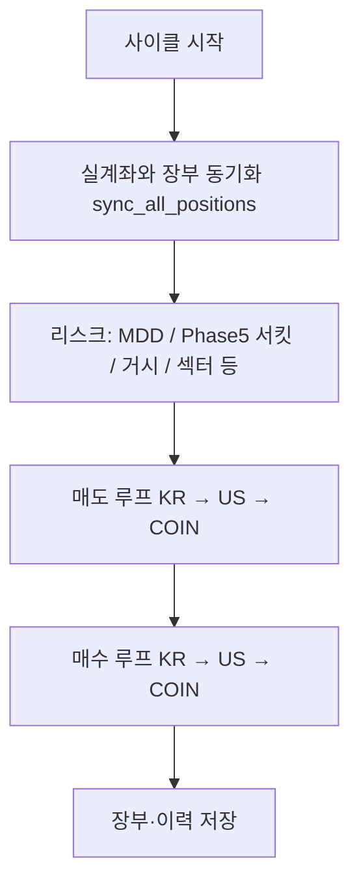

# c-bot — 국·미·코인 자동매매 봇

_문서 갱신: 2026-04-26 — 타임스탑·TWAP 청산 설계, GUI/텔레그램 현재가 공통화 등 최근 운영 변경을 반영했습니다._

---

## 목차

1. [이 프로젝트는 무엇인가요?](#1-이-프로젝트는-무엇인가요)
2. [처음 오셨나요? (준비물 체크)](#2-처음-오셨나요-준비물-체크)
3. [빠른 시작](#3-빠른-시작)
3-1. [GUI 사용 안내 (`run_gui.py`)](#gui-사용-안내)
4. [폴더 구조 한눈에 보기](#4-폴더-구조-한눈에-보기)
5. [한 사이클 안에서 일어나는 일](#5-한-사이클-안에서-일어나는-일)
6. [최상위 파일 설명](#6-최상위-파일-설명)
7. [데이터 파일과 Git](#7-데이터-파일과-git)
8. [전략: V8(추세)과 스윙](#8-전략-v8추세과-스윙)
9. [Phase 1~5가 의미하는 것](#9-phase-15가-의미하는-것)
10. [관측성: 로그를 읽는 법](#10-관측성-로그를-읽는-법)
11. [`config.json` 핵심 키](#11-configjson-핵심-키)
12. [트러블슈팅](#12-트러블슈팅)
13. [운영 팁 · 체크리스트](#13-운영-팁--체크리스트)
14. [`config.json` 예시 템플릿](#14-configjson-예시-템플릿)

---

## 1) 이 프로젝트는 무엇인가요?

**한국투자증권(KIS)** 로 국장·미장 주식을, **업비트** 로 원화 마켓 코인을, 정해진 규칙에 따라 **자동으로 매매**하는 프로그램입니다.

| 구분 | 설명 |
|------|------|
| **일상 운영** | `run_bot.bat` 또는 `py -3.11 run_gui.py` — **GUI 권장** |
| **개발·서버** | `py -3.11 run_bot.py` — 헤드리스(콘솔만), 선택 사항 |
| **엔진** | `run_bot.py` 안의 `run_trading_bot()` 이 한국·미국·코인 순으로 동기화 → 리스크 → 매도 → 매수를 처리합니다 |

코드는 크게 **전략(`strategy/`)**, **실행·장부(`execution/`)**, **브로커 API(`api/`)**, **GUI·조회 보조(`services/`, `utils/`)** 로 나뉩니다. 자세한 파일 단위 설명은 **`PROJECT_STRUCTURE.txt`** 에도 같은 맥락으로 적어 두었습니다.

---

## 2) 처음 오셨나요? (준비물 체크)

1. **Python 3.11** 권장 (`py -3.11` 명령이 동작하는지 확인).
2. **`requirements.txt`** 로 의존성 설치: `py -3.11 -m pip install -r requirements.txt`
3. **`.gitignore`에 있는 파일**은 저장소에 없을 수 있습니다. 특히 **`config.json`** 은 직접 만들고, API 키·계좌·텔레그램 값을 넣어야 합니다.
4. **`bot_state.json`**, **`trade_history.json`** 은 없으면 실행 중 생성되거나 비어 있는 상태에서 시작해도 됩니다.
5. **국장 후보 종목**은 스크리너가 **`kr_targets.json`** 을 만듭니다. 이 파일은 **매 스캔마다 바뀌므로 Git에 포함하지 않습니다** (`.gitignore`). 처음에는 비어 있으면 봇이 빈 목록으로 국장 매수 루프만 스킵할 수 있으니, 운영 전에 스크리너를 한 번 돌리거나 HTS 결과를 반영하세요.

---

## 3) 빠른 시작

### 실행

```bash
py -3.11 -m pip install -r requirements.txt
```

**GUI (권장)**

```bash
run_bot.bat
```

또는

```bash
py -3.11 run_gui.py
```

**헤드리스 (선택)**

```bash
py -3.11 run_bot.py
```

**Phase 5 고점 수동 보정(입·출금 후)**

```bash
py -3.11 adjust_capital.py
```

### 설정이 반영되지 않을 때

`config.json` 은 **프로세스가 시작될 때 한 번** 읽습니다. 값을 바꾼 뒤에는 **GUI/봇을 완전히 종료했다가 다시 실행**해야 합니다.

### 매매·알림 시계 (GUI = 헤드리스와 같은 매매 리듬)

- **매매 엔진:** 기동 직후 `do_trade()` 1회, 이후 KST **`:00` / `:15` / `:30` / `:45`** 분기마다 다음 사이클.
- **텔레그램 생존신고(heartbeat):** 기동 직후 1회, 이후 KST **`:00` / `:30`** (매매 주기와 별도). 보유 한 줄은 **매수가·현재가(수익률)·최고가·매도선·보유기간** 형식이며, 주말 미장은 `normalize_us_current_p_api_for_display` 로 장부 폴백 시에도 **yfinance 종가**를 쓰도록 GUI와 동일 전처리를 맞춥니다.

---

## GUI 사용 안내

일상 운영은 **`run_gui.py`** (또는 `run_bot.bat`) 로 켜는 **PyQt5 대시보드**가 기본입니다. 창 제목은 **「🚀 64비트 3콤보 트레이딩 대시보드 (완전체)」** 이고, 내부에서 **`import run_bot`** 을 하므로 **`config.json` 은 GUI를 켜는 순간 한 번만** 읽힙니다. 설정을 바꿨다면 **GUI를 껐다가 다시 실행**해야 합니다.

### 상단 영역

| 요소 | 설명 |
|------|------|
| **성적표 라벨** | `bot_state.json` 의 `stats`(승/패, 누적 수익률 합)와, 마지막으로 갱신된 **국·미·코인 보유 수익률**을 보여 줍니다. 약 **3초마다** 텍스트만 다시 그립니다. |
| **🇰🇷 🇺🇸 🪙 세 칸** | 시장별 **예수금·총평가·보유 수익률**. 숫자는 백그라운드 스레드(`BalanceUpdaterThread`)가 브로커·스냅샷 규칙에 맞춰 채웁니다. |
| **🔄 예수금 새로고침** | 일반 갱신: 장중/쿨다운 등 **정책을 지키며** KIS·업비트 조회. 조건이 안 맞으면 저장된 **`last_kis_display_snapshot`** 등으로 맞춥니다. |
| **🏦 KIS 강제 새로고침** | 장외·쿨다운 중에도 **KIS를 한 번 강제로** 호출해 국·미 숫자를 바로 확인할 때 사용합니다. (남용하면 증권사 쪽 부담·제한에 걸릴 수 있어, 자동 갱신에는 **최소 간격(약 25초)** 이 있습니다.) |
| **최대 종목 수 스핀박스** | 국장 / 미장 / 코인 각각 **동시에 들고 갈 수 있는 종목 수 상한**입니다. |
| **💾 설정 실시간 적용** | `run_bot` 모듈의 `MAX_POSITIONS_*` 값을 즉시 바꾸고, 같은 내용을 **`bot_state.json` 의 `settings`** (`max_pos_kr` / `max_pos_us` / `max_pos_coin`)에 저장합니다. **다음 매수 사이클부터** 반영됩니다. |

### 탭 구성 (위에서 아래 순)

1. **실시간 현황**  
   - 보유 종목 **테이블**: 시장, 종목명(코드), 수량, 매수단가, 현재가, 수익률, **수동 매도** 버튼.  
   - 수동 매도는 확인 창 후 `run_bot.manual_sell` 로 주문합니다.  
   - 아래 **검은 콘솔**은 `print` / 로그가 모이는 곳입니다. 같은 내용이 **`logs/bot.log`** 등 파일 로거로도 이어질 수 있습니다(`RedirectText`).  
   - 잔고 갱신 시 `build_account_snapshot_for_report`·`gui_table_adapter` 경로로 행이 만들어집니다.

2. **매매 내역**  
   - `trade_history.json` 을 읽어 **시간·시장·종목·매수/매도·수량·가격·수익률·사유** 를 표로 보여 줍니다.

3. **장부 (현재 포지션)**  
   - `bot_state.json` 의 `positions` 를 읽어 **매수가·손절가·최고가·수량·매수시간** 등을 표시합니다.  
   - 마지막 열 헤더는 **「전략」** 이지만, 현재 코드 기준으로는 장부의 **`tier`** 문자열이 들어갑니다(비어 있으면 공란). V8/스윙 구분(`strategy_type`)을 화면에 꼭 보이게 하려면 추후 컬럼 추가가 필요합니다.

4. **고점 보정 (입출금)**  
   - `adjust_capital.py` 와 **동일한 로직**을 백그라운드 스레드(`CapitalAdjustThread`)로 실행합니다.  
   - **입금 / 출금** 선택, 원화 금액 입력 후 **「실행 (스냅샷 갱신 → 고점 반영)」** → `peak_total_equity` 등 갱신·`capital_adjustments` 기록.

### 자동으로 도는 것들

| 동작 | 설명 |
|------|------|
| **매매 엔진** | 기동 **약 1초 후** `run_trading_bot()` **1회**, 이후 **KST `:00` / `:15` / `:30` / `:45`** 마다 다시 실행. 이미 한 사이클이 돌고 있으면 중복 호출은 건너뜁니다. |
| **매매 직전** | `do_trade()` 안에서 잔고 갱신(`refresh_balance`)으로 **최신 `max_p` 등**을 맞춘 뒤 `WorkerThread`에서 실제 `run_trading_bot()` 을 돌립니다. |
| **텔레그램 heartbeat** | 기동 직후 1회, 이후 **KST `:00` / `:30`** — UI 스레드를 막지 않도록 **별도 스레드**에서 `heartbeat_report()` 호출. |
| **스캐너 스케줄** | GUI가 `run_bot` 을 불러올 때 `start_scanner_scheduler()` 가 한 번 붙습니다(국·미 스캔 시각은 README 앞부분·`PROJECT_STRUCTURE.txt` 참고). |
| **네트워크 감시** | 일정 간격으로 외부망 연결을 검사하고, **연속 실패** 시 프로세스를 종료합니다. `run_bot.bat` 로 감싸 두었다면 **자동 재기동**에 맡기는 설계입니다. (끄려면 환경 변수 `BOT_DISABLE_NET_WATCH` 참고 — 코드 주석 확인.) |

### GUI에서 장부와 맞추는 가격

- 잔고 테이블을 그릴 때 확인한 **현재가**는 가능하면 장부 `positions[*].curr_p` 로 넘기고, **최고가 `max_p`** 도 시장이 열려 있을 때만 더 높으면 올립니다(`update_max_price_if_higher`). 자동매매 루프와 **같은 `bot_state.json`** 을 쓰므로, GUI를 켜 두면 **수동으로도 최고가 추적에 도움**이 될 수 있습니다.

---

## 4) 폴더 구조 한눈에 보기

```
c-bot/
├── run_bot.py          # 메인 매매 엔진
├── run_gui.py          # PyQt5 운영 GUI
├── screener.py         # 국장 HTS 조건검색 → kr_targets.json
├── us_screener.py      # 미장 유니버스 캐시 갱신
├── adjust_capital.py   # 입출금 시 Phase5 고점 보정
├── config.json         # (로컬 생성) API·설정 — Git 제외
├── bot_state.json      # (자동) 장부·쿨다운·Phase5 등 — Git 제외
├── trade_history.json  # (자동) 매매 이력 append — Git 제외
├── kr_targets.json     # (스캐너 생성) 국장 스캔 결과 — Git 제외
├── us_universe_cache.json  # 미장 감시 목록 캐시 — Git 제외
├── api/                # KIS·업비트·거시 데이터 래퍼
├── strategy/           # 진입·청산 규칙, 섹터·AI·거시 필터
├── execution/          # 동기화, TWAP, 분할익절, 서킷브레이커
├── services/           # 잔고 facade, 스냅샷, GUI 테이블 어댑터
├── utils/              # 로그, 텔레그램, 공통 헬퍼
├── tests/              # 실험·회귀 테스트
└── 조건검색/           # HTS 조건검색식 등(참고용 리소스)
```

---

## 5) 한 사이클 안에서 일어나는 일

아래는 **한 번의 `run_trading_bot()`** 이 개념적으로 하는 일입니다. (실제 코드는 `_prepare_cycle_state` → 동기화 → 컨텍스트 → 시장별 루프로 나뉘어 있습니다.)



**매도 쪽 주의:** 포지션마다 `strategy_type` 이 있습니다. **`SWING_FIB`** 이면 스윙 전용 청산만 타고, 그 외는 **V8 계열**(분할 익절·타임스탑·하드스탑·샹들리에 등)을 탑니다.

**매수 쪽:** 종목마다 **먼저 V8 신호**(`calculate_pro_signals`)를 보고, 실패 시 **스윙 보조**(`check_swing_entry`)를 봅니다.

---

## 6) 최상위 파일 설명

### `run_bot.py`

- **국장(KR) / 미장(US) / 코인(COIN)** 통합 엔진.
- 읽고 쓰는 대표 파일: `config.json`, `bot_state.json`, `trade_history.json`.
- **Phase 5** 합산 서킷용으로 브로커에서 가져온 국·미·코인 평가액을 **`circuit_aux_last_*`** 에 넣고, **`peak_total_equity` / `last_reset_week`** 로 **월요일(서울) 주차별 트레일링 MDD** 를 관리합니다.
- **관측성:** 예산·예수·TWAP·시장별 스킵은 `[KR …]`, `[US …]`, `[COIN …]` 등 태그 로그로 남깁니다. 모듈 상단 docstring에 grep용 태그 요약이 있습니다.

### `run_gui.py`

- PyQt5 GUI. `run_bot` 을 import 해서 **같은 엔진**을 돌립니다.
- 잔고 표시는 **`services/account_snapshot.py`** 와 동일 규칙으로 맞춥니다.
- **KIS 주말 점검** 구간에는 국·미 API를 덜 부르고, 저장된 **`last_kis_display_snapshot`** 과 장부 **`positions[*].qty`** 로 화면을 채웁니다.
- **버튼·탭·타이머** 등 화면 구성은 위 **[GUI 사용 안내](#gui-사용-안내)** 절을 보세요.

### `screener.py` / `us_screener.py`

- **국장:** HTS 조건검색 결과를 합쳐 **`kr_targets.json`** 에 기록 (로컬 전용, Git 무시).
- **미장:** 감시 유니버스를 **`us_universe_cache.json`** 에 캐시 (TTL·스케줄러 연동).
- 스케줄 등록은 `run_bot.start_scanner_scheduler` — 국장 **14:50 KST**, 미장 **15:20 US/Eastern** (매수 창 직전 갱신 목적).

### `adjust_capital.py`

- 예수금 입출금만으로 총자산이 바뀌면 Phase5 고점이 왜곡될 수 있어, **`peak_total_equity`** (및 미러 `peak_equity_total_krw`) 를 수동으로 맞출 때 사용합니다.
- 실행 시 **`refresh_circuit_aux_from_brokers`** 로 스냅샷을 맞춘 뒤 금액을 입력합니다.

### `config.json`

- 키·계좌·`test_mode`·TWAP·거시·AI 필터 등. **저장소에 올리지 마세요.**

### `bot_state.json` (장부)

| 키/영역 | 한 줄 설명 |
|---------|------------|
| `positions[티커]` | 매수가·손절·수량 `qty`·ATR·분할익절 여부 `scale_out_done`·**`strategy_type`**·**`entry_fib_level`** 등 |
| `cooldown` / `ticker_cooldowns` | 단기 쿨다운, 매도 후 **재진입 금지** 시각 |
| `peak_total_equity`, `last_reset_week` | Phase5 **월요일 앵커** 이후 이번 주 합산 고점·주차 라벨 |
| `circuit_aux_last_*` | 국·미·코인 합산용 최근 스냅샷 |
| `last_kis_display_snapshot` | 평일 마지막 성공한 KIS 라벨(주말 GUI/텔레용) |

---

## 7) 데이터 파일과 Git

| 파일 | 설명 | Git |
|------|------|-----|
| `config.json` | 비밀·환경 설정 | **제외** (`.gitignore`) |
| `bot_state.json` | 장부·상태 | **제외** |
| `trade_history.json` | 매매 로그 | **제외** |
| `us_universe_cache.json` | 미장 유니버스 캐시 | **제외** |
| `kr_targets.json` | 국장 스크리너 출력(자주 변함) | **제외** |
| `조건검색/` | HTS 식 등 참고 자료 | 선택적으로 커밋 |

새로 클론한 저장소에는 위 제외 파일이 없을 수 있으니, **로컬에서 생성**하거나 스크리너/봇을 한 번 실행해 채우면 됩니다.

---

## 8) 전략: V8(추세)과 스윙

### 진입 (매수)

1. **`calculate_pro_signals`** (V8 계열 추세·수급 스나이퍼)를 **먼저** 평가합니다. 스캔 로그에는 **`[V8]`** 접두사가 붙습니다.
2. V8이 실패하면 **`check_swing_entry`** (볼밴·RSI·피보나치 등)를 **추가로** 평가합니다. 실패 시 **`[스윙]`** 한 줄로 **왜 안 샀는지** 사유가 나옵니다.
3. V8으로 통과하면 **`[V8-BUY]`**, 스윙으로만 통과하면 **`[SWING-BUY]`** 와 `entry_fib_level` 이 로그에 찍힙니다.

### 청산 (매도)

- 장부 **`strategy_type`** 이 **`SWING_FIB`** 이면 먼저 **`check_swing_exit`** (`FULL` / `HALF` / `HOLD`)를 봅니다. **`HALF`·`FULL`** 이 나오면 스윙 규칙으로 부분·전량 매도 후 해당 사이클은 종료하고, **`HOLD`** 이면 그 아래 **분할 익절 → 타임스탑·하드스탑·샹들리에** 를 **같이** 탑니다 (스윙만 있다가 타임스탑에 걸리지 않도록 한 동작).
- 그 외(`TREND_V8` 또는 예전 장부)는 **V8 매도 루프**(분할 익절 → 타임스탑 → 하드스탑 → 샹들리에 순)를 탑니다.

#### 타임스탑 (보유 시간 `buy_date` 우선, 없으면 `buy_time`)

| 전략·시장 | 보유 기준 | 수익률 검사 | 유예(타임스탑 무효) |
|-----------|------------|-------------|---------------------|
| V8 주식 (KR·US) | **7일**(168h) | **+4% 미만**이면 전량 | **≥ +4%** |
| V8 코인 | **3일**(72h) | 동일 | **≥ +4%** |
| SWING 주식 (KR·US) | **10일**(240h) | **+2% 미만**이면 전량 | **≥ +2%** |
| SWING 코인 | **5일**(120h) | 동일 | **≥ +2%** |

매도 **`reason`**·로그에는 **`[V8_TIME_STOP_KR]`**, **`[V8_TIME_STOP_US]`**, **`[V8_TIME_STOP_COIN]`**, **`[SWING_TIME_STOP_KR]`** 등 태그가 붙습니다. `execution/guard.py` 의 **`ticker_cooldowns`** 도 이 문자열을 인식해 타임스탑 계열 쿨다운을 적용합니다.

#### TWAP(`twap_*`)과 전량 청산 (의도된 설계)

- **`config.json`의 `twap_*`** 로 **나눠 치는 것**은 **매수 TWAP**와 **분할 익절(Scale-Out) 매도**에 붙습니다 (`execution/order_twap.py`, `execution/scale_out.py`, `run_bot.py` 연동).
- **타임스탑·하드스탑·샹들리에로 나가는 전량 청산**은 시장가 **한 번에 전량 주문**(실패 시 재시도)입니다. 금액이 커도 이 경로에서는 **TWAP 분할을 쓰지 않습니다.**

---

## 9) Phase 1~5가 의미하는 것

코드·로그에서 **Phase N** 이라고 부르는 운영 레이어 묶음입니다. (`tests/test_lab.py` 에도 같은 이름의 실험 블록이 있습니다.)

| Phase | 역할 | 주요 위치 |
|-------|------|-----------|
| **1** | 같은 GICS **섹터** 과다 보유 방지 | `strategy/sector_lock.py` |
| **2** | **TWAP** 분할 매수·**분할 익절 매도**(전량 청산 타임스탑/하드스탑 경로는 단일 주문) | `execution/order_twap.py`, `execution/scale_out.py`, `run_bot.py` |
| **3** | **AI 휩쏘** 필터 | `strategy/ai_filter.py`, `config.json` 의 `ai_false_breakout_*` |
| **4** | **거시 방어막** (VIX·Fear&Greed 등) | `strategy/macro_guard.py`, `api/macro_data.py` |
| **5** | **합산 계좌 서킷** — 월요일(서울) **주차별 고점** 리셋 후 트레일링 MDD, 쿨다운 후 고점 1회 리셋 | `execution/circuit_break.py`, `execution/guard.py`, `run_bot`, `adjust_capital.py` |

**MDD(시장·종목 단위)** 와 **매도 후 재진입 `ticker_cooldowns`** 는 Phase 번호 없이 `execution/guard.py` 쪽과 연동됩니다.

---

## 10) 관측성: 로그를 읽는 법

- **시장별:** `[KR …]`, `[US …]`, `[COIN …]` — 예산·예수·정수주 0·TWAP 미체결·BEAR+ADX 스킵 등.
- **V8 스캔:** `🔍 [V8] [n/N] 종목 … ❌ 패스:` 또는 통과 시 `🔥 [V8] …`.
- **스윙 보조:** V8 실패 뒤 `🔍 [스윙] … ❌ 패스: 사유` 또는 `✅ [SWING-BUY] …`.
- **스냅샷/GUI:** `[snapshot …]`, 조회 폴백은 `📌` / `⚠️` 한 줄.
- **Phase5:** `[Phase5 서킷]` 등 (구체 문자열은 런타임 로그 참고).

---

## 11) `config.json` 핵심 키

### 브로커·알림

- `kis_key`, `kis_secret`, `kis_account`, `kis_hts_id`
- `upbit_access`, `upbit_secret`
- `telegram_token`, `telegram_chat_id`

### 안전

- `test_mode` — `true` 는 드라이런 성격, `false` 는 실주문.

### TWAP

- `twap_enabled`, `twap_krw_threshold`, `twap_usd_threshold`, `twap_slice_delay_sec`

### 시간·리스크

- `buy_window_minutes_before_close` — 장 마감 N분 전만 매수 허용.
- `account_circuit_enabled`, `account_circuit_mdd_pct` — 이번 주 **`peak_total_equity`** 대비 합산 하락률(%) 임계(기본 15). `(peak - current) / peak * 100 >= 임계` 시 발동.
- `account_circuit_cooldown_hours` — 쿨다운 후 **고점을 현재 총자산으로 1회 리셋**해 연쇄 발동을 줄임.

### 필터

- `ai_false_breakout_*`, `macro_guard_enabled`, `macro_*`

---

## 12) 트러블슈팅

### 설정을 바꿨는데 반영이 안 됨

프로세스를 **완전히 종료 후 재시작**하세요.

### `NameError: List is not defined`

현재 `run_bot.py` 는 `list[str]` 형태로 정리되어 있습니다. 구버전 브랜치와 혼동하지 마세요.

### Windows 콘솔에서 이모지 깨짐

`utils/logger.py` 에서 안전 출력 처리. 표시만 깨지고 파일 로그는 UTF-8 일 수 있습니다.

### 코인 먼지 잔고

`utils/helpers.py` 의 `COIN_MIN_POSITION_QTY` 이하는 실질 보유로 보지 않습니다.

### 분할 익절(Scale-Out)을 바꿀 때

- 로직·상수: `execution/scale_out.py`
- 호출·주문 순서: `run_bot.py` 매도 루프

---

## 13) 운영 팁 · 체크리스트

1. `test_mode: true` 로 먼저 하루 이상 관찰.
2. 이상 없으면 `false` 로 전환 후 재시작.
3. `kis_hts_id` 누락 시 국장 스크리너가 실패할 수 있음.
4. 텔레그램 `chat_id` 오타 시 알림 무반응.

**변경 후 점검**

- [ ] `config.json` JSON 문법
- [ ] 봇/GUI 완전 재기동
- [ ] 시작 로그 에러 없음
- [ ] 텔레그램 테스트 수신
- [ ] `test_mode` 의도와 실제 모드 일치
- [ ] `bot_state.json` 과 실계좌 대략 일치

---

## 14) `config.json` 예시 템플릿

민감정보는 실제 값으로 교체하세요.

```json
{
  "kis_key": "YOUR_KIS_APP_KEY",
  "kis_secret": "YOUR_KIS_APP_SECRET",
  "kis_account": "12345678-01",
  "kis_hts_id": "YOUR_HTS_ID",

  "upbit_access": "YOUR_UPBIT_ACCESS_KEY",
  "upbit_secret": "YOUR_UPBIT_SECRET_KEY",

  "telegram_token": "123456789:AA...",
  "telegram_chat_id": "123456789",

  "test_mode": true,

  "twap_enabled": true,
  "twap_krw_threshold": 5000000,
  "twap_usd_threshold": 5000,
  "twap_slice_delay_sec": 90,

  "buy_window_minutes_before_close": 30,

  "account_circuit_enabled": true,
  "account_circuit_mdd_pct": 15.0,
  "account_circuit_cooldown_hours": 24.0,

  "ai_false_breakout_enabled": true,
  "ai_false_breakout_threshold": 70,
  "ai_false_breakout_threshold_coin": 80,
  "ai_false_breakout_provider": "gemini",

  "macro_guard_enabled": true,
  "macro_vix_block_threshold": 25.0,
  "macro_fgi_reduce_threshold": 80,
  "macro_fgi_budget_multiplier": 0.5,
  "macro_vix_fallback": 22.0,
  "macro_fgi_fallback": 60
}
```

### 키별 상세 (요약)

- **`kis_*` / `upbit_*`:** 브로커 인증. 틀리면 토큰·주문 실패.
- **`telegram_*`:** 알림. `chat_id` 가 틀리면 전송 실패.
- **`test_mode`:** `true` 드라이런, `false` 실주문.
- **`twap_*`:** 주문 금액이 임계를 넘으면 분할, 슬라이스 간 `twap_slice_delay_sec` 초 대기.
- **`buy_window_minutes_before_close`:** 장 마감 N분 전만 신규 매수 허용.
- **`account_circuit_*`:** 합산 계좌 서킷 on/off, MDD 임계(%), 쿨다운 시간(시간).
- **`ai_false_breakout_*`:** 매수 직전 AI 휩쏘 게이트.
- **`macro_*`:** VIX/FGI 기반 예산 조절·차단.

---

## 더 읽을 곳

- **파일 단위 빠른 참조:** `PROJECT_STRUCTURE.txt`
- **추가 모듈화 로드맵:** `MODULARIZATION_ROADMAP_2026-04-22.md`
- **과거 모듈화 완료 요약:** `MODULARIZATION_REVIEW_2026-04-21.md`, `MODULARIZATION_NEXT_STEPS_2026-04-21.md`
