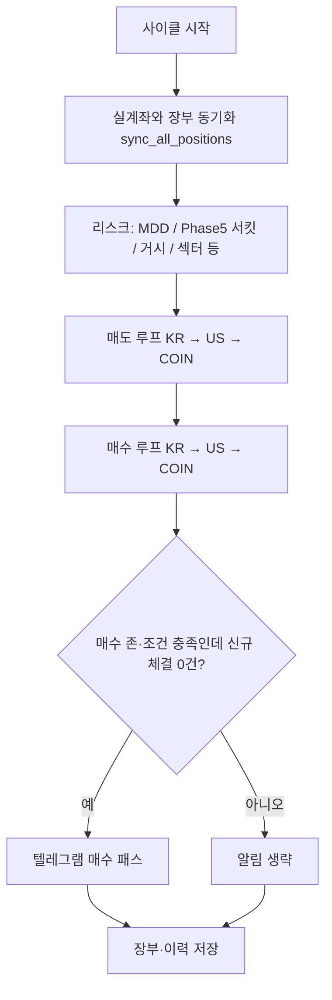

# c-bot — 국·미·코인 자동매매 봇

_문서 갱신: 2026-05-01 — 아래 내용은 저장소 코드(`run_bot.py`, `run_gui.py`, `execution/guard.py`, `execution/sync_positions.py` 등)와 맞춰 두었습니다._

---

## 목차

1. [이 프로젝트는 무엇인가요?](#1-이-프로젝트는-무엇인가요)
2. [처음 오셨나요? (준비물 체크)](#2-처음-오셨나요-준비물-체크)
3. [빠른 시작](#3-빠른-시작)
3-1. [GUI 사용 안내 (`run_gui.py`)](#gui-사용-안내)
4. [폴더 구조 한눈에 보기](#4-폴더-구조-한눈에-보기)
5. [한 사이클 안에서 일어나는 일](#5-한-사이클-안에서-일어나는-일)
6. [최상위 파일 설명](#6-최상위-파일-설명)
7. [데이터 파일과 Git](#7-데이터-파일과-git)
8. [전략: V8(추세)과 스윙](#8-전략-v8추세과-스윙)
9. [Phase 1~5가 의미하는 것](#9-phase-15가-의미하는-것)
10. [관측성: 로그를 읽는 법](#10-관측성-로그를-읽는-법)
11. [`config.json` 핵심 키](#11-configjson-핵심-키)
12. [트러블슈팅](#12-트러블슈팅)
13. [운영 팁 · 체크리스트](#13-운영-팁--체크리스트)
14. [`config.json` 예시 템플릿](#14-configjson-예시-템플릿)

---

## 1) 이 프로젝트는 무엇인가요?

**한국투자증권(KIS)** 로 국장·미장 주식을, 코인은 **`config.json`** 으로 **업비트(원화 마켓)** 또는 **바이낸스 현물(USDT 마켓, CCXT)** 중 하나를 고르고, 정해진 규칙에 따라 **자동으로 매매**하는 프로그램입니다.

| 구분 | 설명 |
|------|------|
| **일상 운영** | `run_bot.bat` 또는 `py -3.11 run_gui.py` — **GUI 권장** |
| **개발·서버** | `py -3.11 run_bot.py` — 헤드리스(콘솔만), 선택 사항 |
| **엔진** | `run_bot.py` 안의 `run_trading_bot()` 이 한국·미국·코인 순으로 동기화 → 리스크 → 매도 → 매수를 처리합니다 |

코드는 크게 **전략(`strategy/`)**, **실행·장부(`execution/`)**, **브로커 API(`api/`)**, **GUI·조회 보조(`services/`, `utils/`)** 로 나뉩니다. 자세한 파일 단위 설명은 **`PROJECT_STRUCTURE.txt`** 에도 같은 맥락으로 적어 두었습니다.

---

## 2) 처음 오셨나요? (준비물 체크)

1. **Python 3.11** 권장 (`py -3.11` 명령이 동작하는지 확인).
2. **`requirements.txt`** 로 의존성 설치: `py -3.11 -m pip install -r requirements.txt`
3. **`.gitignore`에 있는 파일**은 저장소에 없을 수 있습니다. 특히 **`config.json`** 은 직접 만들고, API 키·계좌·텔레그램 값을 넣어야 합니다.
4. **`bot_state.json`**, **`trade_history.json`** 은 없으면 실행 중 생성되거나 비어 있는 상태에서 시작해도 됩니다.
5. **국장 후보 종목**은 스크리너가 **`kr_targets.json`** 을 만듭니다. 이 파일은 **매 스캔마다 바뀌므로 Git에 포함하지 않습니다** (`.gitignore`). 처음에는 비어 있으면 봇이 빈 목록으로 국장 매수 루프만 스킵할 수 있으니, 운영 전에 스크리너를 한 번 돌리거나 HTS 결과를 반영하세요.

---

## 3) 빠른 시작

### 실행

```bash
py -3.11 -m pip install -r requirements.txt
```

**GUI (권장)**

```bash
run_bot.bat
```

또는

```bash
py -3.11 run_gui.py
```

**헤드리스 (선택)**

```bash
py -3.11 run_bot.py
```

**Phase 5 고점 수동 보정(입·출금 후)**

```bash
py -3.11 adjust_capital.py
```

### 설정이 반영되지 않을 때

`config.json` 은 **프로세스가 시작될 때 한 번** 읽습니다. 값을 바꾼 뒤에는 **GUI/봇을 완전히 종료했다가 다시 실행**해야 합니다.

### 매매·알림 시계

- **매매 엔진:** **GUI**는 기동 직후 즉시 실행 없이, KST **`:00` / `:15` / `:30` / `:45`** 분기 스케줄에서만 `run_trading_bot()` 을 돌립니다. **`run_bot.py` 헤드리스**는 시작 시 **`run_trading_bot()` 1회**를 먼저 돌린 뒤, 같은 KST 분 슬롯에 이어서 스케줄합니다.
- **텔레그램 생존신고(heartbeat):** **GUI**는 **기동 직후 발송 없음**. 다음 **KST `:00` / `:30`** 벽시계에 맞춰 첫 전송 후, 같은 간격으로 반복합니다(매매 15분 주기와 별도). **`run_bot.py` 단독(헤드리스)** 은 프로세스 시작 시 **`heartbeat_report()` 1회**를 보낸 뒤, **`schedule.every(4).hours`** 로 이어집니다(벽시계 `:00/:30` 정렬은 GUI 전용). 보유 한 줄은 **매수가·현재가(수익률)·최고가·매도선·보유기간** 형식이며, 주말 미장은 `normalize_us_current_p_api_for_display` 로 장부 폴백 시에도 **yfinance 종가**를 쓰도록 GUI와 동일 전처리를 맞춥니다. **코인** 보유 한 줄의 가격은 바이낸스 **USDT** 단위. 요약 줄의 **예수·총평**(바이낸스)은 ``coin_broker.binance_display_cash_and_total_usdt()`` 로 **가용 USDT + 코인 명목**을 직접 합산한다(KRW 왕복 없음). 업비트 요약은 **원**. 서킷·Phase5용 스냅샷은 여전히 원화 환산. 코인 TWAP 체결 알림도 같은 단위 규칙을 따른다.

---

## GUI 사용 안내

일상 운영은 **`run_gui.py`** (또는 `run_bot.bat`) 로 켜는 **PyQt5 대시보드**가 기본입니다. 창 제목은 **「🚀 64비트 3콤보 트레이딩 대시보드 (완전체)」** 이고, 내부에서 **`import run_bot`** 을 하므로 **`config.json` 은 GUI를 켜는 순간 한 번만** 읽힙니다. 설정을 바꿨다면 **GUI를 껐다가 다시 실행**해야 합니다.

### 상단 영역

| 요소 | 설명 |
|------|------|
| **성적표 라벨** | `bot_state.stats` 의 **승/패·누적 수익률 합**(전량 청산 기준)·마지막 보유 ROI. 수동 부분 매도 분(`manual_partial_total_profit_pct`)은 **JSON에는 누적**되지만 성적표 한 줄에는 아직 표시하지 않습니다. 약 **3초마다** 갱신합니다. |
| **🇰🇷 🇺🇸 🪙 세 칸** | 시장별 **예수금·총평가·보유 수익률**. 숫자는 백그라운드 스레드(`BalanceUpdaterThread`)가 브로커·스냅샷 규칙에 맞춰 채웁니다. **코인 칸:** 업비트는 **원(KRW)**. 바이낸스는 상단 **가용·총평**을 ``coin_broker.binance_display_cash_and_total_usdt()`` 로 **거래소 USDT·시세 직접 합산**(KRW 왕복 없음). 스냅샷·Phase5·서킷용 내부 수치는 여전히 **원화 환산**입니다. |
| **🔄 예수금 새로고침** | 일반 갱신: 장중/쿨다운 등 **정책을 지키며** KIS·**설정된 코인 거래소**(업비트/바이낸스) 조회. 조건이 안 맞으면 저장된 **`last_kis_display_snapshot`** 등으로 맞춥니다. |
| **🏦 KIS 강제 새로고침** | 장외·쿨다운 중에도 **KIS를 한 번 강제로** 호출해 국·미 숫자를 바로 확인할 때 사용합니다. (남용하면 증권사 쪽 부담·제한에 걸릴 수 있어, 자동 갱신에는 **최소 간격(약 25초)** 이 있습니다.) |
| **최대 종목 수 스핀박스** | 국장 / 미장 / 코인 각각 **동시에 들고 갈 수 있는 종목 수 상한**입니다. |
| **💾 설정 실시간 적용** | `run_bot` 모듈의 `MAX_POSITIONS_*` 값을 즉시 바꾸고, 같은 내용을 **`bot_state.json` 의 `settings`** (`max_pos_kr` / `max_pos_us` / `max_pos_coin`)에 저장합니다. **다음 매수 사이클부터** 반영됩니다. |

### 탭·로그 레이아웃

- **위쪽:** `QTabWidget` — **실시간 현황**(보유표·수동 매도), **매매 내역**, **장부**, **고점 보정** 등 탭만 전환됩니다.  
- **아래쪽:** **실시간 작동 로그(봇 브리핑)** 는 탭 **밖**에 두어, 탭을 바꿔도 **항상 같은 자리**에 보입니다. 세로 **`QSplitter`** 로 위·아래 높이를 드래그해 조절합니다(초기 비율은 `run_gui.py` 의 `setSizes` 참고).  
- 기동 시 **매매 루프는 돌리지 않되**, 약 **0.15초 후** `refresh_balance(sync_first=False)` 를 한 번 호출해 표·라벨을 가능한 빨리 채웁니다(스냅샷 폴백 포함).

1. **실시간 현황** 탭  
   - 보유 종목 **테이블**: 시장, 종목명(코드), 수량, 매수단가, 현재가, 수익률, **매도수량 입력 + 매도** (기본값은 해당 행 보유 전량; 칸을 비우면 전량 매도).  
   - 확인 창 후 `run_bot.manual_sell` 로 주문합니다. 국·미장은 정수 주, 코인은 소수 수량 입력 가능합니다.  
   - 잔고 갱신 시 `build_account_snapshot_for_report`·`gui_table_adapter` 경로로 행이 만들어집니다. **바이낸스**일 때 코인 행의 매수가·현재가는 **USDT** 단위로 표시합니다(업비트는 **원**).  

2. **매매 내역**  
   - `trade_history.json` 을 읽어 **시간·시장·종목·매수/매도·수량·가격·수익률·사유** 를 표로 보여 줍니다.

3. **장부 (현재 포지션)**  
   - `bot_state.json` 의 `positions` 를 읽어 **매수가·손절가·최고가·수량·매수시간** 등을 표시합니다. 코인이 **바이낸스(USDT 마켓)** 이면 해당 가격 열은 **USDT** 로 보여 줍니다(업비트 코인은 **원**).  
   - 마지막 열 헤더는 **「전략」** 이지만, 현재 코드 기준으로는 장부의 **`tier`** 문자열이 들어갑니다(비어 있으면 공란). V8/스윙 구분(`strategy_type`)을 화면에 꼭 보이게 하려면 추후 컬럼 추가가 필요합니다.

4. **고점 보정 (입출금)**  
   - `adjust_capital.py` 와 **동일한 로직**을 백그라운드 스레드(`CapitalAdjustThread`)로 실행합니다.  
   - **입금 / 출금** 선택, 원화 금액 입력 후 **「실행 (스냅샷 갱신 → 고점 반영)」** → `peak_total_equity` 등 갱신·`capital_adjustments` 기록.

### 자동으로 도는 것들

| 동작 | 설명 |
|------|------|
| **매매 엔진** | 기동 직후 즉시 실행 없이, **KST `:00` / `:15` / `:30` / `:45`** 마다 `run_trading_bot()` 실행. 이미 한 사이클이 돌고 있으면 중복 호출은 건너뜁니다. |
| **매매 직전** | `do_trade()` 안에서 잔고 갱신(`refresh_balance`)으로 **최신 `max_p` 등**을 맞춘 뒤 `WorkerThread`에서 실제 `run_trading_bot()` 을 돌립니다. |
| **텔레그램 heartbeat** | **기동 직후 전송 없음.** 다음 **KST `:00` / `:30`** 에 맞춰 전송·재스케줄 — UI 스레드를 막지 않도록 **별도 스레드**에서 `heartbeat_report()` 호출. |
| **스캐너 스케줄** | GUI가 `run_bot` 을 불러올 때 `start_scanner_scheduler()` 가 한 번 붙습니다(국·미 스캔 시각은 README 앞부분·`PROJECT_STRUCTURE.txt` 참고). |
| **네트워크 감시** | 일정 간격으로 외부망 연결을 검사하고, **연속 실패** 시 프로세스를 종료합니다. `run_bot.bat` 로 감싸 두었다면 **자동 재기동**에 맡기는 설계입니다. (끄려면 환경 변수 `BOT_DISABLE_NET_WATCH` 참고 — 코드 주석 확인.) |

### GUI에서 장부와 맞추는 가격

- 잔고 테이블을 그릴 때 확인한 **현재가**는 가능하면 장부 `positions[*].curr_p` 로 넘기고, **최고가 `max_p`** 도 시장이 열려 있을 때만 더 높으면 올립니다(`update_max_price_if_higher`). 자동매매 루프와 **같은 `bot_state.json`** 을 쓰므로, GUI를 켜 두면 **수동으로도 최고가 추적에 도움**이 될 수 있습니다.

---

## 4) 폴더 구조 한눈에 보기

```
c-bot/
├── run_bot.py          # 메인 매매 엔진
├── run_gui.py          # PyQt5 운영 GUI
├── screener.py         # 국장 HTS 조건검색 → kr_targets.json
├── us_screener.py      # 미장 유니버스 캐시 갱신
├── adjust_capital.py   # 입출금 시 Phase5 고점 보정
├── config.json         # (로컬 생성) API·설정 — Git 제외
├── bot_state.json      # (자동) 장부·쿨다운·Phase5 등 — Git 제외
├── trade_history.json  # (자동) 매매 이력 append — Git 제외
├── kr_targets.json     # (스캐너 생성) 국장 스캔 결과 — Git 제외
├── us_universe_cache.json  # 미장 감시 목록 캐시 — Git 제외
├── api/                # KIS·업비트·거시 데이터 래퍼
├── strategy/           # 진입·청산 규칙, 섹터·AI·거시 필터
├── execution/          # 동기화, TWAP, 분할익절, 서킷브레이커
├── services/           # 잔고 facade, 스냅샷, GUI 테이블 어댑터
├── utils/              # 로그, 텔레그램, 공통 헬퍼
├── tests/              # 실험·회귀 테스트
└── 조건검색/           # HTS 조건검색식 등(참고용 리소스)
```

---

## 5) 한 사이클 안에서 일어나는 일

아래는 **한 번의 `run_trading_bot()`** 이 개념적으로 하는 일입니다. (실제 코드는 `_prepare_cycle_state` → 동기화 → 컨텍스트 → 시장별 루프로 나뉘어 있습니다.)



**동기화:** 국·미 **정규장이 아닐 때는 KIS로 보유 티커 목록을 새로 조회하지 않습니다**(`fetch_equity_held_lists_for_position_sync`). 코인 보유 조회와 장부 동기화는 매 사이클 계속합니다. 비장중에 KIS가 빈 보유를 주어도 장부 국·미 줄이 유령 삭제되지 않도록 `sync_all_positions` 에서 `held` 보강 등을 합니다.

**매도 쪽 주의:** 포지션마다 `strategy_type` 이 있습니다. **`SWING_FIB`** 이면 스윙 전용 청산만 타고, 그 외는 **V8 계열**(분할 익절·타임스탑·하드스탑·샹들리에 등)을 탑니다.

**매수 쪽:** 종목마다 **먼저 V8 신호**(`calculate_pro_signals`)를 보고, 실패 시 **스윙 보조**(`check_swing_entry`)를 봅니다. **코인(업비트·바이낸스 공통)** 도 동일한 **일봉 직전 KST 창** 안에서만 매수 판단하며, 진입 순서도 국·미와 같습니다.

**텔레그램(운영 알림):** **어느 한쪽이라도** “매수 시간창·게이트까지 진입”했는데 **신규 매수 TWAP 성공이 한 건도 없으면**, 사이클 종료 시 `📭 [매수 패스] …` 한 통을 보냅니다. 본문 앞부분은 **이번에 매수 존에 들어간 시장만** `KR` / `US` / `COIN` 으로 찍습니다(예: 국장만이면 `KR 매수 가능 시간·…`, 둘 이상이면 `KR·US …`). `utils/telegram.py`의 일반 텍스트 `sendMessage`. 세 시장 모두 매수창 밖이면 보내지 않습니다.

---

## 6) 최상위 파일 설명

### `run_bot.py`

- **국장(KR) / 미장(US) / 코인(COIN)** 통합 엔진.
- 읽고 쓰는 대표 파일: `config.json`, `bot_state.json`, `trade_history.json`.
- **Phase 5** 합산 서킷용으로 브로커에서 가져온 국·미·코인 평가액을 **`circuit_aux_last_*`** 에 넣고, **`peak_total_equity` / `last_reset_week`** 로 **월요일(서울) 주차별 트레일링 MDD** 를 관리합니다. 고점은 **`peak_total_equity` 단일 키**가 소스이며, 옛 **`peak_equity_total_krw`** 가 남아 있으면 `execution/guard.py` 의 `load_state()` 에서 **한 번 이관 후 삭제**합니다.
- US 스냅샷(`services/account_snapshot.py`)은 미장 예수금/총평가가 간헐적으로 튈 때 직전 `last_kis_display_snapshot.us`로 폴백해 텔레그램/GUI 표시를 안정화합니다.
- KR/US 잔고 정책(GUI 스냅샷 등): **장중에만 KIS 실조회**, **장외(휴장/점검)에는 `last_kis_display_snapshot` 고정값 사용**. 코인은 기존대로 실조회합니다.  
- **`_sync_positions_for_cycle` / `fetch_equity_held_lists_for_position_sync`:** 동기화 시 국·미가 **정규장이 아니면 KIS 보유 목록 API를 호출하지 않고** 빈 리스트로 넘깁니다. **`sync_all_positions`** 안에서 비장중·빈 보유 대비 **장부 키로 `held` 보강** 등으로 유령 일괄 삭제를 막습니다. 시장이 **False** 인 경우 **KIS 시드·평단 보정·유령 삭제·주식 자동복구** 루프는 실행하지 않습니다(코인 동기화는 계속). 주식 **자동복구**로 새 행을 넣을 때 **`buy_date`** 는 가능하면 **`trade_history.json`** 에서 해당 티커·시장의 **가장 최근 `BUY`의 `timestamp`** 를 씁니다(없을 때만 복구 시각).
- **매수 패스 텔레그램:** 위 [한 사이클](#5-한-사이클-안에서-일어나는-일) 참고.
- **매도 후 Layer2:** 전량 청산 시 `set_ticker_cooldown_after_sell`(전략·시장·사유 매트릭스). 수동 매도는 `_apply_manual_sell_state_update`·`_run_manual_sell_position_sync` 경로.
- **관측성:** 예산·예수·TWAP·시장별 스킵은 `[KR …]`, `[US …]`, `[COIN …]` 등 태그 로그로 남깁니다. 모듈 상단 docstring에 grep용 태그 요약이 있습니다.

### `run_gui.py`

- PyQt5 GUI. `run_bot` 을 import 해서 **같은 엔진**을 돌립니다.
- 국·미·코인 ROI 등은 스냅샷과 맞추고, **바이낸스** 상단 코인 **가용·총평** 숫자는 ``binance_display_cash_and_total_usdt()``(API USDT 직접). 보유표·장부의 코인 **단가**는 USDT 표기. 내부 서킷·Phase5는 **원화 환산** 유지.
- **KIS 주말 점검** 구간에는 국·미 API를 덜 부르고, 저장된 **`last_kis_display_snapshot`** 과 장부 **`positions[*].qty`** 로 화면을 채웁니다.
- **수동 매도 UI:** 보유 행마다 **수량 `QLineEdit`(기본=해당 행 보유 전량) + 매도 버튼**. 빈 칸은 전량, 국·미는 정수 주, 코인은 소수 입력. `_on_manual_sell_click` 에서 보유 초과·형식 검증.
- **버튼·탭·타이머** 등 화면 구성은 위 **[GUI 사용 안내](#gui-사용-안내)** 절을 보세요.

### `screener.py` / `us_screener.py`

- **국장:** HTS 조건검색 결과를 합쳐 **`kr_targets.json`** 에 기록 (로컬 전용, Git 무시).
- **미장:** 감시 유니버스를 **`us_universe_cache.json`** 에 캐시 (TTL·스케줄러 연동).
- 스케줄 등록은 `run_bot.start_scanner_scheduler` — 국장 **14:50 KST**, 미장 **15:20 US/Eastern** (매수 창 직전 갱신 목적).

### `adjust_capital.py`

- 예수금 입출금만으로 총자산이 바뀌면 Phase5 고점이 왜곡될 수 있어, **`peak_total_equity`** 를 수동으로 맞출 때 사용합니다.
- 실행 시 **`refresh_circuit_aux_from_brokers`** 로 스냅샷을 맞춘 뒤 금액을 입력합니다.

### `config.json`

- 키·계좌·`test_mode`·TWAP·거시·AI 필터 등. **저장소에 올리지 마세요.**

### `bot_state.json` (장부)

| 키/영역 | 한 줄 설명 |
|---------|------------|
| `positions[티커]` | 매수가·손절·수량 `qty`·ATR·분할익절 여부 `scale_out_done`·**`strategy_type`**·**`entry_fib_level`** 등 |
| `stats` | `wins` / `losses` / `total_profit` 은 **전량 청산**(자동·수동) 시만 반영. 수동 **부분** 매도 실현분은 **`manual_partial_total_profit_pct`** 에만 가중 누적 |
| `cooldown` / `ticker_cooldowns` | 단기 쿨다운, 매도 후 **재진입 금지** 시각 |
| `peak_total_equity`, `last_reset_week` | Phase5 **월요일 앵커** 이후 이번 주 합산 고점·주차 라벨(고점은 **`peak_total_equity`만** 표준; 레거시 키는 로드 시 정리) |
| `circuit_aux_last_*` | 국·미·코인 합산용 최근 스냅샷 |
| `last_kis_display_snapshot` | 평일 마지막 성공한 KIS 라벨(주말 GUI/텔레용) |
| `last_coin_display_snapshot` | 마지막 성공한 **코인 라벨**(예수·총평·ROI; 업비트=원, 바이낸스=원화환산 정수) — 잔고 API 실패 시 GUI/텔레 상단 폴백. 이때 `labels["coin"].display_fallback` 이 켜지고, **바이낸스**는 라이브 USDT가 0이어도 직전 숫자를 덮어쓰지 않음. 보유 **행**은 장부·실조회 |

### 장부 `positions` 키의 `KRW-` / `USDT-`는 “원화 잔고”가 아닙니다

- 업비트를 쓸 때 코인 포지션은 티커 키가 **`KRW-BTC`**, **`KRW-XRP`** 처럼 보입니다. 여기서 **`KRW`는 “지금 장부에 원화만 따로 적혀 있다”는 뜻이 아니라**, 업비트 API가 쓰는 **마켓 이름(원화로 거래하는 코인 시장)** 을 그대로 옮긴 **종목 식별자(접두사)** 입니다. 매수가·손절가 등 숫자는 그 안의 필드(`buy_p`, `sl_p` …)에 들어 있고, 단위는 해당 마켓이 **원화(KRW)** 일 때 **원**입니다.
- 바이낸스 현물(USDT)을 선택하면 같은 역할의 키가 **`USDT-BTC`**, **`USDT-ETH`** 처럼 **`USDT-` 접두사**로 저장될 수 있습니다. 이때 가격·평단 필드는 **USDT** 기준으로 쓰이고, **합산 평가액·Phase5용 코인 스냅샷** 등은 봇이 **`krw_per_usdt`(또는 자동 추정 환율)** 으로 **원화로 환산**해 기존과 맞춥니다. **GUI**에서는 금액·단가를 **USDT** 로 읽기 쉽게 보여 줄 뿐이며, 그 숫자를 다시 환산해 합산 로직을 바꾸지는 않습니다.
- **거래소만 바꾸고 장부를 그대로 두면** `KRW-` 키로 남아 있는 기록이 **새 거래소 잔고와 안 맞을 수** 있으니, 업비트↔바이낸스 전환 시에는 **실계좌·`positions`를 같이 정리**하는 것이 안전합니다.

---

## 7) 데이터 파일과 Git

| 파일 | 설명 | Git |
|------|------|-----|
| `config.json` | 비밀·환경 설정 | **제외** (`.gitignore`) |
| `bot_state.json` | 장부·상태 | **제외** |
| `trade_history.json` | 매매 로그 | **제외** |
| `us_universe_cache.json` | 미장 유니버스 캐시 | **제외** |
| `kr_targets.json` | 국장 스크리너 출력(자주 변함) | **제외** |
| `조건검색/` | HTS 식 등 참고 자료 | 선택적으로 커밋 |

새로 클론한 저장소에는 위 제외 파일이 없을 수 있으니, **로컬에서 생성**하거나 스크리너/봇을 한 번 실행해 채우면 됩니다.

---

## 8) 전략: V8(추세)과 스윙

### 진입 (매수)

1. **`calculate_pro_signals`** (V8 계열 추세·수급 스나이퍼)를 **먼저** 평가합니다. 스캔 로그에는 **`[V8]`** 접두사가 붙습니다.
2. V8이 실패하면 **`check_swing_entry`** (볼밴·RSI·피보나치 등)를 **추가로** 평가합니다. 실패 시 **`[스윙]`** 한 줄로 **왜 안 샀는지** 사유가 나옵니다.
3. V8으로 통과하면 **`[V8-BUY]`**, 스윙으로만 통과하면 **`[SWING-BUY]`** 와 `entry_fib_level` 이 로그에 찍힙니다.

#### 포지션 사이징 (Position Sizing)

- 국장·미장·코인은 모두 **“프랍 데스크 스타일 1/N 모델”** 로 비중을 잡습니다.
  - 국장: `base_ratio = 1 / MAX_POSITIONS_KR`
  - 미장: `base_ratio = 1 / MAX_POSITIONS_US`
  - 코인: `base_ratio = 1 / MAX_POSITIONS_COIN`
- **개별 종목·티어·날씨로 비중을 키우는 로직(0.4·0.6 등 가산)은 없습니다.**  
  과거 ADX·불장에 따라 비중을 키우던 분기와 `max_allowed_ratio` 캡은 제거되었습니다.
- 최종 배정 예산은 시장별로 모두 동일한 공식으로 계산합니다.

```python
ratio = base_ratio                   # 1 / MAX_POSITIONS_*
target_budget = total_equity * ratio * macro_mult
```

- 거시 방어막(`macro_mult`)이 0.0/0.5/1.0 등으로 변하면 **시장 전체 비중만** 줄거나 유지됩니다.
- 예수금이 부족하면 기존처럼 **“영끌”** 로 조정합니다.

```python
if cash < target_budget:
    target_budget = cash
```

- 시장별 최소 주문 금액(국장 5만 원 / 미장 50달러 / 코인 5천 원 상당) 미만이면 주문을 내지 않고 **“예산 부족/예수금 부족”** 로그만 남깁니다.

### 청산 (매도)

- 장부 **`strategy_type`** 이 **`SWING_FIB`** 이면 먼저 **`check_swing_exit`** (`FULL` / `HALF` / `HOLD`)를 봅니다. **`HALF`·`FULL`** 이 나오면 스윙 규칙으로 부분·전량 매도 후 해당 사이클은 종료하고, **`HOLD`** 이면 그 아래 **분할 익절 → 타임스탑·하드스탑·샹들리에** 를 **같이** 탑니다 (스윙만 있다가 타임스탑에 걸리지 않도록 한 동작).
- 그 외(`TREND_V8` 또는 예전 장부)는 **V8 매도 루프**(분할 익절 → 타임스탑 → 하드스탑 → 샹들리에 순)를 탑니다.

#### 타임스탑 (보유 시간 `buy_date` 우선, 없으면 `buy_time`)

| 전략·시장 | 보유 기준 | 수익률 검사 | 유예(타임스탑 무효) |
|-----------|------------|-------------|---------------------|
| V8 주식 (KR·US) | **10일**(240h) | **+4% 미만**이면 전량 | **≥ +4%** |
| V8 코인 | **3일**(72h) | 동일 | **≥ +4%** |
| SWING 주식 (KR·US) | **14일**(336h) | **+2% 미만**이면 전량 | **≥ +2%** |
| SWING 코인 | **5일**(120h) | 동일 | **≥ +2%** |

주식은 **영업일이 아니라 `buy_date`/`buy_time` 기준 경과 시간(연속 시각)** 으로만 판단합니다. “약 N영업일”은 **의도 설명**이며, 실제 상수는 `run_bot.py` 의 `V8_TIME_STOP_HOURS_*` / `SWING_TIME_STOP_HOURS_*` 와 동일합니다.

매도 **`reason`**·로그에는 **`[V8_TIME_STOP_KR]`**, **`[V8_TIME_STOP_US]`**, **`[V8_TIME_STOP_COIN]`**, **`[SWING_TIME_STOP_KR]`** 등 태그가 붙습니다.

#### Layer 2: `ticker_cooldowns` (매도 후 재매수 금지, 시간 단위)

전량 청산 시에만 장부 **`strategy_type`** (`TREND_V8` / `SWING_FIB`), 시장 (**KR** / **US** / **COIN**), 매도 **`reason`**·**`profit_rate`** 로 **손절·타임스탑 vs 정상 익절** 을 나눠 시간을 적용합니다. **분할 익절 후 잔여 수량이 있으면** (`remaining_qty > 0`) 쿨다운을 **부여하지 않습니다**.

| 전략 | 구분 | KR·US | COIN |
|------|------|-------|------|
| **TREND_V8** | 정상 익절 등 | 72h (3일) | 24h (1일) |
| **TREND_V8** | 손절·타임스탑 | **240h (10일)** — 주식 타임스탑과 동일 스케일 | 72h (3일) |
| **SWING_FIB** | 정상 익절 등 | 480h (20일) | 168h (7일) |
| **SWING_FIB** | 손절·타임스탑·지하실/좀비화 등 | 720h (30일) | 240h (10일) |

구현·로그: `execution/guard.py` 의 `compute_ticker_cooldown_hours` / `set_ticker_cooldown_after_sell`, 매도 루프는 `run_bot.py` (전량 청산 직전 `strategy_type`·시장·`profit_rate` 전달). 발동 시 `[쿨다운 적용] …`, 분할 익절 잔량 시 `[쿨다운 패스] …`.

**건드리지 않는 레이어:** 같은 파일의 Layer1 공용 매수 후 `cooldown`(분 단위), Phase5 계좌 서킷, 신규 매수 후 **15분** 매도 보호 등은 기존대로 유지합니다.

#### 수동 매도 (`run_bot.manual_sell`)

| 항목 | 동작 |
|------|------|
| **호출 경로** | GUI **매도수량 입력 + 매도** 또는 코드에서 `manual_sell(market, code, quantity)` |
| **부분 vs 전량** | 장부 `positions[*].qty` 와 주문 수량 비교. 부분이면 `execution/scale_out.post_partial_ledger`(수동 경로는 `set_scale_out_done=False` 로 자동 분할익절 플래그와 충돌 없음) |
| **통계** | **전량 청산** 시에만 `wins`·`losses`·`total_profit` 반영. **부분**만 `stats.manual_partial_total_profit_pct` 에 가중 누적 |
| **Layer2 쿨다운** | **전량**만 `ticker_cooldowns` 적용; 부분 매도 후 잔량 있으면 미부여 |
| **동기화** | 체결 반영 후 국·미·코인 실보유 조회가 **모두 성공**할 때만 `sync_all_positions` 로 재동기화(실패 시 다음 자동 사이클에 위임) |

#### TWAP(`twap_*`)과 전량 청산 (의도된 설계)

- **`config.json`의 `twap_*`** 로 **나눠 치는 것**은 **매수 TWAP**와 **분할 익절(Scale-Out) 매도**에 붙습니다 (`execution/order_twap.py`, `execution/scale_out.py`, `run_bot.py` 연동).
- **타임스탑·하드스탑·샹들리에로 나가는 전량 청산**은 시장가 **한 번에 전량 주문**(실패 시 재시도)입니다. 금액이 커도 이 경로에서는 **TWAP 분할을 쓰지 않습니다.**

---

## 9) Phase 1~5가 의미하는 것

코드·로그에서 **Phase N** 이라고 부르는 운영 레이어 묶음입니다. (`tests/test_lab.py` 에도 같은 이름의 실험 블록이 있습니다.)

| Phase | 역할 | 주요 위치 |
|-------|------|-----------|
| **1** | 같은 GICS **섹터** 과다 보유 방지 | `strategy/sector_lock.py` |
| **2** | **TWAP** 분할 매수·**분할 익절 매도**(전량 청산 타임스탑/하드스탑 경로는 단일 주문) | `execution/order_twap.py`, `execution/scale_out.py`, `run_bot.py` |
| **3** | **AI 휩쏘** 필터 | `strategy/ai_filter.py`, `config.json` 의 `ai_false_breakout_*` |
| **4** | **거시 방어막** (VIX·Fear&Greed 등) | `strategy/macro_guard.py`, `api/macro_data.py` |
| **5** | **합산 계좌 서킷** — 월요일(서울) **주차별 고점** 리셋 후 트레일링 MDD, 쿨다운 후 고점 1회 리셋 | `execution/circuit_break.py`, `execution/guard.py`, `run_bot`, `adjust_capital.py` |

**Phase 3 — LLM 점수 루브릭 (`_FALSE_BREAKOUT_SCORE_RUBRIC`):** Gemini/OpenAI 프롬프트에 주입되는 **0~100 위험도 절대 기준**이다. 숫자가 클수록 위험하며, 봇의 매수 차단 임계와 맞추기 위해 다음 구간 정의를 따른다.

| 구간 | 의미 (요약) |
|------|-------------|
| **0~30** | 안전 — 진짜 돌파 또는 찐 바닥 다지기 등 |
| **31~69** | 보통 — 노이즈·약한 윗꼬리 있으나 추세 유지 → 기본 설정에서 **통과 구간** |
| **70~79** | 경고 — 휩소 징후 뚜렷 → **국장·미장** 기본 임계(70)에서 매수 차단 |
| **80~100** | 치명 — 펌프·설거지·칼날 등 → **코인** 기본 임계(80)에서도 차단 |

매수 게이트: `false_breakout_prob >= ai_false_breakout_threshold`(국장·미장 기본 70) 또는 `>= ai_false_breakout_threshold_coin`(코인 기본 80) 이면 차단. 루브릭은 모델이 **임계선 근처에서의 채점 흔들림**을 줄이도록 돕는다(API 실패 시에는 동일 점수 필드로 **룰베이스** 폴백).

**Gemini → OpenAI 폴백:** `ai_false_breakout_provider` 가 `gemini`(기본)일 때, Gemini가 키 없음·API 오류·JSON 실패 등으로 **LLM 점수를 내지 못하면**, `OPENAI_API_KEY`가 있고 `ai_false_breakout_openai_fallback` 이 `false`가 아니면(기본: 폴백 **켜짐**) **한 번** OpenAI를 호출한다. 로그 산출에 `openai (Gemini→OpenAI 폴백)` 이 붙는다. OpenAI 모델명은 `ai_false_breakout_openai_model`(기본 `gpt-4o-mini`). **OpenAI API는 “영구 무료”가 아니라** 신규 계정에 소액 무료 크레딧이 있을 수 있고, 소진 후에는 **종량제**다. 장기 무료에 가깝게 쓰려면 Google AI Studio(Gemini) 쪽이 유리한 경우가 많다.

**MDD(시장·종목 단위)** 와 **매도 후 재진입 `ticker_cooldowns`** 는 Phase 번호 없이 `execution/guard.py` 쪽과 연동됩니다.

---

## 10) 관측성: 로그를 읽는 법

- **파일 로그:** `utils/logger.py` 의 일별 롤오버로 **`logs/bot.log`** 가 쌓이고, 자정 넘기면 이전 날짜 파일이 **`logs/bot.YYYY-MM-DD.log`** 형식으로 보관됩니다.
- **시장별:** `[KR …]`, `[US …]`, `[COIN …]` — 예산·예수·정수주 0·TWAP 미체결·BEAR+ADX 스킵 등.
- **V8 스캔:** `🔍 [V8] [n/N] 종목 … ❌ 패스:` 또는 통과 시 `🔥 [V8] …`.
- **스윙 보조:** V8 실패 뒤 `🔍 [스윙] … ❌ 패스: 사유` 또는 `✅ [SWING-BUY] …`.
- **매수 패스(텔레그램):** 매수 가능 구간이었는데 이번 사이클에 신규 매수 체결이 없으면 `📭 [매수 패스] …` — **해당 사이클에 존에 들어간 시장만** `KR` / `US` / `COIN` 으로 표기(본문은 `run_bot.py` 와 동일). `telegram_token` / `telegram_chat_id` 필수.
- **스냅샷/GUI:** `[snapshot …]`, 조회 폴백은 `📌` / `⚠️` 한 줄.
- **Phase5:** `[Phase5 서킷]` 등 (구체 문자열은 런타임 로그 참고).

---

## 11) `config.json` 핵심 키

### 브로커·알림

- `kis_key`, `kis_secret`, `kis_account`, `kis_hts_id`
- `upbit_access`, `upbit_secret`
- `telegram_token`, `telegram_chat_id`
- (선택) `telegram_connect_timeout_sec`(기본 30), `telegram_read_timeout_sec`(기본 60), `telegram_max_retries`(기본 5) — `utils/telegram.py` 에서 연결 타임아웃·재시도 조절

<a id="coin-exchange-config"></a>

### 코인 거래소 (업비트 / 바이낸스)

한 번에 **하나만** 활성입니다. `kis_api.configure()` 시 `coin_config`가 같이 로드됩니다.

| 키 | 설명 |
|----|------|
| `upbit_enabled` | `false` 이면 업비트 클라이언트를 띄우지 않음(기본은 기존 호환으로 켜진 것처럼 동작). |
| `binance_enabled` | `true` 이면 바이낸스 키로 현물 클라이언트 초기화 가능. |
| `market_preference` | `"UPBIT"` 또는 `"BINANCE"` — 실제 매매·잔고 조회에 쓸 거래소. |
| `binance_access`, `binance_secret` | 바이낸스 API 키. |
| `krw_per_usdt` | (선택) 1 USDT당 원화. 없으면 Yahoo `USDKRW=X` 등으로 추정(401 소음·실패 가능) — **직접 입력 권장**. |
| `binance_min_cost_usdt` | (선택) 최소 주문 명목(USDT), 기본 10 근처 — CCXT 마켓 정보와 함께 최소금액 검사에 사용. |
| `binance_universe_top` | (선택) 바이낸스 24h USDT 거래대금 상위 N만 스캔, 기본 **50**. |
| `upbit_universe_top` | (선택) 업비트 KRW 마켓 거래대금 상위 N만 스캔, 기본 **20**. |
| `buy_window_minutes_before_close` | (선택) 코인 **일봉 기준점(KST 09:00 = 바이낸스 UTC 일봉 경계)** 직전 N분만 매수 허용. **업비트·바이낸스 동일 창**(기본 N=30 → **08:30~09:00** KST). 이 창 안에서는 **KST 분기 매매틱(`:00/:15/:30/:45`)마다** V8→스윙 매수 판단을 반복합니다. |
| `coin_min_notional_usd` | (선택) 코인 **잔고·GUI** 에서 제외할 최소 **명목(USD)**. 기본 **1** (바이낸스: USDT, 업비트: 달러 환산 KRW). 가격 조회 실패 시 옛 **수량** 먼지 기준으로 폴백. |

구현: `api/coin_config.py`, `api/coin_broker.py`(공통 진입), `api/binance_api.py`(CCXT). 의존성: **`ccxt`** (`requirements.txt`). 바이낸스 **시장가** 체결 시 터미널·로그에 `[BINANCE MARKET BUY]` / `[BINANCE MARKET SELL]` … `USDT` 형식이 붙습니다. **바이낸스**도 **업비트와 같은 일봉 직전 창**에서 상위 N USDT 종목에 대해 **V8 → 스윙** 순으로 진입을 판단합니다(구 `binance_v8_interval_minutes`·일 1회 제한·별도 스윙 시간대는 폐기). **`run_bot`에는** `last_binance_v8_scan_*` 같은 **바이낸스 전용 스캔 state 키나** 시간당/15분 슬롯만의 스케줄 분기 **가 없다**(레거시 문서·옛 채팅과 혼동 주의). **수수료를 BNB로 할인**하려면 바이낸스 웹에서 켜 두면 됩니다(API와 별개).

**Yahoo Finance (`yfinance`):** 미장 보조 시세·일부 환율 추정 등에 쓰이며 **공식 API가 아니라** Yahoo가 401·`Invalid Crumb`·접근 제한 메시지를 줄 수 있다(증권·코인 거래소 인증 오류와 무관). 완화: `pip install -U "yfinance>=0.2.48"`, **`krw_per_usdt`를 `config.json`에 직접 두면** 바이낸스 쪽 USDKRW Yahoo 호출이 줄어든다. 봇은 `yfinance`/`urllib3` 로거 레벨을 올려 터미널 소음을 줄인다 — 메시지가 **무조건 사라지진 않을 수 있다**(라이브러리가 `print` 하는 경우).

### 안전

- `test_mode` — `true` 는 드라이런 성격, `false` 는 실주문.

### TWAP

- `twap_enabled`, `twap_krw_threshold`, `twap_usd_threshold`, `twap_slice_delay_sec`

### 시간·리스크

- `buy_window_minutes_before_close` — 국·미·코인(일봉 09:00 KST 직전) 통합: **장·일봉 마감 N분 전만** 매수(코인: 업비트·바이낸스 **동일 창**, 창 안 매 틱 재판단).
- `account_circuit_enabled`, `account_circuit_mdd_pct` — 이번 주 **`peak_total_equity`** 대비 합산 하락률(%) 임계(기본 15). `(peak - current) / peak * 100 >= 임계` 시 발동.
- `account_circuit_cooldown_hours` — 쿨다운 후 **고점을 현재 총자산으로 1회 리셋**해 연쇄 발동을 줄임.

### 필터

- `ai_false_breakout_*`, `macro_guard_enabled`, `macro_*`

---

## 12) 트러블슈팅

### 설정을 바꿨는데 반영이 안 됨

프로세스를 **완전히 종료 후 재시작**하세요.

### `NameError: List is not defined`

현재 `run_bot.py` 는 `list[str]` 형태로 정리되어 있습니다. 구버전 브랜치와 혼동하지 마세요.

### Windows 콘솔에서 이모지 깨짐

`utils/logger.py` 에서 안전 출력 처리. 표시만 깨지고 파일 로그는 UTF-8 일 수 있습니다.

### 코인 먼지 잔고

기본은 **`config.json`의 `coin_min_notional_usd`**(없으면 **1 USDT** 명목 미만)을 잔고·GUI에서 제외합니다. 현재가 조회가 실패할 때만 **`COIN_MIN_POSITION_QTY`**(`utils/helpers.py`) 수량 폴백을 씁니다.

### 분할 익절(Scale-Out)을 바꿀 때

- 로직·상수: `execution/scale_out.py`
- 호출·주문 순서: `run_bot.py` 매도 루프

---

## 13) 운영 팁 · 체크리스트

1. `test_mode: true` 로 먼저 하루 이상 관찰.
2. 이상 없으면 `false` 로 전환 후 재시작.
3. `kis_hts_id` 누락 시 국장 스크리너가 실패할 수 있음.
4. 텔레그램 `chat_id` 오타 시 알림 무반응.

**변경 후 점검**

- [ ] `config.json` JSON 문법
- [ ] 봇/GUI 완전 재기동
- [ ] 시작 로그 에러 없음
- [ ] 텔레그램 테스트 수신
- [ ] `test_mode` 의도와 실제 모드 일치
- [ ] `bot_state.json` 과 실계좌 대략 일치

---

## 14) `config.json` 예시 템플릿

민감정보는 실제 값으로 교체하세요.

```json
{
  "kis_key": "YOUR_KIS_APP_KEY",
  "kis_secret": "YOUR_KIS_APP_SECRET",
  "kis_account": "12345678-01",
  "kis_hts_id": "YOUR_HTS_ID",

  "upbit_access": "YOUR_UPBIT_ACCESS_KEY",
  "upbit_secret": "YOUR_UPBIT_SECRET_KEY",

  "_comment_coin": "코인만 업비트/바이낸스 택1 — 예: 바이낸스만 쓸 때",
  "upbit_enabled": true,
  "binance_enabled": false,
  "market_preference": "UPBIT",
  "binance_access": "",
  "binance_secret": "",
  "krw_per_usdt": 1380,
  "binance_min_cost_usdt": 10,

  "telegram_token": "123456789:AA...",
  "telegram_chat_id": "123456789",

  "test_mode": true,

  "twap_enabled": true,
  "twap_krw_threshold": 5000000,
  "twap_usd_threshold": 5000,
  "twap_slice_delay_sec": 90,

  "buy_window_minutes_before_close": 30,

  "account_circuit_enabled": true,
  "account_circuit_mdd_pct": 15.0,
  "account_circuit_cooldown_hours": 24.0,

  "ai_false_breakout_enabled": true,
  "ai_false_breakout_threshold": 70,
  "ai_false_breakout_threshold_coin": 80,
  "ai_false_breakout_provider": "gemini",

  "macro_guard_enabled": true,
  "macro_vix_block_threshold": 25.0,
  "macro_fgi_reduce_threshold": 80,
  "macro_fgi_budget_multiplier": 0.5,
  "macro_vix_fallback": 22.0,
  "macro_fgi_fallback": 60
}
```

### 키별 상세 (요약)

- **`kis_*` / `upbit_*` / `binance_*` / `market_preference`:** 브로커·코인 거래소 인증 및 선택. 코인은 [위 표](#coin-exchange-config) 참고.
- **`telegram_*`:** 알림. `chat_id` 가 틀리면 전송 실패.
- **`test_mode`:** `true` 드라이런, `false` 실주문.
- **`twap_*`:** 주문 금액이 임계를 넘으면 분할, 슬라이스 간 `twap_slice_delay_sec` 초 대기.
- **`buy_window_minutes_before_close`:** 장 마감 N분 전만 신규 매수 허용.
- **`account_circuit_*`:** 합산 계좌 서킷 on/off, MDD 임계(%), 쿨다운 시간(시간).
- **`ai_false_breakout_*`:** 매수 직전 AI 휩쏘 게이트. LLM에는 `strategy/ai_filter.py` 의 **0~100 절대 루브릭**이 프롬프트에 포함되며, 점수가 임계 이상이면 차단(위 표·Phase 3 절 참고). **API 키**는 환경 변수 `GOOGLE_API_KEY` / `OPENAI_API_KEY`, 또는 `config.json` 동명 키, 또는 **프로젝트 루트 `ai_keys.txt`**(`KEY=value`, `ai_keys.txt.example` 참고) 순으로 조회된다. 선택 키: `ai_false_breakout_openai_fallback`(Gemini 실패 시 OpenAI 재시도, 기본 켜짐), `ai_false_breakout_openai_model`(OpenAI 호출 시 모델, 기본 `gpt-4o-mini`).
- **`macro_*`:** VIX/FGI 기반 예산 조절·차단.

---

## GitHub `trade` 저장소에 푸시하기

1. GitHub에서 **비어 있는** 저장소 `trade`를 만듭니다(이름은 `trade` 권장). 웹에서 README를 같이 만들면 첫 `push` 때 충돌할 수 있어, **빈 저장소**로 두는 편이 안전합니다.  
2. 로컬에서 **`github_trade_remote.bat`** 을 실행하고, 프롬프트에 **GitHub 사용자명 또는 조직**을 입력합니다. `origin`이 `https://github.com/아이디/trade.git` 으로 등록됩니다.  
3. **`git_push.bat`** 을 실행합니다. 커밋 메시지(한국어 권장, [.cursor/rules/git-commit-korean.mdc](.cursor/rules/git-commit-korean.mdc))를 입력한 뒤 `git add` → `commit` → **`git push -u origin main`** 까지 진행합니다.

수동으로 할 때는 예시대로 실행하면 됩니다.

```bat
github_trade_remote.bat
git_push.bat
```

HTTPS 푸시 시 GitHub 비밀번호 대신 **Personal Access Token**을 쓰는 경우가 많습니다. `git credential` 또는 GitHub Desktop으로 한 번 로그인해 두면 이후 편합니다.

---

## 더 읽을 곳

- **파일 단위 빠른 참조:** `PROJECT_STRUCTURE.txt`
- **추가 모듈화 로드맵:** `MODULARIZATION_ROADMAP_2026-04-22.md`
- **과거 모듈화 완료 요약:** `MODULARIZATION_REVIEW_2026-04-21.md`, `MODULARIZATION_NEXT_STEPS_2026-04-21.md`
