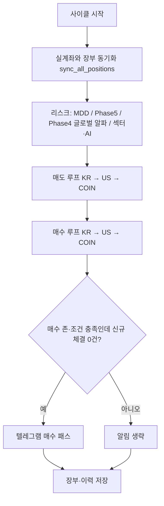

# c-bot — 국·미·코인 자동매매 봇

_문서 갱신: 2026-05-13 — Phase4 글로벌 `-> 🚨` 차단 로그를 국·미·코인 매수 창 안에서만 출력하도록 문서·코드 정합._

---

## 목차

1. [이 프로젝트는 무엇인가요?](#1-이-프로젝트는-무엇인가요)
2. [처음 오셨나요? (준비물 체크)](#2-처음-오셨나요-준비물-체크)
3. [빠른 시작](#3-빠른-시작)
3-1. [GUI 사용 안내 (`run_gui.py`)](#gui-사용-안내)
4. [폴더 구조 한눈에 보기](#4-폴더-구조-한눈에-보기)
5. [한 사이클 안에서 일어나는 일](#5-한-사이클-안에서-일어나는-일)
6. [최상위 파일 설명](#6-최상위-파일-설명)
7. [데이터 파일과 Git](#7-데이터-파일과-git)
8. [전략: V8(추세)과 스윙](#8-전략-v8추세과-스윙) — [HTS 조건검색 26.05](#국장-hts-조건검색-v8-2605)
9. [Phase 1~5가 의미하는 것](#9-phase-15가-의미하는-것)
10. [관측성: 로그를 읽는 법](#10-관측성-로그를-읽는-법)
11. [`config.json` 핵심 키](#11-configjson-핵심-키)
12. [트러블슈팅](#12-트러블슈팅)
13. [운영 팁 · 체크리스트](#13-운영-팁--체크리스트)
14. [`config.json` 예시 템플릿](#14-configjson-예시-템플릿)

---

## 1) 이 프로젝트는 무엇인가요?

**한국투자증권(KIS)** 로 국장·미장 주식을, 코인은 **`config.json`** 으로 **업비트(원화 마켓)** 또는 **바이낸스 현물(USDT 마켓, CCXT)** 중 하나를 고르고, 정해진 규칙에 따라 **자동으로 매매**하는 프로그램입니다.

| 구분 | 설명 |
|------|------|
| **일상 운영** | `run_bot.bat` 또는 `py -3.11 run_gui.py` — **GUI 권장** |
| **개발·서버** | `py -3.11 run_bot.py` — 헤드리스(콘솔만), 선택 사항 |
| **엔진** | `run_bot.py` 안의 `run_trading_bot()` 이 한국·미국·코인 순으로 동기화 → 리스크 → 매도 → 매수를 처리합니다 |

코드는 크게 **전략(`strategy/`)**, **실행·장부(`execution/`)**, **브로커 API(`api/`)**, **GUI·조회 보조(`services/`, `utils/`)** 로 나뉩니다. 자세한 파일 단위 설명은 **`PROJECT_STRUCTURE.txt`** 에도 같은 맥락으로 적어 두었습니다.

---

## 2) 처음 오셨나요? (준비물 체크)

1. **Python 3.11** 권장 (`py -3.11` 명령이 동작하는지 확인).
2. **`requirements.txt`** 로 의존성 설치: `py -3.11 -m pip install -r requirements.txt`
3. **`.gitignore`에 있는 파일**은 저장소에 없을 수 있습니다. 특히 **`config.json`** 은 직접 만들고, API 키·계좌·텔레그램 값을 넣어야 합니다.
4. **`bot_state.json`**, **`trade_history.json`** 은 없으면 실행 중 생성되거나 비어 있는 상태에서 시작해도 됩니다.
5. **국장 후보 종목**은 스크리너가 **`kr_targets.json`** 을 만듭니다. HTS에는 **`조건검색/v8조건검색 26.05(외국인수급제외 간결화).txt`** (또는 동명 `.xml`/`.tdf`)를 등록해 두고, `screener.py` 가 API로 조회합니다. `kr_targets.json` 은 **매 스캔마다 바뀌므로 Git에 포함하지 않습니다**. 처음에는 비어 있으면 국장 매수 루프만 스킵되므로, 운영 전에 스크리너를 한 번 돌리세요.

---

## 3) 빠른 시작

### 실행

```bash
py -3.11 -m pip install -r requirements.txt
```

**GUI (권장)**

```bash
run_bot.bat
```

또는

```bash
py -3.11 run_gui.py
```

**헤드리스 (선택)**

```bash
py -3.11 run_bot.py
```

**Phase 5 고점 수동 보정(입·출금 후)**

```bash
py -3.11 adjust_capital.py
```

### 설정이 반영되지 않을 때

`config.json` 은 **프로세스가 시작될 때 한 번** 읽습니다. 값을 바꾼 뒤에는 **GUI/봇을 완전히 종료했다가 다시 실행**해야 합니다.

### 매매·알림 시계

- **매매 엔진:** **GUI**는 기동 직후 즉시 실행 없이, KST **`:00` / `:15` / `:30` / `:45`** 분기 스케줄에서만 `run_trading_bot()` 을 돌립니다. **`run_bot.py` 헤드리스**는 시작 시 **`run_trading_bot()` 1회**를 먼저 돌린 뒤, 같은 KST 분 슬롯에 이어서 스케줄합니다.
- **텔레그램 생존신고(heartbeat):** **GUI**는 **기동 직후 발송 없음**. 다음 **KST `:00` / `:30`** 슬롯을 예약한 뒤, **해당 슬롯의 15분 매매 사이클(`:00/:15/:30/:45`)이 끝난 다음** `heartbeat_report()` 를 보냅니다(매매 15분 주기와 별도). **`run_bot.py` 단독(헤드리스)** 은 프로세스 시작 시 **`heartbeat_report()` 1회**를 보낸 뒤, **`schedule.every(4).hours`** 로 이어집니다(벽시계 `:00/:30` 정렬은 GUI 전용). 보유 한 줄은 **`종목 | 전략:V8|스윙 | 매수가 | 현재가(수익%) | 최고가(%) | 매도선(%) | 보유기간`** 형식이며, 장부 `strategy_type`·`tier`·없으면 `trade_history` 최근 BUY 로 전략을 표시합니다. 주말 미장은 `normalize_us_current_p_api_for_display` 로 장부 폴백 시에도 **yfinance 종가**를 쓰도록 GUI와 동일 전처리를 맞춥니다. **코인** 보유 한 줄의 가격은 바이낸스 **USDT** 단위. 요약 줄의 **예수·총평**(바이낸스)은 ``coin_broker.binance_display_cash_and_total_usdt()`` 로 **가용 USDT + 코인 명목**을 직접 합산한다(KRW 왕복 없음). 업비트 요약은 **원**. 서킷·Phase5용 스냅샷은 여전히 원화 환산. 코인 TWAP 체결 알림도 같은 단위 규칙을 따른다.

---

## GUI 사용 안내

일상 운영은 **`run_gui.py`** (또는 `run_bot.bat`) 로 켜는 **PyQt5 대시보드**가 기본입니다. **다크 터미널 스타일** UI(Fusion + 전역 QSS)이며, 기본 크기는 **1480×900**(최소 **1280×760**)입니다. 내부에서 **`import run_bot`** 을 하므로 **`config.json` 은 GUI를 켜는 순간 한 번만** 읽힙니다. 설정을 바꿨다면 **GUI를 껐다가 다시 실행**해야 합니다.

### 상단 영역

| 요소 | 설명 |
|------|------|
| **성적표 라벨** | `bot_state.stats` 의 **승/패·누적 수익률 합**(전량 청산 기준)·마지막 보유 ROI. 수동 부분 매도 분(`manual_partial_total_profit_pct`)은 **JSON에는 누적**되지만 성적표 한 줄에는 아직 표시하지 않습니다. 약 **3초마다** 갱신합니다. |
| **🇰🇷 🇺🇸 🪙 세 칸** | 시장별 **예수금·총평가·보유 수익률**. 숫자는 백그라운드 스레드(`BalanceUpdaterThread`)가 브로커·스냅샷 규칙에 맞춰 채웁니다. **코인 칸:** 업비트는 **원(KRW)**. 바이낸스는 상단 **가용·총평**을 ``coin_broker.binance_display_cash_and_total_usdt()`` 로 **거래소 USDT·시세 직접 합산**(KRW 왕복 없음). 스냅샷·Phase5·서킷용 내부 수치는 여전히 **원화 환산**입니다. |
| **🔄 예수금 새로고침** | 일반 갱신: 장중/쿨다운 등 **정책을 지키며** KIS·**설정된 코인 거래소**(업비트/바이낸스) 조회. 조건이 안 맞으면 저장된 **`last_kis_display_snapshot`** 등으로 맞춥니다. |
| **🏦 KIS 강제 새로고침** | 장외·쿨다운 중에도 **KIS를 한 번 강제로** 호출해 국·미 숫자를 바로 확인할 때 사용합니다. (남용하면 증권사 쪽 부담·제한에 걸릴 수 있어, 자동 갱신에는 **최소 간격(약 25초)** 이 있습니다.) |
| **최대 종목 수 스핀박스** | 국장 / 미장 / 코인 각각 **동시에 들고 갈 수 있는 종목 수 상한**입니다. |
| **💾 설정 실시간 적용** | `run_bot` 모듈의 `MAX_POSITIONS_*` 값을 즉시 바꾸고, 같은 내용을 **`bot_state.json` 의 `settings`** (`max_pos_kr` / `max_pos_us` / `max_pos_coin`)에 저장합니다. **다음 매수 사이클부터** 반영됩니다. |

### 탭·로그 레이아웃

- **위쪽:** `QTabWidget` — **실시간 현황**(보유표·수동 매도), **매매 내역**, **장부**, **고점 보정** 등 탭만 전환됩니다.  
- **아래쪽:** **실시간 작동 로그(봇 브리핑)** 는 탭 **밖**에 두어, 탭을 바꿔도 **항상 같은 자리**에 보입니다. 세로 **`QSplitter`** 로 위·아래 높이를 드래그해 조절합니다(초기 비율은 `run_gui.py` 의 `setSizes` 참고).  
- 기동 시 **매매 루프는 돌리지 않되**, 약 **0.15초 후** `refresh_balance(sync_first=False)` 를 한 번 호출해 표·라벨을 가능한 빨리 채웁니다(스냅샷 폴백 포함).

1. **실시간 현황** 탭  
   - 보유 종목 **테이블**: 시장, 종목명(코드), 수량, 매수단가, 현재가, 수익률, **전략(V8 / 스윙)**, **매도수량 입력 + 매도** (기본값은 해당 행 보유 전량; 칸을 비우면 전량 매도). 종목명 열은 좁게, 수량·가격·전략·매도 열은 남는 폭을 나눠 표시합니다.  
   - 확인 창 후 `run_bot.manual_sell` 로 주문합니다. 국·미장은 정수 주, 코인은 소수 수량 입력 가능합니다.  
   - 잔고 갱신 시 `build_account_snapshot_for_report`·`gui_table_adapter` 경로로 행이 만들어집니다. **바이낸스**일 때 코인 행의 매수가·현재가는 **USDT** 단위로 표시합니다(업비트는 **원**). **실시간 표 수익률**은 현재가 기준이며, 거래소에 평단이 없는 **바이낸스**는 장부 `buy_p`·`trade_history` 최근 BUY로 평단을 보강합니다. **전략** 열은 장부 `strategy_type`·`tier` 로 **V8** 또는 **스윙** 을 표시합니다.

2. **매매 내역**  
   - `trade_history.json` 을 읽어 **시간·시장·종목·매수/매도·수량·가격·수익률·사유** 를 표로 보여 줍니다.  
   - **코인 `BUY`의 `qty`** 는 **체결 코인 수량(base)** 입니다(원화·USDT 지출액이 아님). 과거에 잘못 기록된 행은 수동 보정이 필요합니다.

3. **장부 (현재 포지션)**  
   - `bot_state.json` 의 `positions` 를 읽어 **매수가·손절가·최고가·수량·매수시간** 등을 표시합니다. 코인이 **바이낸스(USDT 마켓)** 이면 해당 가격 열은 **USDT** 로 보여 줍니다(업비트 코인은 **원**).  
   - **수량**은 실시간 보유 표와 같이 **실계좌 잔고**를 우선 표시합니다(`qty` 미기록·구형 장부도 동기화·조회로 맞춤).  
   - **수익률** 열은 **매수가 대비 장부 최고가(`max_p`)** 기준입니다(실시간 보유 표·상단 보유 ROI는 **현재가** 기준).  
   - 마지막 열 **「전략」** 은 매수 시 `tier`에 기록된 **V8·스윙 전략명**을 보여 줍니다. `1/N 고정`·`vol-target` 같은 비중 라벨·`strategy_type`만 있는 구형 행은 화면에서 전략명으로 복원합니다.
   - **손절가 열:** `SWING_FIB`(또는 tier `SWING_FIB`)는 저장된 `sl_p` 대신 **현재가·일봉으로 `get_swing_exit_display_price` 를 재계산**해 표시합니다(코인·국·미 동일).

4. **고점 보정 (입출금)**  
   - `adjust_capital.py` 와 **동일한 로직**을 백그라운드 스레드(`CapitalAdjustThread`)로 실행합니다.  
   - **입금 / 출금** 선택, 원화 금액 입력 후 **「실행 (스냅샷 갱신 → 고점 반영)」** → `peak_total_equity` 등 갱신·`capital_adjustments` 기록.

### 자동으로 도는 것들

| 동작 | 설명 |
|------|------|
| **매매 엔진** | 기동 직후 즉시 실행 없이, **KST `:00` / `:15` / `:30` / `:45`** 마다 `run_trading_bot()` 실행. 이미 한 사이클이 돌고 있으면 중복 호출은 건너뜁니다. |
| **매매 직전** | `do_trade()` 안에서 잔고 갱신(`refresh_balance`)으로 **최신 `max_p` 등**을 맞춘 뒤 `WorkerThread`에서 실제 `run_trading_bot()` 을 돌립니다. |
| **텔레그램 heartbeat** | **기동 직후 전송 없음.** 다음 **KST `:00` / `:30`** 슬롯을 예약한 뒤, **해당 슬롯의 15분 매매 사이클(`:00/:15/:30/:45`)이 끝난 다음** `heartbeat_report()` 를 보냅니다(UI 스레드 블로킹 방지용 백그라운드 스레드). 보유 한 줄에 **`전략:V8`** 또는 **`전략:스윙`** 이 포함됩니다(장부 `strategy_type`·`tier` 우선, 없으면 `trade_history` 최근 BUY `reason` 폴백). |
| **스캐너 스케줄** | GUI가 `run_bot` 을 불러올 때 `start_scanner_scheduler()` 가 한 번 붙습니다(국·미 스캔 시각은 README 앞부분·`PROJECT_STRUCTURE.txt` 참고). |
| **네트워크 감시** | 일정 간격으로 외부망 연결을 검사하고, **연속 실패** 시 프로세스를 종료합니다. `run_bot.bat` 로 감싸 두었다면 **자동 재기동**에 맡기는 설계입니다. (끄려면 환경 변수 `BOT_DISABLE_NET_WATCH` 참고 — 코드 주석 확인.) |

### GUI에서 장부와 맞추는 가격

- 잔고 테이블을 그릴 때 확인한 **현재가**는 가능하면 장부 `positions[*].curr_p` 로 넘기고, **최고가 `max_p`** 도 시장이 열려 있을 때만 더 높으면 올립니다(`update_max_price_if_higher`). 자동매매 루프와 **같은 `bot_state.json`** 을 쓰므로, GUI를 켜 두면 **수동으로도 최고가 추적에 도움**이 될 수 있습니다.

---

## 4) 폴더 구조 한눈에 보기

```
c-bot/
├── run_bot.py          # 메인 매매 엔진
├── run_gui.py          # PyQt5 운영 GUI
├── screener.py         # 국장 HTS 조건검색 → kr_targets.json
├── us_screener.py      # 미장 유니버스 캐시 갱신
├── adjust_capital.py   # 입출금 시 Phase5 고점 보정
├── config.json         # (로컬 생성) API·설정 — Git 제외
├── bot_state.json      # (자동) 장부·쿨다운·Phase5 등 — Git 제외
├── trade_history.json  # (자동) 매매 이력 append — Git 제외
├── kr_targets.json     # (스캐너 생성) 국장 스캔 결과 — Git 제외
├── us_universe_cache.json  # 미장 감시 목록 캐시 — Git 제외
├── api/                # KIS·업비트·거시 데이터 래퍼
├── strategy/           # rules, alpha_sizing(RS·변동성 비중), ai_filter, macro_guard 등
├── execution/          # 동기화, TWAP, 분할익절, 서킷브레이커
├── services/           # 잔고 facade, 스냅샷, GUI 테이블 어댑터
├── utils/              # 로그, 텔레그램, math_utils(Hurst) 등
├── tests/              # 실험·회귀 테스트 (test_lab, test_kis_parsers, test_alt_data_research, test_news_fetch, diagnose_*)
└── 조건검색/           # HTS 조건검색식 — 최신: v8조건검색 26.05(외국인수급제외 간결화).txt
```

---

## 5) 한 사이클 안에서 일어나는 일

아래는 **한 번의 `run_trading_bot()`** 이 개념적으로 하는 일입니다. (실제 코드는 `_prepare_cycle_state` → 동기화 → 컨텍스트 → 시장별 루프로 나뉘어 있습니다.)



**동기화:** 국·미 **정규장이 아닐 때는 KIS로 보유 티커 목록을 새로 조회하지 않습니다**(`fetch_equity_held_lists_for_position_sync`). 코인 보유 조회와 장부 동기화는 매 사이클 계속합니다. 비장중에 KIS가 빈 보유를 주어도 장부 국·미 줄이 유령 삭제되지 않도록 `sync_all_positions` 에서 `held` 보강 등을 합니다.

**매도 쪽 주의:** 포지션마다 `strategy_type` 이 있습니다. **`SWING_FIB`** 는 `check_swing_exit`(HALF·피보/구름 FULL·RSI FULL) → (HOLD 시) 분할 익절 → 타임스탑 → **수익 락 이탈만**(`check_swing_profit_lock_trailing_exit`, `_check_swing_trailing_exit` 경유). **피보·구름 하드스탑 FULL은 `check_swing_exit` 전담**이며, 손실 구간 공통 `hard_stop`(평단 90% 등) 루프는 **스윙에 적용하지 않습니다.** 표시·`sl_p` 는 `get_swing_exit_display_price`(하드+락 합성)로 매 사이클 갱신. **V8 샹들리에는 쓰지 않습니다.** 그 외(`TREND_V8`)는 분할 익절·타임스탑·하드스탑·샹들리에(V8)이며, **평단 대비 최대 손절폭**은 국·미 **-8%**·코인 **-12%** 캡으로 제한합니다(§8 하드스탑·매도선).

**매수 쪽:** 시장별 스캔 대상은 **10일 RS**로 정렬한 뒤(`strategy/alpha_sizing.py`), 종목마다 **먼저 V8**(`calculate_pro_signals`, Hurst **&lt; 0.45** 차단)을 보고, 실패 시 **스윙 보조**(`check_swing_entry`)를 봅니다. 통과 후 비중은 **`min(1/N, alpha_target_vol/ATR%)`** 로 잡고 `macro_mult`·예수금·최소주문을 적용합니다. **코인(업비트·바이낸스 공통)** 도 동일한 **일봉 직전 KST 창** 안에서만 매수 판단하며, 진입 순서도 국·미와 같습니다.

**Phase4 거시:** `_build_market_context` → `get_macro_guard_snapshot` 이 **시장별 글로벌 알파 차단**만 판정합니다. **US PCR** 차단 시에는 V8만 막고 **SWING_FIB** 는 미장 매수 창에서 계속 검증합니다(§10 Phase 4). KR·COIN·Phase5 등은 스윙 예외 없음. `macro_mult`는 항상 **1.0**입니다.

**텔레그램(운영 알림):** **어느 한쪽이라도** “매수 시간창·게이트까지 진입”했는데 **신규 매수 TWAP 성공이 한 건도 없으면**, 사이클 종료 시 `📭 [매수 패스] …` 한 통을 보냅니다. 본문 앞부분은 **이번에 매수 존에 들어간 시장만** `KR` / `US` / `COIN` 으로 찍습니다(예: 국장만이면 `KR 매수 가능 시간·…`, 둘 이상이면 `KR·US …`). `utils/telegram.py`의 일반 텍스트 `sendMessage`. 세 시장 모두 매수창 밖이면 보내지 않습니다.

---

## 6) 최상위 파일 설명

### `run_bot.py`

- **국장(KR) / 미장(US) / 코인(COIN)** 통합 엔진.
- 읽고 쓰는 대표 파일: `config.json`, `bot_state.json`, `trade_history.json`.
- **Phase 5** 합산 서킷용으로 브로커에서 가져온 국·미·코인 평가액을 **`circuit_aux_last_*`** 에 넣고, **`peak_total_equity` / `last_reset_week`** 로 **월요일(서울) 주차별 트레일링 MDD** 를 관리합니다. 고점은 **`peak_total_equity` 단일 키**가 소스이며, 옛 **`peak_equity_total_krw`** 가 남아 있으면 `execution/guard.py` 의 `load_state()` 에서 **한 번 이관 후 삭제**합니다.
- US 스냅샷(`services/account_snapshot.py`)은 미장 예수금/총평가가 간헐적으로 튈 때 직전 `last_kis_display_snapshot.us`로 폴백해 텔레그램/GUI 표시를 안정화합니다.
- KR/US 잔고 정책(GUI 스냅샷 등): **장중에만 KIS 실조회**, **장외(휴장/점검)에는 `last_kis_display_snapshot` 고정값 사용**. 코인은 기존대로 실조회합니다.  
- **`_sync_positions_for_cycle` / `fetch_equity_held_lists_for_position_sync`:** 동기화 시 국·미가 **정규장이 아니면 KIS 보유 목록 API를 호출하지 않고** 빈 리스트로 넘깁니다. **`sync_all_positions`** 안에서 비장중·빈 보유 대비 **장부 키로 `held` 보강** 등으로 유령 일괄 삭제를 막습니다. 시장이 **False** 인 경우 **KIS 시드·평단 보정·유령 삭제·주식 자동복구** 루프는 실행하지 않습니다(코인 동기화는 계속). 주식 **자동복구**로 새 행을 넣을 때 **`buy_date`** 는 가능하면 **`trade_history.json`** 에서 해당 티커·시장의 **가장 최근 `BUY`의 `timestamp`** 를 씁니다(없을 때만 복구 시각).
- **매수 패스 텔레그램:** 위 [한 사이클](#5-한-사이클-안에서-일어나는-일) 참고.
- **Phase4·알파 사이징:** `_build_market_context` 가 `macro_snap`(PCR·고래·환율 모멘텀·`market_buy_allowed`)을 넘깁니다. `_sort_buy_targets_by_rs`, `_position_ratio_with_vol_target` 로 RS 정렬·변동성 타겟 비중을 적용합니다.
- **매도 후 Layer2:** 전량 청산 시 `set_ticker_cooldown_after_sell`(매도 **사유별** 1h/24h). 수동 매도는 `_apply_manual_sell_state_update`·`_run_manual_sell_position_sync` 경로.
- **보유 중복 방지:** 스캔 대상이 실계좌·장부에 **이미 보유**이면 `이미 보유중 (패스)` — 신규 매수·쿨다운과 무관하게 유지됩니다.
- **관측성:** 예산·예수·TWAP·시장별 스킵은 `[KR …]`, `[US …]`, `[COIN …]` 등 태그 로그로 남깁니다. 모듈 상단 docstring에 grep용 태그 요약이 있습니다.

### `run_gui.py`

- PyQt5 GUI. `run_bot` 을 import 해서 **같은 엔진**을 돌립니다.
- 국·미·코인 ROI 등은 스냅샷과 맞추고, **바이낸스** 상단 코인 **가용·총평** 숫자는 ``binance_display_cash_and_total_usdt()``(API USDT 직접). 보유표·장부의 코인 **단가**는 USDT 표기. 내부 서킷·Phase5는 **원화 환산** 유지.
- **KIS 주말 점검** 구간에는 국·미 API를 덜 부르고, 저장된 **`last_kis_display_snapshot`** 과 장부 **`positions[*].qty`** 로 화면을 채웁니다.
- **코인 수익률·수량:** 상단 코인 보유 ROI는 `_calc_coin_holdings_metrics` 가 **바이낸스 평단 API 부재** 시 장부 `buy_p`·`trade_history` BUY를 씁니다. 실시간·장부 **수량**은 `_build_live_qty_lookup` 으로 실계좌 잔고를 우선합니다.
- **수동 매도 UI:** 보유 행마다 **수량 `QLineEdit`(기본=해당 행 보유 전량) + 매도 버튼**. 빈 칸은 전량, 국·미는 정수 주, 코인은 소수 입력. `_on_manual_sell_click` 에서 보유 초과·형식 검증.
- **버튼·탭·타이머** 등 화면 구성은 위 **[GUI 사용 안내](#gui-사용-안내)** 절을 보세요.

### `screener.py` / `us_screener.py`

- **국장:** `config.json` 의 **`kis_hts_id`** 계좌에 HTS에 등록된 **조건검색식 전체** 결과를 합쳐 **`kr_targets.json`** 에 기록 (로컬 전용, Git 무시). 조건식 본문·등록 방법은 아래 **[국장 HTS 조건검색 (V8 26.05)](#국장-hts-조건검색-v8-2605)**.
- **미장:** 감시 유니버스를 **`us_universe_cache.json`** 에 캐시 (TTL·스케줄러 연동).
- 스케줄 등록은 `run_bot.start_scanner_scheduler` — 국장 **14:50 KST**, 미장 **15:20 US/Eastern** (매수 창 직전 갱신 목적).

### `adjust_capital.py`

- 예수금 입출금만으로 총자산이 바뀌면 Phase5 고점이 왜곡될 수 있어, **`peak_total_equity`** 를 수동으로 맞출 때 사용합니다.
- 실행 시 **`refresh_circuit_aux_from_brokers`** 로 스냅샷을 맞춘 뒤 금액을 입력합니다.

### `config.json`

- 키·계좌·`test_mode`·TWAP·거시·AI 필터 등. **저장소에 올리지 마세요.**

### `bot_state.json` (장부)

| 키/영역 | 한 줄 설명 |
|---------|------------|
| `positions[티커]` | 매수가·손절·수량 `qty`·ATR·분할익절 여부 `scale_out_done`·**`strategy_type`**·**`entry_fib_level`** 등 |
| `stats` | `wins` / `losses` / `total_profit` 은 **전량 청산**(자동·수동) 시만 반영. 수동 **부분** 매도 실현분은 **`manual_partial_total_profit_pct`** 에만 가중 누적 |
| `cooldown` / `ticker_cooldowns` | 단기 쿨다운, 매도 후 **재진입 금지** 시각 |
| `peak_total_equity`, `last_reset_week` | Phase5 **월요일 앵커** 이후 이번 주 합산 고점·주차 라벨(고점은 **`peak_total_equity`만** 표준; 레거시 키는 로드 시 정리) |
| `circuit_aux_last_*` | 국·미·코인 합산용 최근 스냅샷 |
| `last_kis_display_snapshot` | 평일 마지막 성공한 KIS 라벨(주말 GUI/텔레용) |
| `last_coin_display_snapshot` | 마지막 성공한 **코인 라벨**(예수·총평·ROI; 업비트=원, 바이낸스=원화환산 정수) — 잔고 API 실패 시 GUI/텔레 상단 폴백. 이때 `labels["coin"].display_fallback` 이 켜지고, **바이낸스**는 라이브 USDT가 0이어도 직전 숫자를 덮어쓰지 않음. 보유 **행**은 장부·실조회 |

### 장부 `positions` 키의 `KRW-` / `USDT-`는 “원화 잔고”가 아닙니다

- 업비트를 쓸 때 코인 포지션은 티커 키가 **`KRW-BTC`**, **`KRW-XRP`** 처럼 보입니다. 여기서 **`KRW`는 “지금 장부에 원화만 따로 적혀 있다”는 뜻이 아니라**, 업비트 API가 쓰는 **마켓 이름(원화로 거래하는 코인 시장)** 을 그대로 옮긴 **종목 식별자(접두사)** 입니다. 매수가·손절가 등 숫자는 그 안의 필드(`buy_p`, `sl_p` …)에 들어 있고, 단위는 해당 마켓이 **원화(KRW)** 일 때 **원**입니다.
- 바이낸스 현물(USDT)을 선택하면 같은 역할의 키가 **`USDT-BTC`**, **`USDT-ETH`** 처럼 **`USDT-` 접두사**로 저장될 수 있습니다. 이때 가격·평단 필드는 **USDT** 기준으로 쓰이고, **합산 평가액·Phase5용 코인 스냅샷** 등은 봇이 **`krw_per_usdt`(또는 자동 추정 환율)** 으로 **원화로 환산**해 기존과 맞춥니다. **GUI**에서는 금액·단가를 **USDT** 로 읽기 쉽게 보여 줄 뿐이며, 그 숫자를 다시 환산해 합산 로직을 바꾸지는 않습니다.
- **거래소만 바꾸고 장부를 그대로 두면** `KRW-` 키로 남아 있는 기록이 **새 거래소 잔고와 안 맞을 수** 있으니, 업비트↔바이낸스 전환 시에는 **실계좌·`positions`를 같이 정리**하는 것이 안전합니다.

---

## 7) 데이터 파일과 Git

| 파일 | 설명 | Git |
|------|------|-----|
| `config.json` | 비밀·환경 설정 | **제외** (`.gitignore`) |
| `bot_state.json` | 장부·상태 | **제외** |
| `trade_history.json` | 매매 로그 | **제외** |
| `us_universe_cache.json` | 미장 유니버스 캐시 | **제외** |
| `kr_targets.json` | 국장 스크리너 출력(자주 변함) | **제외** |
| `조건검색/` | HTS 조건검색식 원본 — **최신 V8:** `v8조건검색 26.05(외국인수급제외 간결화).txt` (`.xml`/`.tdf` 동봉) | 선택적으로 커밋 |

새로 클론한 저장소에는 위 제외 파일이 없을 수 있으니, **로컬에서 생성**하거나 스크리너/봇을 한 번 실행해 채우면 됩니다.

---

## 8) 전략: V8(추세)과 스윙

### 국장 HTS 조건검색 (V8 26.05)

**최신 원본 (2026.05):** `조건검색/v8조건검색 26.05(외국인수급제외 간결화).txt` — HTS 등록용 동명 **`.xml` / `.tdf`** 와 내용을 맞춥니다. (`조건검색/README.md` 요약)

**이전안과 차이:** 구 `조건검색/v8조건검색 26.05.txt` 는 시가총액·**외국인/기관 5일 순매수**·순이익 증가율 등 **3갈래 OR** 이었습니다. **간결화(26.05)** 는 외국인·기관·시총·실적 조건을 빼고, **유동성(A·B) + 두 가지 진입 경로**만 남깁니다.

**조합 로직 (HTS):**

```text
A and B and ((C and D and E and F) or (G and H))
```

| 심볼 | 조건 항목 | 요약 |
|------|-----------|------|
| **A** | 주가범위 | 종가 3,000원 이상 |
| **B** | 평균거래대금 | 5봉 평균 거래대금 하한(천원 단위 HTS 설정) |
| **C** | 가격/20MA | 종가 &gt; 20일 단순이평 |
| **D** | 20MA 추세 | 20일선 상승 추세 유지 |
| **E** | 거래량 | 전일 동시간 대비 200%~900% |
| **F** | MACD | MACD(12,26,9) &gt; Signal |
| **G** | 볼린저 | 종가가 하한밴드(20,2) **상향 돌파** |
| **H** | RSI | RSI(14,9)가 Signal **상향 돌파** |

| 경로 | HTS 블록 | 봇 2차 필터 (같은 사이클) |
|------|----------|---------------------------|
| **추세·수급** | C ∧ D ∧ E ∧ F | **`calculate_pro_signals`** (V8) — Hurst·양봉·MACD·RSI·20MA 우상향·ATR 과열 등 |
| **턴어라운드 / Pullback** | G ∧ H (국장 HTS) | V8 실패 시 **`check_swing_entry`** (KR·US·COIN 코드 검증) |

**국장 후보 → 매수까지 흐름**

1. HTS에 위 조건식 등록 → `screener.py` (`run_night_screener`, **14:50 KST** 스케줄)가 `kis_hts_id` 계정의 **등록된 모든 조건식** 종목을 합쳐 **`kr_targets.json`** 저장.
2. `run_bot` 매수 창: `kr_targets` + 당일 **시총 상위 200** + **거래대금 상위 50** 교집합·티어 정렬(`_build_kr_targets`) → **10일 RS** 정렬 → 종목마다 **V8 → 스윙** → 예산·AI·섹터락 등.

**참고:** `조건검색/스윙조건검색.txt`, `바닥탈출턴어라운드.txt` 등은 **별도 HTS 식**(레거시·참고). `screener`는 계정에 등록된 식을 **이름 구분 없이 전부** 합치므로, V8만 쓰려면 HTS에 **간결화 식만** 두거나 다른 식을 비활성화하세요.

### 진입 (매수)

1. **`calculate_pro_signals`** (V8 계열 추세·수급 스나이퍼)를 **먼저** 평가합니다. 스캔 로그에는 **`[V8]`** 접두사가 붙습니다. (HTS **C~F** 경로와 대응)
2. V8이 실패하면 **`check_swing_entry`**(추세 속 눌림목)를 **추가로** 평가합니다. 미장·코인은 HTS 없이 이 코드 필터만 사용합니다. 실패 시 **`[스윙]`** 한 줄로 사유가 나옵니다.
3. V8으로 통과하면 **`[V8-BUY]`**, 스윙으로만 통과하면 **`[SWING-BUY]`** 와 `entry_fib_level` 이 로그에 찍힙니다.

**시장 날씨 `🌧️ BEAR`:** 지수 급락·MDD·Phase4 등과 별도로, 날씨가 BEAR여도 **스캔 루프는 계속** 돌고 V8 신호만 차단합니다(`_v8_trend_buy_allowed_in_weather`). V8 통과 종목은 `⏭️ BEAR — V8 차단` 로그 후 스윙 분기로 넘어가며, **`check_swing_entry` 통과 시 `SWING_FIB` 매수는 허용**됩니다. BULL/SIDEWAYS에서는 기존과 동일하게 V8·스윙 모두 가능합니다.

#### 스윙 매수 (`check_swing_entry`) — V8 실패 시 2차 폴백 (Pullback, KR·US·COIN)

| 항목 | 내용 |
|------|------|
| **추세** | 판정가 **&gt; 60MA** 이고 **≤ 60MA×1.30** (+30% 이격 상한) |
| **양봉** | 시가 &lt; 판정가 (`reference_close` 실시간 우선) |
| **갭** | 전일 종가→당일 시가 **+3% 미만** (`SWING_GAP_UP_MAX_PCT`) — 뇌동 추격 컷 |
| **거래량** | 당일 ≥ 전일 **80%** 또는 ≥ **5일 평균** (`SWING_VOL_MIN_VS_PREV_RATIO`) |
| **윗꼬리** | 당일 고가 대비 판정가 하락 **&lt; 5%** |
| **손절 피보** | 60봉 38.2/50/61.8% 중 **현재가 아래** 가장 가까운 지지 → `entry_fib_level` |
| **절대 손절 한도** | `max(피보, 구름)` 이 평단 **-5%(KR/US)**·**-7%(COIN)** 보다 깊으면 **평단×0.95 / ×0.93** 으로 상향 (`SWING_MAX_STOP_CAP_MULT_*`) |
| **판정가** | KR/US/COIN: **`reference_close`**(KIS·거래소) 우선, 없으면 일봉 종가 |
| **V8 대비** | Hurst·MACD·RSI·20MA 우상향·3ATR 과열 **없음** |
| **국장 V8·공통** | `run_bot` 국장 루프: 갭 **+5%** (`calculate_pro_signals` 전) — 스윙 **+3%** 와 별도 |
| **바깥 게이트** | MDD·Phase4·BEAR(V8만)·섹터락·AI(`swing_terminal_risk`) 등 |

**논리 요약:** HTS 후보(국장)든 RS 유니버스(미·코)든, 코드에서 **추세(60MA) 안의 눌림 반등**만 허용합니다. 과열 이격·무량 양봉·갭 추격은 차단하고, **피보는 현재가 아래**만 인정합니다.

**스윙 상수 (`strategy/rules.py`)**

| 상수 | 기본값 | 용도 |
|------|--------|------|
| `SWING_UPPER_WICK_DROP_PCT` | 5.0 | 당일 고가 대비 판정가 하락 ≥ 이 값(%)이면 매수 거절 |
| `SWING_MA60_MAX_EXTENSION_PCT` | 30.0 | 60MA 대비 판정가 이격 상한(%) |
| `SWING_VOL_MIN_VS_PREV_RATIO` | 0.80 | 당일 거래량 ≥ 전일×이 값, 또는 5일 평균 이상 |
| `SWING_GAP_UP_MAX_PCT` | 3.0 | 전일 종가→당일 시가 갭 상한(%) |
| `SWING_BB_HALF_MIN_PROFIT_PCT` | 2.0 | 볼밴 HALF: 평단 대비 최소 수익률(%) |
| `_SWING_FIB_RETRACE_RATIOS` | 0.382, 0.5, 0.618 | 손절 피보 후보(현재가 **아래**만) |
| `_SWING_PROFIT_LOCK_TIERS` | 4%→+0.5%, 8%→+3%, 15%→+7%, 25%→+12% | 스윙 전용 타이트 락 (V8 10/20/30%와 분리) |
| `SWING_HALF_FIXED_TARGET_PCT` | 5.0 | HALF: 볼밴 OR 고정 +5% (최소 +2%는 `SWING_BB_HALF_MIN_PROFIT_PCT`) |
| `SWING_RSI_FULL_*` | +1%~+10% 미만 | RSI FULL 허용 구간 (+10%↑는 락 트레일링만) |

**실시간가 주입 (`run_bot.py`)**

| 시장 | `reference_close` / `reference_price` |
|------|-------------------------------------|
| KR | `kis_api.broker_kr.fetch_price` → `stck_prpr` |
| US | `kis_api.broker_us.fetch_price` → `last` |
| COIN | `coin_broker.get_current_price` |

#### V8 방어: Hurst Exponent (횡보·역추세 차단)

- **위치:** `strategy/rules.py` 의 `calculate_pro_signals` — 20일선·MACD 등 **기존 V8 타점 검증보다 앞**에서, OHLCV가 **50봉 이상**일 때만 적용합니다.
- **계산:** `utils/math_utils.py` 의 `calculate_hurst_exponent` (R/S 분석, numpy). 최근 **50~100봉** 종가를 사용합니다.
- **차단:** Hurst **H &lt; 0.45** 이면 `❌ 패스: Hurst 차단 — 강한 횡보/역추세` 로 **매수 시그널을 내지 않습니다**. **0.45 이상**이면 Hurst만으로는 통과하며, 이후 양봉·윗꼬리·이격도·수급 등 **기존 V8 필터**가 그대로 이어집니다.
- **스윙(`check_swing_entry`)** 경로에는 Hurst 필터를 **넣지 않습니다** (V8 전용 방어막).

#### V8 매수 시 초기 손절·절대 한도 (`calculate_pro_signals`)

| 항목 | 내용 |
|------|------|
| **기술 손절** | `max(20일선 − ATR×1.0, 종가 − ATR×2.0)` — ATR 없으면 종가×0.90(-10%) |
| **절대 손절 한도** | 기술선이 평단(진입 시 **종가**) 대비 **-8%(KR/US)**·**-12%(COIN)** 보다 깊으면 **평단×0.92 / ×0.88** 으로 상향 (`V8_MAX_STOP_CAP_MULT_*`) |
| **장부** | 체결 후 `buy_p`=실제 평단, `sl_p`=위에서 계산한 값, `strategy_type=TREND_V8` |

스윙의 피보·구름과 달리 V8은 **ATR·이평 거리**가 기준이고, **-5%/-7% 스윙 캡과 별도**로 V8만 **-8%/-12%** 를 씁니다.

**V8 상수 (`strategy/rules.py`)**

| 상수 | 값 | 의미 |
|------|-----|------|
| `V8_MAX_STOP_CAP_MULT_EQUITY` | 0.92 | 국·미: 평단 대비 최대 **-8%** |
| `V8_MAX_STOP_CAP_MULT_COIN` | 0.88 | 코인: 평단 대비 최대 **-12%** |

#### 포지션 사이징 (Position Sizing)

- 국장·미장·코인은 **1/N 고정**을 **뼈대**로 두고, 그 위에 **상대강도(RS) 정렬**과 **변동성 타겟 비중**을 얹습니다 (`strategy/alpha_sizing.py`, `run_bot.py`).
  - 국장: `base_ratio = 1 / MAX_POSITIONS_KR`
  - 미장: `base_ratio = 1 / MAX_POSITIONS_US`
  - 코인: `base_ratio = 1 / MAX_POSITIONS_COIN`
- **개별 종목·티어·날씨로 비중을 키우는 로직(0.4·0.6 등 가산)은 없습니다.**  
  과거 ADX·불장에 따라 비중을 키우던 분기와 `max_allowed_ratio` 캡은 제거되었습니다.

**1) 후보 정렬 — 10일 상대강도(RS)**

- **시점:** V8·스윙 **진입 판단 직전**, 시장별 매수 스캔 대상 리스트를 **한 번** RS 내림차순으로 정렬합니다.
- **정의:** `(종목 최근 10일 수익률 %) − (벤치마크 10일 수익률 %)`. 데이터가 부족하면 RS=0으로 취급해 순서만 유지합니다.
- **벤치마크:** 국장 `^KS11`, 미장 `^GSPC`, 코인 `coin_config.btc_benchmark_ticker()` (업비트·바이낸스 공통).
- **데이터:** 국·미는 `get_ohlcv_yfinance`, 코인은 `coin_broker.fetch_ohlcv(..., "day", 120)`.
- **로그:** `-> [RS] KR|US|COIN 후보 N개 10일 상대강도 순 정렬 (벤치=...)`. 정렬 실패 시 **원본 순서 유지** + `⚠️ [RS]` 한 줄.

**2) 종목별 비중 — 변동성 타겟 (1/N 상한)**

- **공식:** `ratio = min(base_ratio, alpha_target_vol / ATR%)`  
  - `ATR%` = `get_safe_atr(티커, OHLCV) / 종가` (소수, 일봉 ATR 14).  
  - `alpha_target_vol` 기본 **0.02** (2% 일일 변동성 타겟, `config.json` 선택).
- **의미:** 변동성이 큰 종목은 **1/N보다 작은 비중**만 배정합니다. **1/N을 넘기지 않습니다** (`min` 처리).
- **표시:** 장부 `tier`·로그에 `1/N 고정` 또는 `vol-target(ATR%, cap 1/N=...)` 가 붙습니다.

**3) 최종 예산**

```python
target_budget = total_equity * ratio * macro_mult
```

- `macro_mult`는 Phase4에서 **항상 1.0**입니다(예산 축소 없음). 시장별 매수 차단은 `market_buy_allowed` 로만 적용됩니다.
- 예수금이 부족하면 기존처럼 **“영끌”** 로 조정합니다.

```python
if cash < target_budget:
    target_budget = cash
```

- 시장별 최소 주문 금액(국장 5만 원 / 미장 50달러 / 코인 5천 원 상당) 미만이면 주문을 내지 않고 **“예산 부족/예수금 부족”** 로그만 남깁니다.

### 청산 (매도)

- 장부 **`strategy_type`** 이 **`SWING_FIB`** 이면 먼저 **`check_swing_exit`** (`FULL` / `HALF` / `HOLD`)를 봅니다. **`HALF`·`FULL`** 이 나오면 스윙 규칙으로 부분·전량 매도 후 해당 사이클은 종료하고, **`HOLD`** 이면 그 아래 **분할 익절(Scale-Out) → 타임스탑 → (수익≥0일 때) 수익 락 이탈** 을 탑니다. **피보·구름은 위 `check_swing_exit` FULL만** — 손실 구간 V8식 `hard_stop` 루프는 스킵. 수익 구간 트레일링은 **`check_swing_profit_lock_trailing_exit`만**(통합 매도선 전체 이탈이 아님). **V8 샹들리에는 쓰지 않습니다.**
- 그 외(`TREND_V8` 또는 예전 장부)는 **V8 매도 루프**(분할 익절 → 타임스탑 → 하드스탑 → 샹들리에 순)를 탑니다.

#### 스윙 매도선 vs 1차 익절 (개념)

| 구분 | 방향 | 동작 | 장부·화면 |
|------|------|------|-----------|
| **매도선(스윙)** | 가격이 **아래로** 이 선 이하 | 하드스탑·수익 보존 락 → **잔량 전량** 매도 | `sl_p`, GUI 손절가 열, 생존신고 `매도선` |
| **1차 익절(볼밴)** | 가격이 **위로** 볼밴 상단 터치 | `HALF` → **약 50%만** 익절, 잔량 유지 | 로그 `1차익절(볼밴): …` **참고용** (매도선 아님) |

**기존 보유 종목:** 매수 시점과 무관하게 **매도 루프마다** `get_swing_exit_display_price` 로 재계산하고 `sl_p`·`max_p` 를 갱신합니다. `entry_fib_level` 이 비어 있으면 `reconcile_swing_position` 이 60봉·평단으로 피보를 백필합니다(`sl_p`를 피보 대용으로 쓰지 않음). GUI 장부 탭도 스윙 종목은 **현재가·일봉으로 매도선을 재계산**해 표시합니다. 코인(업비트 `KRW-*`·바이낸스 `USDT-*`)도 **동일 공식**입니다.

#### 스윙 매도선 표시·실행 (`get_swing_exit_display_price`)

| 구간 | 매도선(표시 = 하드+락 합성) | 실제 청산 담당 |
|------|---------------------------|----------------|
| 손실·저수익 | `max(피보, 구름, 절대한도)` | FULL → **`check_swing_exit`** (KR/US -5%, COIN -7% 캡 포함) |
| max_p +4/8/15/25% | 평단 +0.5/3/7/12% 보존 바닥 | 수익 락 이탈 → **`check_swing_profit_lock_trailing_exit`** |
| 수익 +2% 이상·HALF 전 | 로그 `1차익절(볼밴): …` 보조 | HALF → **`check_swing_exit`** (볼밴 OR +5%, 최소 +2%) |

GUI·텔레그램 **`sl_p`** = 위 **합성 표시선**(매 사이클 갱신). 실행은 행의 **담당 함수**대로 분리됩니다.

#### 보유 종목 — 전략(V8 / 스윙) 표시

| 위치 | 표기 | 판별 (`run_bot.py` / `run_gui.py`) |
|------|------|-------------------------------------|
| **텔레그램 생존신고** | `전략:스윙` / `전략:V8` | `_heartbeat_strategy_label` — 장부 `strategy_type`·`tier` → 없으면 `_strategy_from_trade_history_buy`(최근 BUY `reason`에 `SWING`/`SWING_FIB`면 스윙) |
| **GUI 실시간 현황** | `스윙` / `V8` | `_dashboard_strategy_short` — 장부 `strategy_type`·`tier` |
| **GUI 장부 탭** | tier 전략명 또는 `SWING_FIB` / V6 스나이퍼… | `_position_strategy_label` — `1/N` 등 사이징 라벨은 전략명으로 치환 |

텔레그램 보유 한 줄 예:

```
  025560(유니온) | 전략:스윙 | 매수가 12,300원 | 현재가 12,800원(+4.07%) | 최고가 13,100원(+6.50%) | 매도선 11,900원(-3.25%) | 보유 5일
  USDT-HOME(HOME) | 전략:스윙 | 매수가 0.0234 USDT | 현재가 0.0245 USDT(+4.70%) | ...
```

코드·설정 변경 후에는 **GUI/봇 재시작**이 있어야 새 형식이 반영됩니다.

보유 로그 예: `매도선(스윙): 25,200원` · V8 보유는 `매도선(V8): …`  
`SWING_FIB` 포지션은 V8 `get_final_exit_price`(샹들리에)를 **표시·수익 트레일링·`check_pro_exit`에 쓰지 않습니다.**

#### 스윙 매도 (`check_swing_exit`) — `strategy/rules.py`

판정 **현재가** = 매도 루프의 KIS/거래소 실시간가(`reference_price`), 없으면 당일 일봉 종가.  
평단 = 장부 `avg_price` → 없으면 **`buy_p`** (실계좌 평단 보정값).

| 우선순위 | 신호 | 조건 | 비고 |
|----------|------|------|------|
| 1 | **FULL** 하드스탑 | 현재가 < `get_swing_hard_stop_floor` (= `max(피보, 구름, 절대한도)`) | KR/US 한도 평단×0.95, COIN×0.93 |
| 2 | **HALF** 1차 익절 | **(볼밴 상단 OR 수익≥+5%)** **且** 수익 **≥ +2%** | 50% 분할 |
| 3 | **FULL** RSI | 데드크로스 **且** 수익 **+1% ~ +10% 미만** | +10%↑는 RSI 무시·수익 락만 |
| — | **HOLD** | 위 미해당 | 아래 V8 경로 계속 |

- HALF 시 로그·`trade_history` 예: `볼밴 상단 1차 익절 (현재가: 26,100 >= 볼밴: 25,920, 평단: 25,800 수익 +1.16%)` — **50% 분할 매도**이므로 매도선과 별개입니다.
- FULL(피보·구름·RSI)과 HALF·RSI는 **매 사이클 OHLCV·실시간가로 재판정**합니다.
- `HOLD` 이후 수익 구간 방어는 **수익 락 바닥 이탈**만 (`check_swing_profit_lock_trailing_exit`, `run_bot._check_swing_trailing_exit` 래퍼). 통합 매도선 전체 이탈로는 청산하지 않습니다.

#### 스윙 전략 — 설계 정합성·알려진 주의점

| 구분 | 평가 |
|------|------|
| **매수 ↔ HALF** | **(볼밴 상단 OR 수익≥+5%)** 이고 **평단 +2%↑** (`SWING_HALF_FIXED_TARGET_PCT`, `SWING_BB_HALF_MIN_PROFIT_PCT`). 타임스탑 유예(+2%)와 최소 수익은 맞춤. |
| **매수 ↔ 피보 손절** | 60봉 38.2/50/61.8% 중 **현재가 아래** 가장 가까운 지지 → `entry_fib_level`. 표시·장부 `sl_p` 는 매 사이클 `get_swing_exit_display_price` 로 갱신. FULL은 **현재가 < 피보/구름**. |
| **매도선 vs 1차 익절** | 매도선 = 아래 방향 전량 방어선. 1차 익절 = 위 방향 볼밴 HALF(절반만). |
| **매수 ↔ RSI FULL** | RSI 데드크로스 FULL은 수익 **+1% ~ +10% 미만** 구간만 (+10%↑는 수익 락 트레일링만). |
| **V8 vs 스윙** | V8 탈락 후 스윙 2차 진입. 스윙 전용 **윗꼬리 5%**·**피보 아래 지지**로 V8식 상투·즉시 손절 일부 완화. Hurst·3ATR 과열은 여전히 V8만. |
| **일봉 고가 한계** | 윗꼬리 판정의 “고가”는 일봉 `h`(실시간 고가 미반영 시 둔할 수 있음). 판정가는 실시간 우선. |

#### 타임스탑 (보유 시간 `buy_date` 우선, 없으면 `buy_time`)

**시간은 달력·연속 시각(주말·휴장 포함)** 으로만 계산합니다. `config.json` 없음 — `run_bot.py` 상수.

| 전략 | 대상 | 타임스탑 | 생존(유예) 조건 | 요약 |
|------|------|----------|-----------------|------|
| **V8** | 국장·미장 | **240h (10일)** | 수익 **≥ +4%** | 돌파 후 10일 안에 +4% 못 가면 가짜 돌파 정리 |
| **V8** | 코인 | **72h (3일)** | **≥ +4%** | 코인 3일 횡보 ≈ 주식 장기 횡보 |
| **스윙** | 국장·미장 | **120h (5일)** | **≥ +2%** | 5일 내 V자 반등 없으면 모멘텀 소멸 |
| **스윙** | 코인 | **48h (2일)** | **≥ +2%** | 단기 반등 실패 시 빠른 정리 |

**판정:** 최소 보유 시간 **이상** 이고, 수익률이 유예 기준 **미만**이면 전량 매도. 유예 기준 **이상**이면 타임스탑 없음(로그: `타임스탑 유예`). 전량 청산 시 `ticker_cooldowns` **24h**.

상수: `V8_TIME_STOP_HOURS_EQUITY`, `V8_TIME_STOP_HOURS_COIN`, `V8_TIME_STOP_EXEMPT_PROFIT_PCT`, `SWING_TIME_STOP_HOURS_EQUITY`, `SWING_TIME_STOP_HOURS_COIN`, `SWING_TIME_STOP_EXEMPT_PROFIT_PCT`.

매도 **`reason`**·로그에는 **`[V8_TIME_STOP_KR]`**, **`[V8_TIME_STOP_US]`**, **`[V8_TIME_STOP_COIN]`**, **`[SWING_TIME_STOP_KR]`** 등 태그가 붙습니다.

#### 하드스탑·매도선 계산 (`strategy/rules.py`, `run_bot._calc_hard_stop`)

**공통:** GUI·텔레 생존신고·장부 손절가·보유 로그의 **「매도선」** 은 매 사이클 **일봉+현재가**로 다시 계산한 값입니다(`sl_p` 저장값을 그대로 쓰지 않음 — 스윙·V8 모두 갱신).

| 구분 | V8 (`TREND_V8`) | 스윙 (`SWING_FIB`) |
|------|-----------------|-------------------|
| **표시용 매도선** | `get_final_exit_price` | `get_swing_exit_display_price` |
| **기술 기준** | ATR·20MA·샹들리에 | 피보·일목 구름 |
| **절대 손절 캡 (평단 대비)** | **-8%** (KR/US) · **-12%** (COIN) | **-5%** (KR/US) · **-7%** (COIN) |
| **손실 구간 V8식 `hard_stop` 루프** | **적용** (현재가 ≤ 하드스탑 시 전량) | **미적용** (피보·구름은 `check_swing_exit` FULL만) |

**V8 vs 스윙 — 절대 한도 (스윙처럼 `max(기술선, 캡)` 적용)**

| 시장 | V8 최대 손절폭 | 스윙 최대 손절폭 |
|------|----------------|------------------|
| 국장·미장 | **-8%** (`×0.92`) | -5% (`×0.95`) |
| 코인 | **-12%** (`×0.88`) | -7% (`×0.93`) |

캡은 **기술 손절이 한도보다 더 깊을 때만** 손절가를 **올립니다**. 기술선이 이미 -5%처럼 한도보다 **타이트하면** 그 값을 그대로 씁니다.

**예 (국장 V8 보유, 평단 10,000원):** 샹들리에·ATR 등으로 손절가가 **8,500원(-15%)** 로 계산되면 → 절대 한도 **9,200원(-8%)** 와 `max` → **매도선·`sl_p`·손실 구간 `hard_stop` 모두 9,200원** 근처로 표시·판정됩니다. 현재가가 9,200원 이하로 내려가면 하드스탑 매도 루프가 동작합니다.

**V8 매도선 (`get_final_exit_price`)**

```
샹들리에     = max_p − (current_atr × 2.5)   (ATR 없으면 현재가×2% 대체)
이익 락      = max_p 수익%에 따라 평단×1.005 / ×1.05 / ×1.15 (10/20/30% 티어)
기술 매도선  = max(샹들리에, 이익락, 장부 sl_p 또는 평단×0.9)
절대 한도    = 평단 × 0.92 (KR/US) 또는 × 0.88 (COIN)
최종 매도선  = max(기술 매도선, 절대 한도)
```

1. **샹들리에 바닥:** `max_p`는 장부 최고가·현재가 중 큰 값.
2. **이익 보존 락:** max 수익 ≥30% → 평단×1.15 · ≥20% → ×1.05 · ≥10% → ×1.005 · 그 미만 → 0
3. **절대 손절 한도:** 위 합성값이 **-8%/-12%** 보다 깊으면 캡으로 상향. **매수 시** `calculate_pro_signals` 초기 `sl_p`에도 동일.
4. **수익 구간 청산:** `check_pro_exit` — 현재가 ≤ 최종 매도선이면 전량(샹들리에·락 사유)

**적용 경로:** `run_bot` 매 사이클 `_resolve_exit_display_price` → `sl_p` 갱신, 손실 시 `_calc_hard_stop`(V8도 캡 재적용), 텔레 생존신고·보유 로그 **「매도선(V8)」**.

**스윙 하드 바닥 (`get_swing_hard_stop_floor`) — FULL·표시의 손실 쪽**

```
기술적 바닥 = max( entry_fib_level, 일목 구름 하단 )
절대 한도     = 평단 × 0.95 (국·미)  또는  평단 × 0.93 (코인)
하드 바닥     = max( 기술적 바닥, 절대 한도 )
```

- **`entry_fib_level`:** 진입 시 60봉 고저의 38.2/50/61.8% 중 **현재가 아래** 가장 가까운 피보. 비어 있으면 `infer_swing_entry_fib_from_ohlcv` 로 백필.
- **절대 한도:** 피보·구름이 더 위에 있어도, 평단 대비 **-5%(주식) / -7%(코인)** 보다 깊게는 내리지 않음(`SWING_MAX_STOP_CAP_MULT_*`).

**스윙 표시용 통합 매도선 (`get_swing_exit_display_price`)**

```
수익 락 바닥 = max_p 기준 티어 (최고 수익% → 평단 배수)
  +4%  → 평단×1.005
  +8%  → ×1.03
  +15% → ×1.07
  +25% → ×1.12
매도선(표시) = max( 하드 바닥, 수익 락 바닥 )   ← 수익 락이 없으면 하드 바닥만
```

**스윙 실행 분리 (표시선 ≠ 한 번에 전량)**

| 조건 | 함수 | 비고 |
|------|------|------|
| 현재가 < 하드 바닥 | `check_swing_exit` → **FULL** | 피보·구름·절대한도 통합 |
| 수익 락 바닥 이탈 | `check_swing_profit_lock_trailing_exit` | 표시선 전체 이탈이 아님 |
| 볼밴 OR +5% & +2%↑ | `check_swing_exit` → **HALF** | 매도선과 무관, 50%만 |

**매도 루프 우선순위 (스윙):** `check_swing_exit`(HALF/FULL) → 분할익절 → 타임스탑 → 수익 락 이탈.  
**매도 루프 우선순위 (V8):** 분할익절 → 타임스탑 → **손실 시** `hard_stop`(`get_final_exit_price` 갱신 `sl_p`, 평단×0.9 폴백, **-8%/-12% cap**) → **수익 시** `check_pro_exit`(샹들리에).

#### Layer 2: `ticker_cooldowns` (매도 후 재매수 금지, 시간 단위)

전량 청산 시에만 매도 **`reason`**·**`profit_rate`** 로 **사유별** 쿨다운을 부여합니다(전략·시장과 무관, KR/US/COIN 동일). **분할 익절 후 잔여 수량이 있으면** (`remaining_qty > 0`) 쿨다운을 **부여하지 않습니다**.

| 매도 사유 (요약) | `reason` 키워드 예 | 쿨다운 |
|------------------|---------------------|--------|
| **익절·트레일링·분할 익절** | 샹들리에, Scale-Out, `[SWING-SELL]`, 익절·Lock 등 | **1시간** |
| **손절** | 하드스탑, 손절, Hard Stop, Cut Loss, `profit_rate < 0` (타임스탑 제외) | **24시간** |
| **타임스탑** | `[V8_TIME_STOP_*]`, `[SWING_TIME_STOP_*]`, 타임스탑 | **24시간** |

구현·로그: `execution/guard.py` 의 `_classify_exit_cooldown_bucket` / `compute_ticker_cooldown_hours` / `set_ticker_cooldown_after_sell`, 매도 루프는 `run_bot.py` (전량 청산 직전 `reason`·`profit_rate`·`remaining_qty` 전달). 발동 시 `[쿨다운 적용] …`, 분할 익절 잔량 시 `[쿨다운 패스] …`.

**건드리지 않는 레이어:** 같은 파일의 Layer1 공용 매수 후 `cooldown`(분 단위), Phase5 계좌 서킷, 신규 매수 후 **15분** 매도 보호 등은 기존대로 유지합니다.

#### 수동 매도 (`run_bot.manual_sell`)

| 항목 | 동작 |
|------|------|
| **호출 경로** | GUI **매도수량 입력 + 매도** 또는 코드에서 `manual_sell(market, code, quantity)` |
| **부분 vs 전량** | 장부 `positions[*].qty` 와 주문 수량 비교. 부분이면 `execution/scale_out.post_partial_ledger`(수동 경로는 `set_scale_out_done=False` 로 자동 분할익절 플래그와 충돌 없음) |
| **통계** | **전량 청산** 시에만 `wins`·`losses`·`total_profit` 반영. **부분**만 `stats.manual_partial_total_profit_pct` 에 가중 누적 |
| **Layer2 쿨다운** | **전량**만 `ticker_cooldowns` 적용; 부분 매도 후 잔량 있으면 미부여 |
| **동기화** | 체결 반영 후 국·미·코인 실보유 조회가 **모두 성공**할 때만 `sync_all_positions` 로 재동기화(실패 시 다음 자동 사이클에 위임) |

#### TWAP(`twap_*`)과 전량 청산 (의도된 설계)

- **`config.json`의 `twap_*`** 로 **나눠 치는 것**은 **매수 TWAP**와 **분할 익절(Scale-Out) 매도**에 붙습니다 (`execution/order_twap.py`, `execution/scale_out.py`, `run_bot.py` 연동).
- **타임스탑·하드스탑·샹들리에로 나가는 전량 청산**은 시장가 **한 번에 전량 주문**(실패 시 재시도)입니다. 금액이 커도 이 경로에서는 **TWAP 분할을 쓰지 않습니다.**

---

## 9) Phase 1~5가 의미하는 것

코드·로그에서 **Phase N** 이라고 부르는 운영 레이어 묶음입니다. (`tests/test_lab.py` 에도 같은 이름의 실험 블록이 있습니다.)

| Phase | 역할 | 주요 위치 |
|-------|------|-----------|
| **1** | 같은 GICS **섹터** 과다 보유 방지 | `strategy/sector_lock.py` |
| **2** | **TWAP** 분할 매수·**분할 익절 매도**(전량 청산 타임스탑/하드스탑 경로는 단일 주문) | `execution/order_twap.py`, `execution/scale_out.py`, `run_bot.py` |
| **3** | **AI 휩쏘** 필터 (전략별 **듀얼 프롬프트**) | `strategy/ai_filter.py`, `run_bot._ai_false_breakout_buy_gate`, `config.json` 의 `ai_false_breakout_*` |
| **4** | **거시 방어막** (시장별 글로벌 알파) | `strategy/macro_guard.py`, `api/macro_data.py` |
| **5** | **합산 계좌 서킷** — 월요일(서울) **주차별 고점** 리셋 후 트레일링 MDD, 쿨다운 후 고점 1회 리셋 | `execution/circuit_break.py`, `execution/guard.py`, `run_bot`, `adjust_capital.py` |

**Phase 3 — 뉴스 악재 LLM 필터 (`strategy/ai_filter.py`):** 매수 직전 **최근 뉴스 헤드라인**만 LLM(Gemini → OpenAI 폴백)에 넘겨 **0~100 위험도**를 받습니다. OHLCV·호가 숫자는 **프롬프트에 넣지 않습니다**.

| 구간 | 의미 (요약) |
|------|-------------|
| **0~30** | 단순 노이즈·중립·호재 — 통과 구간 |
| **80~100** | 횡령·배임·상장폐지·대규모 유상증자·CEO 구속 등 **단기 치명 악재** 징후 |
| **중간** | 프롬프트가 “악재가 확실하면 80~100, 노이즈면 0~30” 으로 유도 |

**뉴스 수집**

| 시장 | 소스 | 비고 |
|------|------|------|
| **KR** | 네이버 금융 종목 뉴스 API (`collect_recent_news_text`) | 상위 5건 헤드라인 |
| **US** | `yfinance` `Ticker.news` | 최근 24시간, 영문 헤드라인 |
| **COIN** | 동일 (`KRW-`/`USDT-` → `BASE-USD` 심볼 매핑) | |

- 수집 실패·본문 없음 → **LLM 미호출**, `false_breakout_prob=0`, **매수 차단 없음** (`evaluation_engine=skip_no_news`).
- 스모크: `tests/test_news_fetch.py`.

**듀얼 프롬프트:** `run_bot` → `evaluate_false_breakout_filter(..., strategy_type=…)` 로 전략명을 넘기면 LLM 시스템 프롬프트가 분기됩니다.

| 전략 | `prompt_profile` | 프롬프트 성격 |
|------|------------------|---------------|
| **TREND_V8** | `v8_strict` | 단기 악재·가짜 돌파에 민감 (기존과 동일) |
| **SWING** / **SWING_FIB** 등 | `swing_terminal_risk` | 실적 부진·섹터 하락 등 일반 악재 무시, **상폐·부도·횡령/배임** 등 Terminal Risk만 80~100 |

**매수 게이트:** `false_breakout_prob >= ai_false_breakout_threshold`(국장·미장 기본 70) 또는 `>= ai_false_breakout_threshold_coin`(코인 기본 80) 이면 차단(전략 공통 임계).

**Gemini → OpenAI 폴백:** `ai_false_breakout_provider` 가 `gemini`(기본)일 때, Gemini가 키 없음·API 오류·JSON 실패 등으로 **LLM 점수를 내지 못하면**, `OPENAI_API_KEY`가 있고 `ai_false_breakout_openai_fallback` 이 `false`가 아니면(기본: 폴백 **켜짐**) **한 번** OpenAI를 호출한다. OpenAI 모델명은 `ai_false_breakout_openai_model`(기본 `gpt-4o-mini`).

**Phase 4 — 거시 방어막 (시장별 글로벌 알파)**

VIX·Crypto Fear&Greed **예산 배수**(`block`/`reduce`)와 원/달러 **절대값**(예: 1500원) 차단은 **제거**되었습니다. `get_macro_guard_snapshot` 의 `budget_multiplier`(`macro_mult`)는 **항상 1.0**이며, 신규 매수는 아래 **시장별 1지표**만으로 막습니다.

`api/macro_data.py` 수집 + `evaluate_market_macro_buy_permission` (지표 **미수집 시 해당 조건은 통과**, fail-open)

| 시장 | 지표 | 수집 | 차단 조건 (기본) |
|------|------|------|------------------|
| **US** | SPY Put/Call OI 비율 | `fetch_us_put_call_ratio()` | PCR **≥ 1.2** → **V8만** 차단, **SWING_FIB** 예외 |
| **COIN** | BTCUSDT 고래 롱/숏 (1d) | `fetch_coin_whale_short_ratio()` | 롱숏 **≤ 0.8** (스윙 예외 없음) |
| **KR** | 원/달러 모멘텀 | `fetch_usd_krw_momentum()` (현재가÷5일 이평) | 모멘텀 **≥ 1.015** (스윙 예외 없음) |

**US PCR 예외 (스윙만):** PCR로 `market_buy_allowed["US"] == false` 이어도 미장 매수 창에서는 유니버스 스캔을 계속하고, V8(`TREND_V8`)은 `⏭️ Phase4 US PCR — V8 추세 매수 차단` 후 스킵, `check_swing_entry` 통과 시 `SWING_FIB` 매수는 허용합니다(`macro_buy_allowed_for_strategy`). **KR 환율·COIN 고래·Phase5 MDD·계좌 서킷**은 스윙에도 예외 없습니다.

- 사이클 시작(매 사이클): `🛡️ [Phase4 거시]` + `🛡️ [Phase4 글로벌]` + 차단 시 `🚫 [Phase4 글로벌] …` (US PCR 시 `SWING_FIB는 매수 창에서만 예외 검증` 문구).
- **실제 적용:** KR·COIN은 `market_buy_allowed == false` 이면 매수 창에서 **전략 무관** 중단. **US PCR**만 스윙 예외로 창 안 스캔 유지·V8만 중단.
- 코드에 `macro_mult <= 0` 분기가 남아 있으나, Phase4 활성 시 **발동하지 않습니다**(항상 1.0).

**선택 `config.json` 키 (Phase 4):** `macro_guard_enabled`, `macro_us_put_call_block_threshold`, `macro_us_put_call_symbol`, `macro_coin_whale_long_short_block_threshold`, `macro_coin_whale_symbol`, `macro_coin_whale_period`, `macro_krw_fx_momentum_block_threshold`.

**레거시(무시):** `macro_vix_*`, `macro_fgi_*`, `macro_krw_fx_spot_block_threshold` — 설정에 남아 있어도 조회·차단에 사용하지 않습니다.

**레거시 — KR/US 호가 TR 수정 (LLM 입력과 별개):** 과거 KIS `inquire-price` 만으로는 호가가 (0,0)이 되어 **별도 LLM 루브릭**에서 오판이 났던 이슈가 있어, **KR** 은 `api/kis_api.fetch_kr_orderbook` (`FHKST01010200`) 로 잔량을 채우는 경로가 남아 있습니다. **현재 Phase 3 LLM 게이트는 뉴스 헤드라인만** 사용합니다.

**MDD(시장·종목 단위)** 와 **매도 후 재진입 `ticker_cooldowns`** 는 Phase 번호 없이 `execution/guard.py` 쪽과 연동됩니다.

---

## 10) 관측성: 로그를 읽는 법

- **파일 로그:** `utils/logger.py` 의 일별 롤오버로 **`logs/bot.log`** 가 쌓이고, 자정 넘기면 이전 날짜 파일이 **`logs/bot.YYYY-MM-DD.log`** 형식으로 보관됩니다.
- **시장별:** `[KR …]`, `[US …]`, `[COIN …]` — 예산·예수·정수주 0·TWAP 미체결·BEAR+ADX 스킵 등.
- **V8 스캔:** `🔍 [V8] [n/N] 종목 … ❌ 패스:` 또는 통과 시 `🔥 [V8] …`. Hurst 차단 시 `Hurst 차단 — 강한 횡보/역추세 (H=...<0.45)`.
- **스윙 보조:** V8 실패 뒤 `🔍 [스윙] … ❌ 패스: 사유` 또는 `✅ [SWING-BUY] …` (BEAR 시 `| BEAR 시장 스윙 예외` 가능).
- **스윙 보유:** `📊 [KR|US|COIN 보유] … 매도선(스윙): …` · `| 1차익절(볼밴): …`(HALF 목표, 매도선 아님) · `[SWING-SELL]` HALF/FULL.
- **BEAR 매수:** `📌 [KR|US|COIN] BEAR 날씨 — V8 추세 매수만 중단, SWING_FIB 스윙 후보는 계속 분석` · V8 통과 시 `⏭️ … BEAR … 추세 매수 차단`.
- **US PCR:** `📌 [US] Phase4 PCR 방어막 — V8 추세 매수 중단, SWING_FIB 후보만 검증` · V8 통과 시 `⏭️ … Phase4 US PCR — V8 추세 매수 차단` · 스윙 체결 시 `| Phase4 PCR 스윙 예외`.
- **RS·비중:** `-> [RS] … 10일 상대강도 순 정렬`, 매수 단계 `vol-target(ATR%, cap 1/N=…)` 또는 `1/N 고정`.
- **Phase3 AI:** `[AI FILTER]` / `[AI PASS]` — 로그에 `프롬프트: v8_strict` 또는 `swing_terminal_risk` 표기.
- **Phase4 글로벌:** 사이클 시작 `🛡️ [Phase4 글로벌] PCR=… 고래롱숏=… 환율모멘텀=…`, 차단 요약 `🚫 [Phase4 글로벌] KR|US|COIN 신규 매수 차단`. **매수 창 안**에서만 `-> 🚨 국장|미장|코인 Phase4 글로벌 방어막: 신규 매수 중단` (창 밖은 `[KR|US|COIN 매수 대기]`만).
- **매수 패스(텔레그램):** 매수 가능 구간이었는데 이번 사이클에 신규 매수 체결이 없으면 `📭 [매수 패스] …` — **해당 사이클에 존에 들어간 시장만** `KR` / `US` / `COIN` 으로 표기(본문은 `run_bot.py` 와 동일). `telegram_token` / `telegram_chat_id` 필수.
- **스냅샷/GUI:** `[snapshot …]`, 조회 폴백은 `📌` / `⚠️` 한 줄.
- **Phase5:** `[Phase5 서킷]` 등 (구체 문자열은 런타임 로그 참고).

---

## 11) `config.json` 핵심 키

### 브로커·알림

- `kis_key`, `kis_secret`, `kis_account`, `kis_hts_id`
- `upbit_access`, `upbit_secret`
- `telegram_token`, `telegram_chat_id`
- (선택) `telegram_connect_timeout_sec`(기본 30), `telegram_read_timeout_sec`(기본 60), `telegram_max_retries`(기본 5) — `utils/telegram.py` 에서 연결 타임아웃·재시도 조절
- (선택) `telegram_error_alerts` (기본 `true`) — `QuantBot` 로거에 부착된 ``_TelegramAlertHandler`` 가 **GUI 콘솔에 찍히는 모든 라인**과 **헤드리스(`run_bot.py` 단독)의 stderr 트레이스백**을 동일하게 감시한다. 캡처 대상은 (1) `WARNING` 이상 레벨, (2) 본문에 `⚠️` / `🚨` / `🛑` 포함, (3) 파이썬 트레이스백 헤더 `Traceback (most recent call last):`, (4) ``XxxError: ...`` / ``XxxException: ...`` 마지막 줄. 이런 시그널 라인이 잡히면 직후 **1.5초 동안 이어지는 후속 라인(`File "...", line ...` / 코드 라인)** 도 같이 캡처되어 트레이스백이 통째로 한 통으로 묶인다. **묶음 윈도우 2초**, **분당 최대 6건**, 같은 본문 **5분 중복 차단**(폭주 방지). 본문에 “텔레그램/telegram” 이 들어간 라인은 무시하므로 송신 자체에서 찍는 재시도 경고는 다시 알림으로 가지 않는다. **정기 보유 감시** 문구(예: `손실 구간:` 수익률 로그)는 GUI·파일 로그에만 남기고 **텔레그램 에러 알림에는 보내지 않는다**. `false` 로 끄면 기존 `atexit` 종료 알림만 남는다.

<a id="coin-exchange-config"></a>

### 코인 거래소 (업비트 / 바이낸스)

한 번에 **하나만** 활성입니다. `kis_api.configure()` 시 `coin_config`가 같이 로드됩니다.

| 키 | 설명 |
|----|------|
| `upbit_enabled` | `false` 이면 업비트 클라이언트를 띄우지 않음(기본은 기존 호환으로 켜진 것처럼 동작). |
| `binance_enabled` | `true` 이면 바이낸스 키로 현물 클라이언트 초기화 가능. |
| `market_preference` | `"UPBIT"` 또는 `"BINANCE"` — 실제 매매·잔고 조회에 쓸 거래소. |
| `binance_access`, `binance_secret` | 바이낸스 API 키. |
| `krw_per_usdt` | (선택) 1 USDT당 원화. 없으면 Yahoo `USDKRW=X` 등으로 추정(401 소음·실패 가능) — **직접 입력 권장**. |
| `binance_min_cost_usdt` | (선택) 최소 주문 명목(USDT), 기본 10 근처 — CCXT 마켓 정보와 함께 최소금액 검사에 사용. |
| `binance_recv_window` | (선택) CCXT 서명 요청 `recvWindow`(ms). 기본 **60000**. PC 시각이 어긋나 `-1021` 이 나면 `api/binance_api.py` 가 서버 시각 보정·1회 재시도한다. |
| `binance_universe_top` | (선택) 바이낸스 24h USDT 거래대금 상위 N만 스캔, 기본 **50**. |
| `upbit_universe_top` | (선택) 업비트 KRW 마켓 거래대금 상위 N만 스캔, 기본 **20**. |
| (스테이블/페그 자동 차단) | 바이낸스·업비트 스캔 모두 **USD/원화 페그 자산은 자동 제외**한다. (1) 알려진 정적 denylist (`USDC`, `USDT`, `FDUSD`, `TUSD`, `USDP`, `DAI`, `BUSD`, `GUSD`, `LUSD`, `MIM`, `FRAX`, `crvUSD`, `sUSD`, `USDD`, `USDE`, `USDB`, `USTC`, `USDX`, `USDS`, `PYUSD`, `USDT0`, `USR`, `USD0` 등). (2) 동적 페그 감지 — `last` 가 `[0.97, 1.03] USDT` 안이고 24h `(high - low) / last < 0.5%` 이거나 `last` 가 `1.0000` 근처(±0.0005)면 페그로 간주해 스킵. 업비트 KRW 마켓도 같은 사상으로 스프레드 0.5% 미만이면 제외. **이유**: 페그 자산은 변동성이 거의 0이라 V8/SWING 하드스탑(`buy_p` 손절선)에 매수 즉시 걸려 수수료·슬리피지로만 손실이 누적되는 함정이라(예: 과거 `USDT-U` 매수 직후 0.01% 하락에 손절). |
| `buy_window_minutes_before_close` | (선택) 코인 **일봉 기준점(KST 09:00 = 바이낸스 UTC 일봉 경계)** 직전 N분만 매수 허용. **업비트·바이낸스 동일 창**(기본 N=30 → **08:30~09:00** KST). 이 창 안에서는 **KST 분기 매매틱(`:00/:15/:30/:45`)마다** V8→스윙 매수 판단을 반복합니다. |
| `coin_min_notional_usd` | (선택) 코인 **잔고·GUI** 에서 제외할 최소 **명목(USD)**. 기본 **1** (바이낸스: USDT, 업비트: 달러 환산 KRW). 가격 조회 실패 시 옛 **수량** 먼지 기준으로 폴백. |

구현: `api/coin_config.py`, `api/coin_broker.py`(공통 진입), `api/binance_api.py`(CCXT). 의존성: **`ccxt`** (`requirements.txt`). 바이낸스 **시장가** 체결 시 터미널·로그에 `[BINANCE MARKET BUY]` / `[BINANCE MARKET SELL]` … `USDT` 형식이 붙습니다. **바이낸스**도 **업비트와 같은 일봉 직전 창**에서 상위 N USDT 종목에 대해 **V8 → 스윙** 순으로 진입을 판단합니다(구 `binance_v8_interval_minutes`·일 1회 제한·별도 스윙 시간대는 폐기). **`run_bot`에는** `last_binance_v8_scan_*` 같은 **바이낸스 전용 스캔 state 키나** 시간당/15분 슬롯만의 스케줄 분기 **가 없다**(레거시 문서·옛 채팅과 혼동 주의). **수수료를 BNB로 할인**하려면 바이낸스 웹에서 켜 두면 됩니다(API와 별개).

**Yahoo Finance (`yfinance`):** 미장 보조 시세·일부 환율 추정 등에 쓰이며 **공식 API가 아니라** Yahoo가 401·`Invalid Crumb`·접근 제한 메시지를 줄 수 있다(증권·코인 거래소 인증 오류와 무관). 완화: `pip install -U "yfinance>=0.2.48"`, **`krw_per_usdt`를 `config.json`에 직접 두면** 바이낸스 쪽 USDKRW Yahoo 호출이 줄어든다. 봇은 `yfinance`/`urllib3` 로거 레벨을 올려 터미널 소음을 줄인다 — 메시지가 **무조건 사라지진 않을 수 있다**(라이브러리가 `print` 하는 경우).

### 안전

- `test_mode` — `true` 는 드라이런 성격, `false` 는 실주문.

### TWAP

- `twap_enabled`, `twap_krw_threshold`, `twap_usd_threshold`, `twap_slice_delay_sec`

### 시간·리스크

- `buy_window_minutes_before_close` — 국·미·코인(일봉 09:00 KST 직전) 통합: **장·일봉 마감 N분 전만** 매수(코인: 업비트·바이낸스 **동일 창**, 창 안 매 틱 재판단).
- `account_circuit_enabled`, `account_circuit_mdd_pct` — 이번 주 **`peak_total_equity`** 대비 합산 하락률(%) 임계(기본 15). `(peak - current) / peak * 100 >= 임계` 시 발동.
- `account_circuit_cooldown_hours` — 쿨다운 후 **고점을 현재 총자산으로 1회 리셋**해 연쇄 발동을 줄임.

### 필터

- `ai_false_breakout_*`, `macro_guard_enabled`, `macro_*`, `alpha_target_vol`

---

## 12) 트러블슈팅

### 설정을 바꿨는데 반영이 안 됨

프로세스를 **완전히 종료 후 재시작**하세요.

### `NameError: List is not defined`

현재 `run_bot.py` 는 `list[str]` 형태로 정리되어 있습니다. 구버전 브랜치와 혼동하지 마세요.

### Windows 콘솔에서 이모지 깨짐

`utils/logger.py` 에서 안전 출력 처리. 표시만 깨지고 파일 로그는 UTF-8 일 수 있습니다.

### 코인 먼지 잔고

기본은 **`config.json`의 `coin_min_notional_usd`**(없으면 **1 USDT** 명목 미만)을 잔고·GUI에서 제외합니다. 현재가 조회가 실패할 때만 **`COIN_MIN_POSITION_QTY`**(`utils/helpers.py`) 수량 폴백을 씁니다.

### 바이낸스 `-1021` (Timestamp / recvWindow)

`InvalidNonce` / `Timestamp for this request is outside of the recvWindow` 는 **PC 시각과 바이낸스 서버 시각 불일치**가 흔한 원인입니다. `binance_recv_window` 조정과 함께 Windows 시간 동기화를 확인하세요. 코드는 `api/binance_api.py` 에서 CCXT `adjustForTimeDifference`·시각 재동기화·잔고/주문 1회 재시도를 씁니다.

### 바이낸스 코인 매수가·수량이 장부·GUI·이력과 어긋남

바이낸스 잔고 API는 **평단(`avg_buy_price`)을 주지 않는다**. `execution/sync_positions.py` 는 **현재가로 `buy_p`를 덮지 않고**, 장부·`trade_history.json`·GUI가 **같은 `buy_p`·실보유 수량**을 쓰도록 맞춥니다. 코인 자동 매수 TWAP 체결 알림·`trade_history` `BUY` `qty`·장부 `qty` 는 **체결 코인 수량** 기준입니다.

### 분할 익절(Scale-Out)을 바꿀 때

- 로직·상수: `execution/scale_out.py`
- 호출·주문 순서: `run_bot.py` 매도 루프

---

## 13) 운영 팁 · 체크리스트

1. `test_mode: true` 로 먼저 하루 이상 관찰.
2. 이상 없으면 `false` 로 전환 후 재시작.
3. `kis_hts_id` 누락 시 국장 스크리너가 실패할 수 있음.
4. 텔레그램 `chat_id` 오타 시 알림 무반응.

**변경 후 점검**

- [ ] `config.json` JSON 문법
- [ ] 봇/GUI 완전 재기동
- [ ] 시작 로그 에러 없음
- [ ] 텔레그램 테스트 수신
- [ ] `test_mode` 의도와 실제 모드 일치
- [ ] `bot_state.json` 과 실계좌 대략 일치

---

## 14) `config.json` 예시 템플릿

민감정보는 실제 값으로 교체하세요.

```json
{
  "kis_key": "YOUR_KIS_APP_KEY",
  "kis_secret": "YOUR_KIS_APP_SECRET",
  "kis_account": "12345678-01",
  "kis_hts_id": "YOUR_HTS_ID",

  "upbit_access": "YOUR_UPBIT_ACCESS_KEY",
  "upbit_secret": "YOUR_UPBIT_SECRET_KEY",

  "_comment_coin": "코인만 업비트/바이낸스 택1 — 예: 바이낸스만 쓸 때",
  "upbit_enabled": true,
  "binance_enabled": false,
  "market_preference": "UPBIT",
  "binance_access": "",
  "binance_secret": "",
  "krw_per_usdt": 1380,
  "binance_min_cost_usdt": 10,

  "telegram_token": "123456789:AA...",
  "telegram_chat_id": "123456789",

  "test_mode": true,

  "twap_enabled": true,
  "twap_krw_threshold": 5000000,
  "twap_usd_threshold": 5000,
  "twap_slice_delay_sec": 90,

  "buy_window_minutes_before_close": 30,

  "account_circuit_enabled": true,
  "account_circuit_mdd_pct": 15.0,
  "account_circuit_cooldown_hours": 24.0,

  "ai_false_breakout_enabled": true,
  "ai_false_breakout_threshold": 70,
  "ai_false_breakout_threshold_coin": 80,
  "ai_false_breakout_provider": "gemini",

  "macro_guard_enabled": true,

  "alpha_target_vol": 0.02,
  "macro_us_put_call_block_threshold": 1.2,
  "macro_coin_whale_long_short_block_threshold": 0.8,
  "macro_krw_fx_momentum_block_threshold": 1.015,
  "macro_us_put_call_symbol": "SPY",
  "macro_coin_whale_symbol": "BTCUSDT",
  "macro_coin_whale_period": "1d"
}
```

### 키별 상세 (요약)

- **`kis_*` / `upbit_*` / `binance_*` / `market_preference`:** 브로커·코인 거래소 인증 및 선택. 코인은 [위 표](#coin-exchange-config) 참고.
- **`telegram_*`:** 알림. `chat_id` 가 틀리면 전송 실패.
- **`test_mode`:** `true` 드라이런, `false` 실주문.
- **`twap_*`:** 주문 금액이 임계를 넘으면 분할, 슬라이스 간 `twap_slice_delay_sec` 초 대기.
- **`buy_window_minutes_before_close`:** 장 마감 N분 전만 신규 매수 허용.
- **`account_circuit_*`:** 합산 계좌 서킷 on/off, MDD 임계(%), 쿨다운 시간(시간).
- **`ai_false_breakout_*`:** 매수 직전 **뉴스 헤드라인** LLM 게이트. `strategy_type` 별 듀얼 프롬프트(`ai_filter.py`). API 키는 환경 변수 `GOOGLE_API_KEY` / `OPENAI_API_KEY`, `config.json`, 루트 `ai_keys.txt` 순. `ai_false_breakout_openai_fallback`, `ai_false_breakout_openai_model` 선택.
- **`macro_*`:** Phase 4 **시장별 글로벌 알파 신규 매수 차단**(Phase 4 절). `budget_multiplier`는 항상 1.0. 글로벌 `-> 🚨` 는 **매수 창 안**에서만(국·미·코인 동일). `macro_guard_enabled=false` 시 비활성. 스냅샷 필드: `market_buy_allowed`, `market_buy_block_reason`, `us_put_call_ratio`, `coin_whale_long_short_ratio`, `usd_krw_momentum_ratio`.
- **`alpha_target_vol`:** 변동성 타겟 비중의 목표 일일 변동성(소수, 기본 0.02). `ratio = min(1/N, alpha_target_vol / ATR%)`.

---

## GitHub `trade` 저장소에 푸시하기

1. GitHub에서 **비어 있는** 저장소 `trade`를 만듭니다(이름은 `trade` 권장). 웹에서 README를 같이 만들면 첫 `push` 때 충돌할 수 있어, **빈 저장소**로 두는 편이 안전합니다.  
2. 로컬에서 **`github_trade_remote.bat`** 을 실행하고, 프롬프트에 **GitHub 사용자명 또는 조직**을 입력합니다. `origin`이 `https://github.com/아이디/trade.git` 으로 등록됩니다.  
3. **`git_push.bat`** 을 실행합니다. 커밋 메시지(한국어 권장, [.cursor/rules/git-commit-korean.mdc](.cursor/rules/git-commit-korean.mdc))를 입력한 뒤 `git add` → `commit` → **`git push -u origin main`** 까지 진행합니다.

수동으로 할 때는 예시대로 실행하면 됩니다.

```bat
github_trade_remote.bat
git_push.bat
```

HTTPS 푸시 시 GitHub 비밀번호 대신 **Personal Access Token**을 쓰는 경우가 많습니다. `git credential` 또는 GitHub Desktop으로 한 번 로그인해 두면 이후 편합니다.

---

## 더 읽을 곳

- **파일 단위 빠른 참조:** `PROJECT_STRUCTURE.txt`
- **추가 모듈화 로드맵:** `MODULARIZATION_ROADMAP_2026-04-22.md`
- **과거 모듈화 완료 요약:** `MODULARIZATION_REVIEW_2026-04-21.md`, `MODULARIZATION_NEXT_STEPS_2026-04-21.md`
